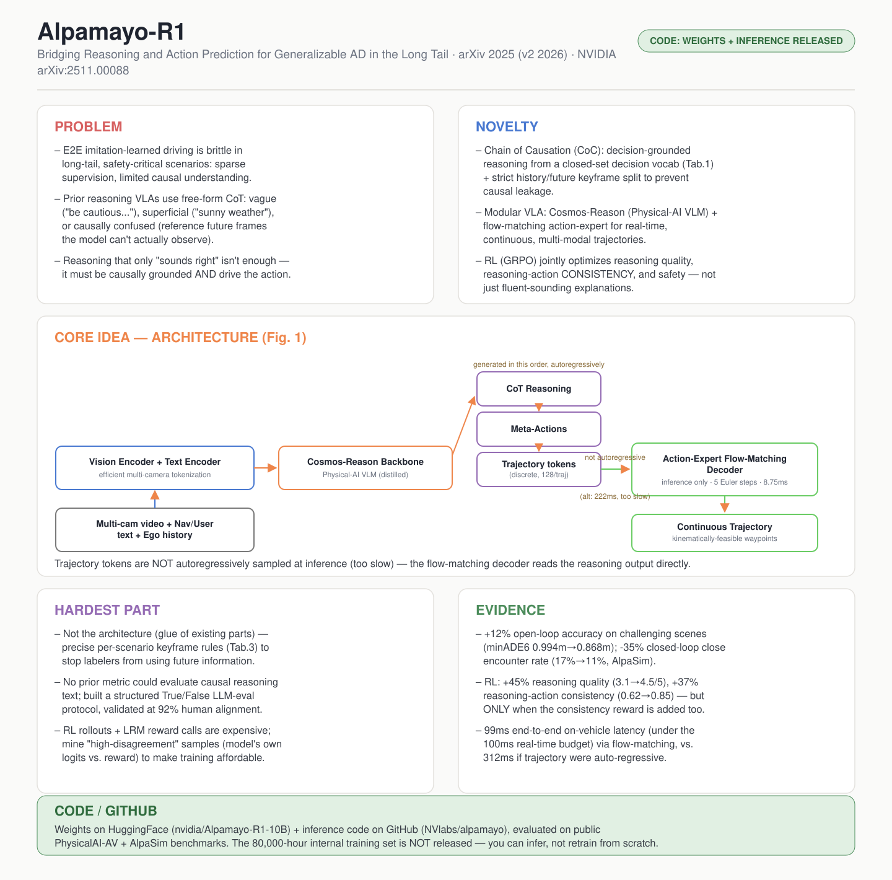

# Alpamayo-R1: Bridging Reasoning and Action Prediction for Generalizable Autonomous Driving in the Long Tail

- **Venue / year:** arXiv, Nov 2025 (v2: Jan 2026) — NVIDIA
- **Authors:** NVIDIA(大团队,核心贡献者见论文 Appendix A;Program Architect: Marco Pavone)
- **Link:** https://arxiv.org/abs/2511.00088
- **Local PDF:** `papers/autonomous_driving_moe/2511.00088v2.pdf`
- **paper_matrix.csv id:** `alpamayo_r1`
- **Code / 模型:** 权重 https://huggingface.co/nvidia/Alpamayo-R1-10B ,推理代码 https://github.com/NVlabs/alpamayo(**已发布,可跑推理**,见第 6 节)
- **Input / 输入:** 多路相机多时间步图像 + 自车历史运动数据 + 可选用户指令/导航文本
- **Output / 输出:** 按顺序自回归生成的 CoT Reasoning(推理文本)→ Meta-Actions → 离散轨迹 token;推理时轨迹 token 不直接用,而是把推理输出交给 flow-matching 动作专家解码成连续、符合运动学约束的轨迹(waypoints)

## 中文精读

### 1. 解决了什么问题

端到端(End-to-End, E2E)模仿学习驱动的自动驾驶,靠堆模型规模和数据量已经取得很大进展,但在**长尾、安全关键场景**里依然很脆弱——原文一句话点明:

> "End-to-end architectures trained via imitation learning have advanced autonomous driving by scaling model size and data, yet performance remains brittle in safety-critical long-tail scenarios where supervision is sparse and causal understanding is limited."

用大模型的"思维链推理"来补这个缺口,这个思路本身也不新(DriveGPT4、DriveLM 等一堆前作都做过),但 Alpamayo-R1 精确指出了前作的共同病灶:**推理是自由格式的(free-form),没有因果结构**。论文用 Figure 2 具体展示了三类病症:

1. **模糊的行为描述**——"the ego vehicle should be cautious and watch out for ..." 这种话说了等于没说,没指定具体决策;
2. **肤浅的推理**——把"天气晴朗""道路宽敞"这种背景描述当成原因,却和自车的具体决策没有直接因果关系;
3. **因果混淆**——标注时把整段视频(包括未来帧)都给标注员看,导致推理里引用了模型在推理时根本看不到的"未来信息",这是最隐蔽也最致命的一种数据泄漏。

Alpamayo-R1 要解决的问题就是:怎么让推理真正**因果扎根(causally grounded)**、**和驾驶任务的决策结构对齐**,并且这个推理不只是"写着好看"的解释,而要真正**驱动**轨迹生成。

### 2. 新意在哪里

三个创新点,层层递进:

**① Chain of Causation(CoC)数据集**——不是自由格式的推理链,而是"决策扎根、因果关联"的结构化推理:每条数据先标注一个来自**封闭决策词表**(Table 1,纵向 7 类如 Yield/Stop for static constraints,横向 7 类如 Lane change/Turn)的具体驾驶决策,再标注**开放式但结构化**的因果因素(Table 2:关键物体、交通灯、让行/停止控制、道路事件……),最后才组织成自然语言推理链。最关键的设计是**关键帧切分**:严格区分 0–2 秒的"历史"窗口和之后的"未来"窗口,标注因果因素时只能看历史窗口,标注决策时才能看未来——从流程上杜绝"因果混淆"。

**② 模块化 VLA 架构**:Cosmos-Reason(专为 Physical AI 训练的 VLM,不是通用聊天模型)做推理骨干,再加一个基于 flow matching(流匹配,一种比扩散模型更简单高效的生成式建模方法)的**动作专家(action-expert)**解码器,专门产生连续、多模态、满足运动学约束的实时轨迹。

**③ 多阶段训练策略**:先用监督微调(SFT)在 CoC 数据上"教会"模型生成推理,再用强化学习(RL, GRPO 算法)对齐——但这里的关键新意不是"用了 RL",而是 RL 的奖励函数同时优化**推理质量**、**推理-动作一致性**、**轨迹安全性**三个信号,尤其是"一致性"这个信号,专门用来防止模型学会"说一套做一套"。

### 3. Idea 具体落在哪里

最值得精读的是三处具体设计:

**双重轨迹表示(discrete-for-training, continuous-for-inference)**:训练时用 128 个离散 token(每个轨迹点用加速度 a、曲率 κ 各一个量化 token,共 64 个轨迹点)做标准的下一词元预测训练,让推理和轨迹共享同一个 token 空间,方便联合优化;但推理时**不用**自回归解码这 128 个 token(太慢),而是用一个独立的小型 flow-matching 动作专家,读取 VLM 的 KV-cache 和推理输出做条件,几步 Euler 积分(默认 5 步)直接生成连续轨迹。原文说得很直接:

> "flow-matching decoding offers computational efficiency, generating continuous trajectories substantially faster than autoregressively sampling 128 discrete tokens, enabling real-time inference."

这个"训练用离散、推理用连续"的双轨设计(借鉴自 π0.5-KI)是全文能同时兼顾"好训练"和"能上车实时跑"的关键工程决策。

**序列化的因果结构(Eq. 1)**:`[o_image, o_egomotion, Reason, τ]`——推理 Reason 排在轨迹 τ **之前**,且轨迹是条件在推理之上生成的,不是推理和轨迹各自独立的两个输出头。这个顺序本身就是"reasoning drives action"这个论点在数学формулировании上的体现。

**Table 9 的 RL 消融实验**——全文最反直觉、也最有教育意义的一张表:如果 RL 后训练**只**优化推理质量奖励,推理打分确实从 3.1 涨到 4.5,但 ADE(轨迹误差)反而从 2.12m 恶化到 2.19m,推理-动作一致性也从 0.62 跌到 0.53。原文的解释是:

> "optimizing for reasoning quality alone can lead to ungrounded or overconfident reasoning, where the model produces fluent but causally disconnected explanations that fail to translate into coherent actions."

只有把一致性奖励也加进去,ADE 才真正降到 1.92m,一致性升到 0.85。这说明"让模型说得好听"和"让模型说到做到"是两件需要分别优化的事,只优化一个会让另一个变差——这是一个非常值得记住的教训:多目标之间不能想当然地认为会同步提升,必须用消融实验去验证。

### 4. 最大难点在哪里

不在模型结构(Cosmos-Reason 是拿来主义,flow-matching 动作专家也是抄 π0.5-KI 的设计),难点集中在两处容易被忽略的"数据/评估基础设施"工作:

- **怎么在大规模标注里系统性地防止因果混淆**:光靠"关键帧切分"这个原则还不够,论文专门为每一类场景(如"resume at traffic light"要在信号变绿后 0.5 秒取关键帧,"yield to VRUs"要在自车开始减速前 0.5 秒取关键帧)人工定义了精确的关键帧规则(Table 3),再加上人工标注的两阶段流程(Stage I 只能看 0-2s 历史标关键因素,Stage II 才能看 0-8s 全窗口标决策)和专门的标注工具(显式区分历史/未来视频段)。这套"防止标注员作弊看到未来"的工程设计,比模型架构本身花的心思更多。
- **怎么评估开放式的因果推理文本**:论文自己承认这是"an open challenge"——BLEU/METEOR/CIDEr 这类文本相似度指标测不出因果关系对不对,纯 LLM 自由打分又容易幻觉。解决方案是把评估拆成三个结构化的 True/False 子任务(决策对不对、因果因素有没有提到、因果关系是否成立),而不是让 LLM 直接打一个笼统的分数,并用 2000 个样本验证这套方法和人工评估有 92% 的一致率。
- **怎么让 RL 训练在算力上可行**:RL 后训练每一步都要做在线 rollout + 调用大推理模型(LRM)打分,比 SFT 贵得多。论文在 5.3.3 节埋了一个很巧妙的数据筛选技巧:把奖励转换成 Boltzmann 分布,和模型自己 logits 隐含的分布对比,只挑"模型自己觉得该做的"和"外部奖励认为该做的"分歧最大的样本去训练——这本质上是一种主动学习(active learning)思路,不是本文首创,但用在这里解决了 RL 后训练"训不起全量数据"的现实问题。

### 5. 局限 / 对我项目的相关性

- 论文自己在 Future Work 里承认的局限:**每一次推理都会生成一整条推理链**,不管场景简不简单,没有"按需推理"(reasoning on demand)的机制,存在推理算力浪费;也没有世界模型/反事实模拟能力,只能从观测状态直接预测,不能"设想如果这么做会怎样"。
- **数据不对等的开放程度**:训练数据是 8 万小时、覆盖 25 国 2500+ 城市的内部专有数据,完全不开源;公开的只是模型权重和一个较小的评测子集(PhysicalAI-AV)。也就是说你能下载权重跑推理、在公开 benchmark 上复现评测数字,但**没法从零复现训练**。
- 对我项目的启发主要在两点:① CoC 数据管线"因果局部性(causal locality)"这个原则——标注/路由用到的上下文信息绝不能包含未来才知道的信息——直接对应我自己项目里设计"可靠性路由信号"时必须守住的红线:路由专家用的 observation density、missing-block 信息等,必须严格限定在推理时刻已知的窗口内,不能用到被插补时刻之后的信息,否则就是同一种"因果泄漏"错误换了个领域。② Table 9 揭示的"多目标奖励互相打架"现象,提醒我如果以后给 imputation MoE 加辅助损失(比如可靠性校准损失),必须专门做消融实验验证它有没有悄悄伤害主任务,不能假设多个目标会自动兼容。

### 6. 是否能连 GitHub

**可以,而且是这份阅读清单里第二篇真正能跑起来的论文**(仅次于 LoRA):模型权重发布在 HuggingFace(`huggingface.co/nvidia/Alpamayo-R1-10B`),推理代码在 GitHub(`github.com/NVlabs/alpamayo`),并且在公开的 PhysicalAI-AV 数据集和 AlpaSim 公开场景集上给出了可复现的评测数字,方便社区对比。但要注意开放程度是"能推理、能对标评测数字",不是"能从零复现训练"——80,000 小时的内部训练数据和完整训练管线(标注工具、RL 基础设施)都没有开源。

---

## English at-a-glance summary

### 图解读 Diagram walkthrough

海报中间的架构图对应论文 **Figure 1**,按推理时的数据流顺序读:

1. 最左边是输入:**多路相机多时间步图像**(实车用 2 个前视摄像头:120° 广角 + 30° 长焦)、**自车历史运动数据**、以及可选的**用户指令/导航文本**(比如"400 英尺后右转")。
2. 图像走 **Vision Encoder**(高效多相机分词,单帧默认 160 token,论文也支持更激进的 triplane/Flex 分词把 token 数压到 1/4 甚至 1/20),文本走 **Text Encoder**,两路 token 一起送进中间橙色的 **Cosmos-Reason Backbone**——这是专门在 Physical AI 数据(含 370 万条 VQA)上后训练过的 VLM,不是通用聊天模型。
3. Backbone **自回归地、按顺序**先后产出三类输出(对应右上角三个绿色框):先是 **CoT Reasoning**(因果推理链),再是 **Meta-Actions**(细粒度动作原语),最后是离散 **Trajectory** token——注意顺序很重要:轨迹是条件在推理之上生成的,不是并行的独立输出头。
4. 真正上车推理时,离散轨迹 token **不会**被自回归采样出来(太慢),而是把 Backbone 的 KV-cache 和推理输出交给右侧的 **Trajectory Decoder**(一个基于 flow matching 的小型动作专家),用 5 步 Euler 积分直接生成连续、符合车辆运动学约束的真实轨迹——这一步是全文能做到 99ms 端到端实时推理的关键。
5. 底部的 **Training Signals(IL, SFT, RL)** 标注了三个输出各自在训练阶段被怎样监督:模仿学习(IL)注入动作模态,监督微调(SFT)在 CoC 数据上激发推理能力,强化学习(RL)则同时用推理质量、推理-动作一致性、轨迹安全性三个奖励做后训练对齐——图中没画出来但笔记第 3 节详细讨论的 Table 9 消融实验,证明这三个奖励必须**一起**优化,只优化推理奖励反而会让轨迹变差。

### English at-a-glance table(中英对照)

| Aspect 方面 | Summary |
|---|---|
| **Problem 问题** | E2E imitation-learned driving is brittle in long-tail, safety-critical scenarios. Prior reasoning VLAs use free-form CoT that is vague, superficial, or causally confused (referencing future frames not observable at inference time). 端到端模仿学习驾驶在长尾安全关键场景里很脆弱。此前的推理型 VLA 用自由格式思维链,存在描述模糊、推理肤浅、或因果混淆(引用推理时根本看不到的未来帧信息)三类问题。 |
| **Novelty 新意** | Chain of Causation (CoC): decision-grounded reasoning from a closed-set decision vocabulary + strict history/future keyframe split to prevent causal leakage; modular VLA (Cosmos-Reason + flow-matching action-expert); RL (GRPO) jointly optimizing reasoning quality, reasoning-action consistency, and trajectory safety. 因果链(CoC):基于封闭决策词表的决策扎根推理 + 严格的历史/未来关键帧切分以防止因果泄漏;模块化 VLA(Cosmos-Reason + flow-matching 动作专家);RL(GRPO)同时优化推理质量、推理-动作一致性、轨迹安全性三个奖励。 |
| **Core idea 核心想法** | Dual trajectory representation: discrete tokens (128/traj) for unified autoregressive training, but a separate flow-matching action-expert for real-time continuous decoding at inference (5 Euler steps) — far faster than autoregressive sampling. 双重轨迹表示:训练时用128个离散token统一自回归训练,但推理时用独立的flow-matching动作专家做实时连续解码(5步Euler积分)——比自回归采样快得多。 |
| **Hardest part 最大难点** | Not the architecture (glue of existing components) but the data/eval infrastructure: precise per-scenario keyframe rules (Tab.3) to prevent causal leakage during labeling; a structured True/False LLM-eval protocol (no prior metric existed for causal reasoning text); an active-learning-style sample selection trick to make RL post-training computationally affordable. 难点不在架构(现成组件拼装),而在数据/评估基础设施:为每类场景设计精确的关键帧规则(表3)以防止标注时的因果泄漏;设计结构化True/False的LLM评估协议(此前没有能评估因果推理文本的指标);用类主动学习的样本筛选技巧让RL后训练算力可负担。 |
| **Evidence 证据** | +12% open-loop accuracy on challenging scenarios (minADE6 0.994m→0.868m) vs trajectory-only baseline; -35% closed-loop close-encounter rate (17%→11%); RL: +45% reasoning quality (3.1→4.5/5), +37% reasoning-action consistency (0.62→0.85), but only when the consistency reward is added jointly; 99ms end-to-end on-vehicle latency. 相比纯轨迹基线,在困难场景开环准确率提升12%(minADE6 0.994m→0.868m);闭环近距离接触率降低35%(17%→11%);RL:推理质量提升45%(3.1→4.5/5),推理-动作一致性提升37%(0.62→0.85),但只有联合加入一致性奖励才有效;端到端车载推理延迟99毫秒。 |
| **Relevance to our project 对我项目的相关性** | The CoC pipeline's "causal locality" principle (never let labels/routing use future-only information) directly maps to a red line for reliability-aware routing signals in traffic imputation. Table 9's reward-conflict finding is a broader lesson: auxiliary losses in an imputation MoE must be ablated, not assumed compatible. CoC 管线的"因果局部性"原则(标注/路由绝不能用到只有未来才知道的信息)直接对应交通插补里可靠性路由信号设计必须守住的红线。表9揭示的奖励冲突现象是更广泛的教训:插补 MoE 里的辅助损失必须做消融验证,不能假设天然兼容。 |
| **Code / GitHub 代码开源情况** | **Weights + inference code released** (huggingface.co/nvidia/Alpamayo-R1-10B, github.com/NVlabs/alpamayo), evaluated on public PhysicalAI-AV + AlpaSim benchmarks for reproducible comparison. The 80,000-hour internal training dataset and full training/RL infrastructure are NOT released — you can run inference, not reproduce training from scratch. **权重+推理代码已发布**,并在公开的 PhysicalAI-AV + AlpaSim 基准上给出可复现评测。但8万小时内部训练数据和完整训练/RL基础设施未开源——能跑推理,不能从零复现训练。 |
