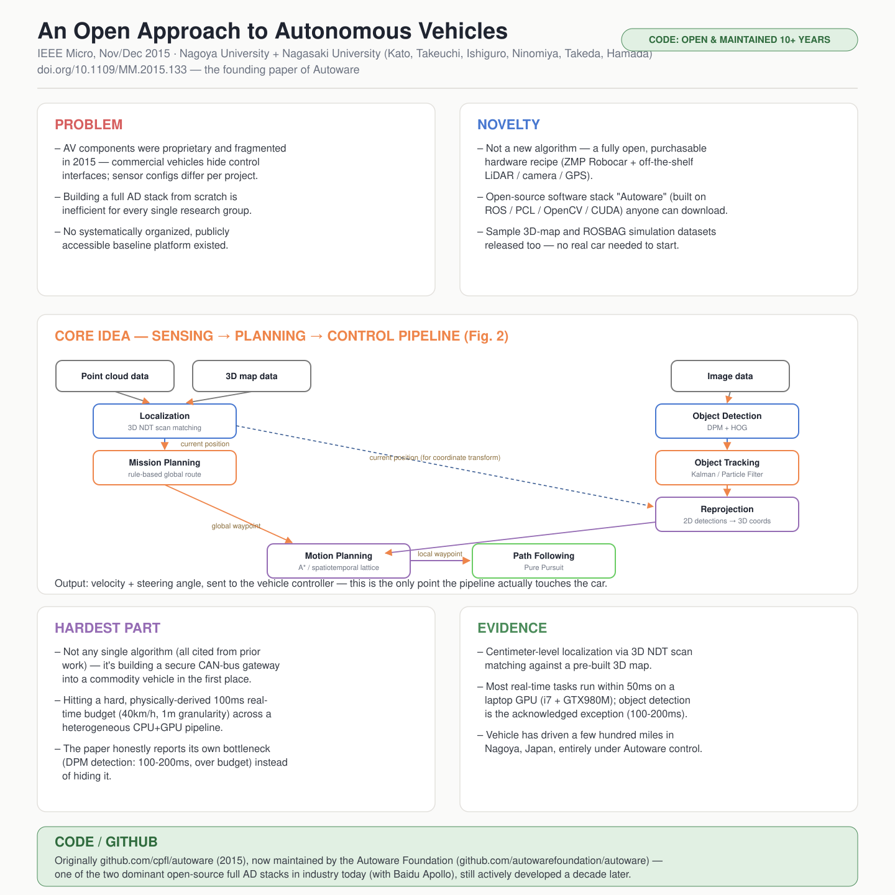

# An Open Approach to Autonomous Vehicles

- **Venue / year:** IEEE Micro, Vol. 35, No. 6, pp. 60–68, Nov/Dec 2015("Cool Chips"专栏)
- **Authors:** Shinpei Kato, Eijiro Takeuchi, Yoshio Ishiguro, Yoshiki Ninomiya, Kazuya Takeda(名古屋大学)· Tsuyoshi Hamada(长崎大学)
- **Link:** https://doi.org/10.1109/MM.2015.133
- **来源说明:** 这篇也不在 TimeSeriesMOE 仓库的本地下载列表里。官方 PDF 链接(`cs.furman.edu`)已经失效(404),我通过 Wayback Machine 找到了 2025 年的存档快照,下载后逐句核对过原文,不是转述二手资料。
- **paper_matrix.csv id:** 无(不在 matrix 里,是我自己在阅读清单之外额外找的一篇,补充"经典模块化 AD 技术栈长什么样"这块背景)
- **Input / 输入:** LiDAR 点云 + 3D 地图数据 + 相机图像
- **Output / 输出:** 速度 + 转向角指令,发送给车辆控制器(中间还会产生当前位置、检测/跟踪到的物体、全局/局部路径点等中间输出)

## 中文精读

### 1. 解决了什么问题

这篇和前面几篇不一样,它不是要提出一个新算法,而是要解决一个**基础设施缺失**的问题。2015 年前后,自动驾驶研究已经有一些标志性工作(比如 CMU 的 Boss,DARPA Urban Challenge 冠军车),但整个领域是碎片化的:

> "autonomous vehicles are not systematically organized. Given that commercial vehicles protect their in-vehicle system interface from users, third-party vendors cannot easily test new components of autonomous vehicles."

翻译:自动驾驶车辆没有被系统性地组织起来——商用车辆把车内系统接口对用户屏蔽,第三方开发者没法轻易测试自动驾驶的新组件。除此之外,不同车辆用的传感器组合也不一样(有的只用摄像头,有的摄像头+激光雷达+GPS+毫米波雷达全都上),软件从零搭建成本极高。这篇论文要解决的问题是:**能不能搭一个任何研究者都能用市售零件复现、软件全部开源的自动驾驶基础平台**,让大家在同一个起点上做研究,而不是每个组各自造轮子。

### 2. 新意在哪里

新意不是算法(论文里用到的定位、检测、跟踪、规划算法全部引用自己有的既有工作,论文自己也毫不掩饰这一点),而是**系统集成 + 开放性**本身:

- **硬件配方公开且可购买**:基于 ZMP Robocar(丰田 Prius 改装的线控底盘,自带 CAN 总线控制网关——这是接入商用车最难绕过的一道坎)+ 一组市售传感器(Velodyne/Ibeo/Hokuyo 三种不同量程和精度的 LiDAR、Point Grey 全景/单向相机、Javad RTK-GPS),全部型号和采购渠道都写在论文里。
- **软件栈完全开源**:命名为 **Autoware**,基于 ROS(机器人操作系统)搭建,整合了 PCL(点云处理)、OpenCV(图像处理)、CUDA(GPU 加速)、Android(乘客/驾驶员交互)、openFrameworks(可视化)——不是自己重新发明这些基础库,而是把它们粘合成一套连贯的自动驾驶流水线,代码放在 GitHub 上任何人可下载。
- **连样例数据集都打包发布**:3D 地图数据、ROSBAG 格式的仿真回放数据,都可以直接从 Autoware 官网下载,不用自己买车买传感器就能先跑仿真。

这篇论文的历史地位在于:它是 **Autoware**(现在是 Autoware Foundation 维护的开源自动驾驶技术栈,和百度 Apollo 并列为业界最主流的两套开源模块化 AD 系统)的奠基论文——前面几篇论文里反复出现的"Apollo/AutoPilot 下游运动规划模块"(DriveMLM 的核心接入对象),说的就是这一类系统。

### 3. Idea 具体落在哪里

最有价值的是 **Figure 2 的完整数据流图**,这是全文唯一真正的"技术贡献"图,把感知-规划-控制串成一条完整链路:

点云数据 + 3D 地图 → **Localization**(用 NDT 算法做 3D 点云配准,定位精度可达厘米级)→ 当前位置 → 同时喂给 **Mission Planning**(全局路径,规则驱动)和图像侧的 **Object Detection**(DPM+HOG 检测车辆/行人)→ **Object Tracking**(Kalman/Particle Filter 跨帧关联)→ **Reprojection**(把图像上的检测结果用相机-LiDAR 外参重新投影回 3D 世界坐标)→ 和 Mission Planning 给出的全局路径点一起送进 **Motion Planning**(非结构化环境用 A*,结构化道路用 conformal spatiotemporal lattice)→ 局部路径点 → **Path Following**(Pure Pursuit 算法)→ 速度和转角指令,发给车辆控制器。

最值得学的一个具体设计是**投影/反投影(Projection and reprojection)**这一步——这是让摄像头和激光雷达两种异构传感器真正"对话"的桥梁:

> "We can then project the 3D point-cloud information obtained by the 3D Lidar sensor onto the image captured by the camera so that we can add depth information to the image and filter out the region of interest of object detection. The result of object detection on the image can also be reprojected onto the 3D point-cloud coordinates using the same extrinsic parameters."

翻译:用相机-LiDAR 的外参标定结果,把 3D 点云投影到相机图像上,给图像加上深度信息、同时把物体检测的搜索范围收窄到路面区域(省计算量、减少误检);反过来,图像上检测到的物体位置也能用同一组外参反投影回 3D 世界坐标——这一来一回,是这套系统能做"传感器融合(sensor fusion)"而不是"多个传感器各算各的"的关键机制。

### 4. 最大难点在哪里

不在任何单个算法(全部引用自己有的论文),难点在于两处典型的系统工程问题,论文处理得比大多数论文诚实:

- **怎么真正接入一辆商用车**:普通研究者拿到一辆丰田 Prius,是没有官方接口去发送油门/刹车/转向指令的。ZMP Robocar 提供的"控制网关"解决的正是这个不起眼但每个人都会卡住的第一步——没有这一步,后面所有算法都无从谈起。
- **在真实延迟预算内让异构流水线跑起来**:论文给出了一段少见的、把工程约束量化到底的分析——假设车速 40km/h、要求每 1 米更新一次决策,反推出每个实时任务必须在 **100 毫秒**内完成。然后论文没有回避自己没做到的地方:

> "We demonstrated that most real-time tasks, including the NDT and State Lattice algorithms, can run within 50 ms, whereas the DPM algorithm still consumes more than 100 to 200 ms on the GPU. This implies that our system currently exhibits a performance bottleneck in object detection."

即使用了 GPU(Nvidia GTX980M)加速,DPM 物体检测仍然超出 100ms 的预算一倍以上——论文明确说"如果系统维持现状,GPU 性能至少要再翻一倍才能满足假设"。这种**明确报告自己哪里没达标**、而不是只展示成功案例的写法,在系统论文里比在算法论文里更常见,也更值得学习——它把"实时性"从一个抽象口号变成了一个可以被证伪的具体数字。

### 5. 局限 / 对我项目的相关性

- **时代局限非常鲜明**:这是 2015 年的系统,物体检测用的是深度学习之前的 DPM+HOG(可变形部件模型 + 方向梯度直方图),运动规划是经典的 A* / state lattice,没有任何端到端学习的成分。把这篇和 DriveVLM/DriveMLM/Alpamayo-R1 放在一起读,能非常直观地看到这十年自动驾驶软件栈的演化路径:**"纯手工模块化流水线"(2015,这篇)→ "模块化流水线 + 语言模型做认知层"(2023-2024,DriveMLM/DriveVLM)→ "单一 VLA 端到端模型,但仍保留结构化推理"(2025,Alpamayo-R1)**——每一代都在向"更少手工规则、更多学习"移动,但都没有完全抛弃模块化接口这个思路。
- **对我项目最直接的价值**:这是这份阅读清单里**唯一**一篇"打开来看,里面全是别人已经讲过的机制(路由/门控这些概念在这里都不存在)"的论文,但正因为如此,它是唯一一篇我可以**这周末就下载下来真的跑起来**的(Autoware 现在有 Docker 一键部署 + 仿真数据集,不需要真车)。读完 DriveMLM 说"决策状态对接现成的运动规划模块",这篇论文能让我具体看到"现成的运动规划模块"内部到底长什么样——这对建立直觉比再读一篇论文更有效。

### 6. 是否能连 GitHub

**可以,而且是这份清单里开源程度最高、维护时间最长的一篇。** 论文发表时的仓库是 `github.com/cpfl/autoware`,现在项目已经迁移到 Autoware Foundation 名下持续维护(`github.com/autowarefoundation/autoware`),是当今业界两大主流开源模块化自动驾驶技术栈之一(另一个是百度 Apollo)。这和前面几篇论文形成有意思的对比:DriveVLM/DriveMLM 号称"要接入 Apollo/AutoPilot 这类系统",但它们自己完全不开源;而这篇 2015 年的老论文,反倒是"它说要接入的那个系统"本身,持续开源了十年。

---

## English at-a-glance summary

### 图解读 Diagram walkthrough

海报中间的架构图对应论文 **Figure 2**,是这份清单里唯一一张"纯经典模块化流水线"图,和前面几篇 VLM/VLA 论文的架构图形成鲜明对比——没有大模型、没有 token,只有传感器数据和几何/滤波算法:

1. 最上方三路输入:**点云数据(Point cloud)**、**3D 地图数据**、**图像数据**。
2. 点云 + 地图先送进 **Localization(NDT 算法)**,输出厘米级精度的**当前位置**——这个位置信息会被后续两个模块复用(全局路径规划、以及给物体检测限定搜索区域)。
3. 图像单独送进 **Object Detection(DPM + HOG)**检测车辆和行人,再送进 **Object Tracking(Kalman / Particle Filter)**跨帧关联轨迹。
4. **Reprojection**(反投影)是连接图像世界和 3D 世界的桥梁:用当前位置 + 相机-LiDAR 外参,把 2D 图像上跟踪到的物体位置换算回 3D 真实世界坐标。
5. 当前位置 → **Mission Planning**(规则驱动的全局路径,决定变道/合流/超车)→ 全局路径点;反投影后的 3D 物体位置 + 全局路径点 → **Motion Planning**(A* 或 conformal spatiotemporal lattice)→ 局部路径点。
6. 最后 **Path Following(Pure Pursuit 算法)**把局部路径点转换成具体的速度和转角指令,发送给车辆控制器——整条链路到这里才第一次真正"碰到"车辆本身。

### English at-a-glance table(中英对照)

| Aspect 方面 | Summary |
|---|---|
| **Problem 问题** | Autonomous-vehicle components were proprietary and fragmented in 2015 — commercial vehicles hide their control interfaces, sensor configurations differ across projects, and building a full AD stack from scratch is inefficient for every research group. 2015年前后,自动驾驶各组件互相独立、彼此不兼容——商用车隐藏控制接口,各项目传感器配置各不相同,每个研究组从零搭建完整技术栈效率极低。 |
| **Novelty 新意** | Not a new algorithm — a fully open, purchasable hardware recipe (ZMP Robocar + off-the-shelf LiDAR/camera/GPS) plus an open-source software stack (Autoware, built on ROS/PCL/OpenCV/CUDA) that anyone can replicate and download, including sample 3D-map and simulation datasets. 不是新算法——而是一套完全开放、可采购的硬件配方(ZMP Robocar + 市售LiDAR/相机/GPS)加一套开源软件栈(Autoware,基于ROS/PCL/OpenCV/CUDA),任何人都能复现下载,还附带样例3D地图和仿真数据集。 |
| **Core idea 核心想法** | Figure 2's full sensing→planning→control pipeline: Localization (NDT) → Object Detection (DPM+HOG) → Object Tracking (Kalman/Particle Filter) → Reprojection (2D↔3D via camera-LiDAR extrinsics) → Mission Planning → Motion Planning (A*/state lattice) → Path Following (Pure Pursuit) → vehicle control. 图2的完整感知→规划→控制流水线:定位(NDT)→物体检测(DPM+HOG)→物体跟踪(卡尔曼/粒子滤波)→反投影(通过相机-LiDAR外参实现2D↔3D互换)→任务规划→运动规划(A*/状态格)→路径跟踪(纯追踪算法)→车辆控制。 |
| **Hardest part 最大难点** | Not any single algorithm (all cited from prior work) — the real difficulty is systems engineering: building a secure CAN-bus gateway into a commodity vehicle, and hitting a hard, physically-derived 100ms real-time budget across a heterogeneous CPU+GPU pipeline. The paper honestly reports its own bottleneck (DPM detection: 100-200ms, over budget) rather than hiding it. 难点不在任何单个算法(全部引用已有工作),而在系统工程:为商用车搭建安全的CAN总线网关,以及让异构CPU+GPU流水线满足一个由物理条件反推出的100毫秒硬性实时预算。论文诚实报告了自己的瓶颈(DPM检测耗时100-200毫秒,超出预算),而不是回避它。 |
| **Evidence 证据** | Centimeter-level localization via 3D NDT; most real-time tasks run within 50ms on a laptop-class GPU (Core i7 + GTX980M), except object detection (100-200ms, acknowledged bottleneck); vehicle has driven a few hundred miles in Nagoya, Japan. 3D NDT实现厘米级定位;大多数实时任务在笔记本级GPU(Core i7 + GTX980M)上能在50毫秒内完成,除了物体检测(100-200毫秒,论文承认的瓶颈);车辆已在日本名古屋实测行驶数百英里。 |
| **Relevance to our project 对我项目的相关性** | The only paper in this list I can actually download and run this weekend (Autoware has Docker-based simulation, no real car needed). Gives concrete grounding for what DriveMLM's "existing motion planning module" actually looks like inside — useful before designing my own router/expert interfaces. 是这份清单里唯一一篇我这周末就能真正下载运行的论文(Autoware 有基于 Docker 的仿真,不需要真车)。能让我具体看清 DriveMLM 里"现成运动规划模块"内部到底长什么样——在设计自己的路由/专家接口之前很有帮助。 |
| **Code / GitHub 代码开源情况** | **The most open and longest-maintained paper in this list.** Originally github.com/cpfl/autoware (2015), now maintained by the Autoware Foundation (github.com/autowarefoundation/autoware) — one of the two dominant open-source full AD stacks in industry today (alongside Baidu Apollo), still actively developed a decade later. **这份清单里开源程度最高、维护时间最长的一篇。** 最初仓库是 github.com/cpfl/autoware(2015年),现由 Autoware Foundation 维护(github.com/autowarefoundation/autoware)——是当今业界两大主流开源完整AD技术栈之一(另一个是百度Apollo),十年后依然在持续开发。 |
