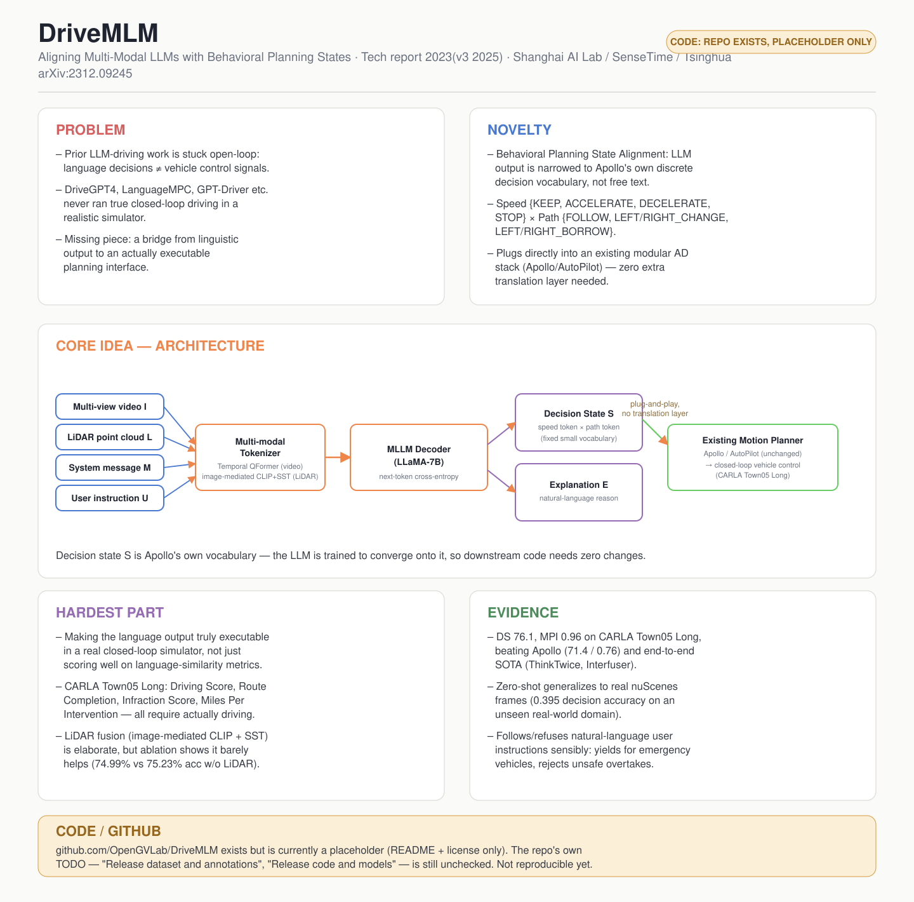

# DriveMLM: Aligning Multi-Modal Large Language Models with Behavioral Planning States for Autonomous Driving

- **Venue / year:** Technical report, 2023 (v3: Dec 2025) — Shanghai AI Lab / SenseTime / Tsinghua / CUHK / Shanghai Jiao Tong
- **Authors:** Erfei Cui, Wenhai Wang, Zhiqi Li, Jiangwei Xie, Haoming Zou, Hanming Deng, Gen Luo, Lewei Lu, Xizhou Zhu, Jifeng Dai
- **Link:** https://arxiv.org/abs/2312.09245
- **Local PDF:** `papers/autonomous_driving_moe/2312.09245v3.pdf`
- **paper_matrix.csv id:** `drivemlm`
- **Code:** https://github.com/OpenGVLab/DriveMLM (**占位仓库,代码和数据集尚未放出**, 见下)
- **Input / 输入:** 多视角视频 I + LiDAR 点云 L + system message M(任务定义/交通规则/决策词表)+ 用户指令 U(文本)
- **Output / 输出:** 离散决策状态 token S(speed × path,如 KEEP/ACCELERATE × FOLLOW/LEFT_CHANGE)+ 自然语言解释 E;S 直接送入现成运动规划模块(Apollo/AutoPilot)产生车辆控制信号

## 中文精读

### 1. 解决了什么问题

在 DriveMLM 之前,已经有一批工作(DriveGPT4、LanguageMPC、GPT-Driver 等)让 LLM(Large Language Model,大语言模型)输出自然语言驾驶决策,但这些工作都**没能在真正的闭环(closed-loop,系统的输出会实际影响下一步输入、需要连续实时应对——对应的是"开环 open-loop":只是单次评测输出好不好,不会真的接着往下开)仿真器里跑起来**。根因很直接:LLM 吐出来的是"我应该左转"这种自然语言或者自由格式的文本,这种输出没法直接转换成车辆的转向/油门/刹车控制信号,中间缺一层"翻译"。

DriveMLM 要解决的问题就是这层翻译:怎么把 LLM 的语言决策,严丝合缝地接入一个**已经能开车的传统模块化系统**(如 Apollo、AutoPilot),做到真正的闭环控制,而不是停留在开环的"看图说话"评测。

### 2. 新意在哪里

核心新意是**行为规划状态对齐(Behavioral Planning States Alignment)**:不让 LLM 自由生成语言或直接回归轨迹点,而是把 Apollo 系统本身的行为规划模块的决策空间,**离散化、收窄成一个固定的小词表**——

- Speed 决策:`KEEP / ACCELERATE / DECELERATE / STOP`
- Path 决策:`FOLLOW / LEFT_CHANGE / RIGHT_CHANGE / LEFT_BORROW / RIGHT_BORROW`

LLM 每一帧只需要在这两个小集合里各选一个 token(词元/标记——语言模型处理文本的最小单位,可以是一个词、一个子词,这里被限制成只能是"KEEP"这样的固定选项),这个 token 直接就是 Apollo 下游运动规划模块能吃的输入格式,不需要额外的解析或转换层。这比 DriveVLM 那种"生成连续 waypoints"的路线更"硬核地即插即用"——本质上是牺牲了输出的自由度和表达力,换来了和现有工业级系统的无缝对接。

第二个新意在 3.4 节的**高效数据引擎**:280 小时 CARLA 驾驶数据,如果要逐帧人工标注决策状态和解释文本,成本极高。他们用专家(人类司机或 agent)在设计好的 30 类高难度场景里开车,决策状态用**硬编码规则**从轨迹自动反推标注,解释文本先按场景要素自动生成模板,再用人工 + GPT-3.5 扩充多样性——用自动化把最贵的两类标注(逐帧决策状态、从零手写解释)都规避掉了。

### 3. Idea 具体落在哪里

最核心的落点是 **Fig.3 的 MLLM(Multi-modal LLM,多模态大语言模型——比普通文本 LLM 多了处理图像/点云等其他模态输入的能力)Planner** 和 **3.2 节的 alignment(对齐)设计**:

- 多视角时序图像用一个 **Temporal QFormer**(Query Transformer,一种用一组可学习的"查询向量"去有选择地从视觉特征里提炼信息、从而压缩 token 数量的模块)处理(每个视角单独做时序融合,再拼接),而不是把所有时刻所有视角的 token 直接拼接——消融实验(ablation study,通过逐个去掉/替换某个模块来验证它到底有没有用的实验)(Table 5)显示这样在 token 数量更少的情况下效果反而更好(+7.4% 相对提升)。
- LiDAR(激光雷达,通过发射激光测距生成三维点云 point cloud 的传感器)数据的对齐很巧妙:因为没有"点云-文本"配对数据,他们借图像做中介——用冻结的 CLIP(Contrastive Language-Image Pretraining,对比语言-图像预训练模型)图像编码器产生目标特征,训练一个 LiDAR 编码器(SST,Single-stride Sparse Transformer)通过余弦相似度损失去逼近对应图像的 CLIP 特征,间接把 LiDAR 特征映射进语言模型认识的特征空间。
- System message(系统消息,对话开始时预先设定、模型必须遵守的背景指令)里显式塞入决策状态的定义(Fig.4),相当于把"选择题的选项"直接写进 prompt(提示词),再配合 cross-entropy(交叉熵损失,分类任务最常用的训练损失函数)+ next-token prediction(逐词预测下一个 token 的训练方式,是语言模型最基本的训练目标)训练,让模型收敛到固定的决策 token 上。

### 4. 最大难点在哪里

不在于把 LLM 接上视觉编码器这种常规操作,而在于两处:

- **让语言输出真正可控、可执行**——这是这篇论文存在的意义,也是它和一大批"只做开环语言决策评测"的前作的本质区别。为此要设计数据引擎、要在 CARLA 里实际跑 30 类场景 × 200 触发点、要用 Driving Score(驾驶得分)/ Route Completion(路线完成率)/ Infraction Score(违规扣分)/ MPI(Miles Per Intervention,平均每次人工接管之间能自动驾驶多远,工业界常用的安全性指标)这些闭环指标而不是语言相似度指标去验证。
- **多模态对齐的性价比其实存疑**:消融表 5 显示,加入 LiDAR(PC)对准确率几乎没有提升(74.99% vs 不加 PC 的 75.23%,反而略降),论文自己也坦言这可能是 SST 和 MLLM decoder 之间表征差距太大导致的。这说明"看起来该有用的模态融合设计"不一定真的有用,工程上砸了不少复杂度(独立训练一个 image-LiDAR CLIP)却没换来对应的收益——这是一个值得记住的教训:做消融实验、别想当然。

### 5. 和 DriveVLM 的关系(同一批老师给的方向下两篇互补的论文)

| | DriveVLM | DriveMLM |
|---|---|---|
| 关注点 | 场景理解的丰富度(长尾物体、语义链条) | 决策的可执行性(能不能真正开环仿真闭环跑) |
| 输出形式 | 连续 waypoints(语言链条→坐标) | 离散决策 token(收窄到固定小词表) |
| 落地方式 | 额外训练一个传统规划器做快慢双系统融合 | 直接复用 Apollo 原有的行为规划下游接口 |
| 评测 | nuScenes 开环规划指标 + 自建 SUP-AD 数据集 | CARLA 闭环仿真(Driving Score/MPI) |

两篇合起来看更清楚:一个偏"看懂路况",一个偏"能不能真开车",都在解决 VLM/LLM 落地自动驾驶时"语言输出→车辆控制"这道鸿沟,只是切入点不同。

### 6. 是否能连 GitHub

**有仓库,但目前是空壳。** https://github.com/OpenGVLab/DriveMLM 上只有 README、图片素材和 Apache 2.0 license,仓库自己的 TODO 列表写着"Release dataset and annotations"和"Release code and models"**均未完成**。目前无法拉下来训练或复现,只能作为架构参考。论文正文也写"数据集可向通讯作者合理索取",不是公开自动分发。

### 7. 关键原文摘录(中英对照)

**① 全文的论点陈述,一句话找到贡献(Abstract)**
> "we bridge the gap between the language decisions and the vehicle control commands by standardizing the decision states according to the off-the-shelf motion planning module."

中译:我们通过依照现成的运动规划模块来标准化决策状态,弥合了语言决策与车辆控制指令之间的鸿沟。
解读:"standardizing the decision states"(标准化决策状态)就是"行为规划状态对齐"这个核心设计的官方说法。精读一篇论文,第一步就是要能从摘要里精确挑出这一句"方法论核心句",而不是记住摘要的整体印象。

**② thesis statement(Section 1 结尾)**
> "This motivates us to align the LLM with the decision state of the behavioral planning module, and further design an LLM-based close-loop AD system that can run on real-world environments or realistic simulators by using the aligned LLM for behavioral planning."

中译:这促使我们将 LLM 与行为规划模块的决策状态对齐,并进一步设计一个基于 LLM 的闭环自动驾驶系统,用这个对齐后的 LLM 做行为规划,使其能在真实环境或仿真器中运行。
解读:这是整篇论文的 thesis statement(论点陈述)——上面①是摘要里的浓缩版,这里是引言里的展开版,两句话互相印证,说明这确实是作者反复强调的核心,不是我过度解读。

**③ 决策空间的精确定义(Section 3.2)**
> "the speed decision states contain [KEEP, ACCELERATE, DECELERATE, STOP], while the path decision states include [FOLLOW, LEFT CHANGE, RIGHT CHANGE, LEFT BORROW, RIGHT BORROW]."

中译:速度决策状态包含 [KEEP, ACCELERATE, DECELERATE, STOP],路径决策状态包含 [FOLLOW, LEFT CHANGE, RIGHT CHANGE, LEFT BORROW, RIGHT BORROW]。
解读:精读时不能满足于"离散决策空间"这种概括,必须精确到这 9 个具体 token——因为"这个词表多大、多细"直接决定了这个方法的表达力上限,是评价这篇论文设计取舍的关键数字。

**④ 消融实验里的"反差句"(Section 4.5 讨论,对应 Table 5)**
> "Point clouds do not show the ability to enhance performance."

中译:点云并未表现出提升性能的能力。
解读:这句话和摘要/方法部分强调"多模态融合"(图像+LiDAR)的正面叙事形成明显反差——论文投入了整整一段(3.3 节)去设计 image-mediated CLIP+SST 的 LiDAR 对齐方案,最后消融实验却说这个模态"没用"。精读时,这种"方法部分很得意、消融部分很诚实"的反差句,往往比任何一句正面结论都更值得划线——它暴露了论文自己也没解决的问题。

**⑤ 闭环结果的因果解释(Section 4.4)**
> "DriveMLM surpasses all other methods on Driving Score by a large margin. This suggests that DriveMLM is better for handling state-transitions to safely drive through hard cases."

中译:DriveMLM 在 Driving Score 上大幅超越所有其他方法,这说明 DriveMLM 更擅长处理状态转移、安全通过高难度场景。
对应数字:Table 4,DriveMLM 的 Driving Score 是 76.1,对比 Apollo 71.4、ThinkTwice 70.9、Interfuser 68.3——第一句"大幅超越"有数字支撑,但第二句"更擅长处理 hard cases"是作者的推断(inference),论文并没有专门做"仅在 hard case 子集上"的对比实验来直接验证这个归因,精读时要把"数据能直接证明的"和"作者合理但未直接验证的推断"分开看。

---

## English at-a-glance summary

### 图解读 Diagram walkthrough

海报中间 "CORE IDEA — ARCHITECTURE" 那张图对应论文 Figure 3(DriveMLM framework),按数据流顺序读:

1. 左边四个蓝色小框是四路输入,**同时**喂入,不是顺序处理:多视角视频 I、LiDAR 点云 L、系统消息 M(任务定义 + 交通规则 + 决策词表定义)、用户指令 U(比如"我赶时间,能超车吗")。
2. 全部汇入橙色的 **Multi-modal Tokenizer**——这是整个架构里工程量最大的部分:视频走 Temporal QFormer 做时序融合;LiDAR 走"image-mediated CLIP + SST"(前面④的反差句提醒我们:这部分虽然设计精巧,消融实验却证明它对最终效果几乎没贡献);系统消息和用户指令直接走普通文本 token 化。
3. 所有模态的 token 一起送进橙色的 **MLLM Decoder (LLaMA-7B)**,用标准的 next-token 交叉熵训练——没有什么特殊的多模态融合损失函数,融合的工作全部由第 2 步的 tokenizer 完成。
4. Decoder 的输出分叉成两个紫色框:**Decision State S**(speed token × path token,真正参与控制的核心产物)和 **Explanation E**(自然语言解释,只用于可解释性和人机交互,不参与闭环控制回路)。
5. 只有 Decision State S 会继续往右送进绿色的 **Existing Motion Planner**(Apollo/AutoPilot,这部分代码完全不改动);图上橙色小字 "plug-and-play, no translation layer" 强调的正是这一步——S 不需要任何额外解析,直接就是 Apollo 认识的输入格式。
6. 最终由这个未经改动的传统规划器闭环控制车辆。这也是全文的核心论点在架构图里的体现:创新点不在"造一个新的规划器",而在"让 LLM 的输出长得和现成规划器的输入一模一样"。

### English at-a-glance table(中英对照)

| Aspect 方面 | Summary |
|---|---|
| **Problem 问题** | Prior LLM-for-driving work (DriveGPT4, LanguageMPC, GPT-Driver, etc.) only produces free-form language decisions that cannot be converted into vehicle control signals — none of them run true closed-loop driving in a simulator. 此前的 LLM 驾驶工作(DriveGPT4、LanguageMPC、GPT-Driver 等)只能生成自由格式的语言决策,无法转换成车辆控制信号——没有一个真正在闭环仿真器里跑起来过。 |
| **Novelty 新意** | *Behavioral Planning States Alignment*: instead of free text or continuous waypoints, the LLM's decision space is narrowed to a small fixed vocabulary — speed `{KEEP, ACCELERATE, DECELERATE, STOP}` and path `{FOLLOW, LEFT_CHANGE, RIGHT_CHANGE, LEFT_BORROW, RIGHT_BORROW}` — that plugs directly into an existing modular AD system's (Apollo/AutoPilot) motion-planning input, with zero extra translation layer. *行为规划状态对齐*:不用自由文本或连续轨迹点,而是把 LLM 的决策空间收窄成一个固定小词表——速度 `{KEEP, ACCELERATE, DECELERATE, STOP}` 和路径 `{FOLLOW, LEFT_CHANGE, RIGHT_CHANGE, LEFT_BORROW, RIGHT_BORROW}`——直接插入现有模块化系统(Apollo/AutoPilot)的运动规划输入,零额外转换层。 |
| **Core idea 核心想法** | MLLM planner = multi-modal tokenizer (temporal QFormer for multi-view video; image-mediated CLIP alignment for LiDAR, since no point-cloud/text pairs exist) + MLLM decoder trained with next-token cross-entropy to emit a decision-state token + explanation. MLLM planner = 多模态分词器(视频用 Temporal QFormer;LiDAR 借图像做中介做 CLIP 对齐,因为没有点云-文本配对数据)+ 用 next-token 交叉熵训练的 MLLM 解码器,输出决策状态 token + 解释。 |
| **Data engine trick 数据引擎技巧** | 280h of CARLA driving across 30 hand-designed safety-critical scenarios; decision states auto-labeled from expert trajectories via hand-crafted rules (no frame-by-frame human annotation); explanations auto-generated from scene elements, then diversified with GPT-3.5 + light human refinement. 280 小时 CARLA 驾驶数据,覆盖 30 类人工设计的高危场景;决策状态用硬编码规则从专家轨迹自动反推标注(无需逐帧人工标注);解释文本先按场景要素自动生成,再用 GPT-3.5 + 少量人工润色扩充多样性。 |
| **Hardest part 最大难点** | (1) Making the language output actually *executable* in a real closed-loop simulator (CARLA Town05 Long, Driving Score/Route Completion/Infraction Score/MPI) rather than just scoring well on language-similarity metrics. (2) The LiDAR fusion pipeline (image-mediated CLIP + SST encoder) is elaborate but the ablation shows point clouds barely help (74.99% vs 75.23% accuracy) — a caution against assuming a modality-fusion design pays off just because it "should." (1) 让语言输出在真正的闭环仿真器(CARLA Town05 Long,用 Driving Score/路线完成率/违规扣分/MPI 评测)里可执行,而不只是语言相似度打分好看。(2) LiDAR 融合流程(image-mediated CLIP + SST 编码器)设计精巧,但消融显示点云几乎没帮助(74.99% vs 不加点云的 75.23%)——提醒我们不能想当然地认为"看起来该有用的模态融合"就一定有用。 |
| **Evidence 证据** | DS 76.1 / MPI 0.96 on CARLA Town05 Long, beating Apollo (71.4/0.76) and end-to-end SOTA (ThinkTwice, Interfuser). Also shows zero-shot generalization on real nuScenes frames and responds sensibly to natural-language user instructions (yields for emergency vehicles, refuses unsafe overtakes). 在 CARLA Town05 Long 上 DS 76.1 / MPI 0.96,超过 Apollo(71.4/0.76)和端到端 SOTA(ThinkTwice、Interfuser)。在真实 nuScenes 画面上展现零样本泛化能力,也能合理响应自然语言用户指令(为救护车让道、拒绝不安全的超车请求)。 |
| **Relation to DriveVLM 与 DriveVLM 的关系** | Complementary halves of the same "VLM/LLM → driving" gap: DriveVLM optimizes scene *understanding* (rich CoT, continuous waypoints, its own SUP-AD benchmark); DriveMLM optimizes decision *executability* (discrete state tokens wired directly into an existing modular pipeline, evaluated closed-loop in CARLA). 是同一道"VLM/LLM → 驾驶"鸿沟的互补两半:DriveVLM 优化场景*理解*(丰富的思维链、连续轨迹点、自建 SUP-AD 基准);DriveMLM 优化决策*可执行性*(离散状态 token 直接接入现有模块化系统,在 CARLA 里闭环评测)。 |
| **Code / GitHub 代码开源情况** | Repo exists (**github.com/OpenGVLab/DriveMLM**) but is currently a placeholder — README + license only; the repo's own TODO list ("Release dataset and annotations", "Release code and models") is **still unchecked**. Not reproducible yet. 仓库存在(**github.com/OpenGVLab/DriveMLM**)但目前只是空壳——只有 README 和 license;仓库自己的 TODO("发布数据集和标注"、"发布代码和模型")**都还没勾选**。目前无法复现。 |
