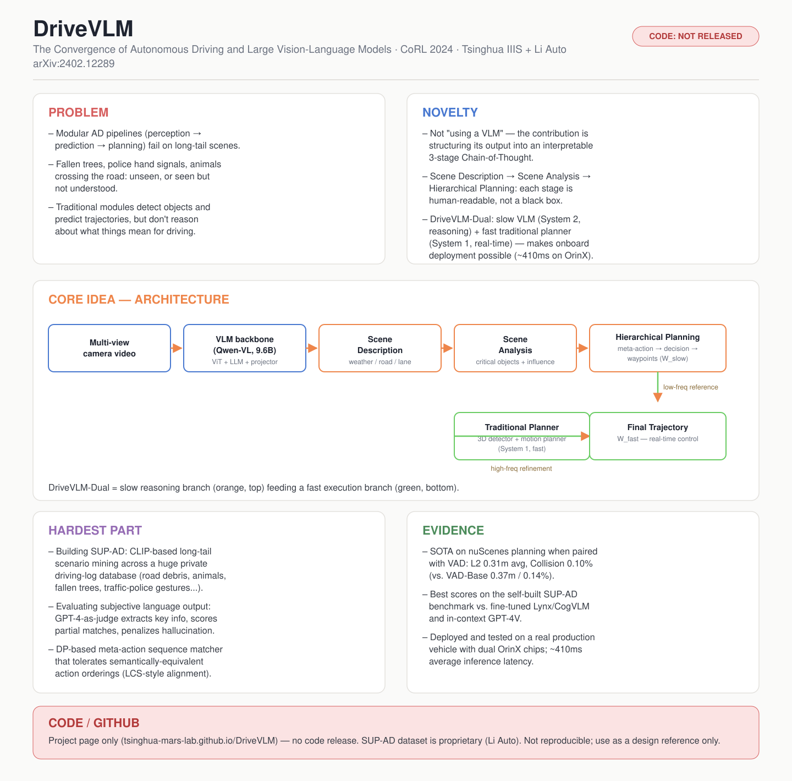

# DriveVLM: The Convergence of Autonomous Driving and Large Vision-Language Models

- **Venue / year:** CoRL 2024
- **Authors:** Xiaoyu Tian, Junru Gu, Bailin Li, Yicheng Liu, Yang Wang, Zhiyong Zhao, Kun Zhan, Peng Jia, Xianpeng Lang, Hang Zhao (Tsinghua IIIS + Li Auto)
- **Link:** https://arxiv.org/abs/2402.12289
- **Local PDF:** `papers/autonomous_driving_moe/2402.12289v5.pdf`
- **paper_matrix.csv id:** `drivevlm`
- **Input / 输入:** 多路环视摄像头视频(multi-view camera video,多个历史时间步)
- **Output / 输出:** 三段式 CoT 文本(场景描述 + 场景分析 + meta-action/决策描述)+ 最终轨迹点 W_fast(DriveVLM-Dual 里由传统规划器高频输出)

## 中文精读

### 1. 解决了什么问题

传统自动驾驶 pipeline(处理流水线)是"感知→预测→规划"三段式,每段都是专门的神经网络模块。这套系统的死穴在于**长尾场景理解(long-tail scenario understanding)**——"长尾"指现实中占比很小但种类繁多、几乎不可能在训练数据里穷举的稀有场景:路上突然倒下一棵树、警察打手势指挥、一群牛横穿马路——传统感知模块要么没见过(检测不出来),要么检测到了也不知道这个物体对驾驶决策意味着什么。传统系统擅长"看见物体、预测轨迹",不擅长"理解语义、做常识推理"。

DriveVLM 要解决的问题是:能不能把 VLM(Vision-Language Model,视觉-语言大模型——把视觉编码器和大语言模型拼在一起、既能看图又能推理的大模型)的看图说话 + 推理能力,直接转化成自动驾驶可用的场景理解和规划输出?

### 2. 新意在哪里

新意不是"用了 VLM"(2024 年已不算新),而是**把 VLM 的输出结构化成一条可执行的规划链条**,一个三段式 Chain-of-Thought(CoT,思维链——让模型把推理过程拆成一步步中间输出,而不是直接跳到答案):

场景描述(天气/道路/车道)→ 场景分析(关键物体的静态属性/运动状态/特殊行为 + 对自车的"影响")→ 分层规划(hierarchical planning:meta-action〔元动作,如"减速""变道"这类粗粒度动作单元〕→ 决策描述 → 具体轨迹点/waypoints)

第二个新意是 **DriveVLM-Dual**:VLM 推理慢(几百毫秒级),没法实时开车。把 VLM 当"慢系统"(对应 Kahneman 双过程理论里的 System 2,即系统2慢思考)生成粗轨迹作参考,再用传统快速规划器(对应 System 1,系统1快思考)做高频微调,这个"快慢双系统"设计是论文能上真车的关键。

### 3. Idea 具体落在哪里

最值得学的是 **3.4 节分层规划**:不直接让 VLM 吐出精确坐标,而是先生成 17 类离散 meta-action(如"减速""变道左"),再生成带主语/动作/时长的决策描述,最后才生成轨迹点。本质是给 VLM 的推理搭"脚手架"——让语言模型在它擅长的抽象决策层面发挥,把精确数值层面交给最后一步或交给 DriveVLM-Dual 里的传统规划器。

### 4. 最大难点在哪里

不在模型结构,而在 **Section 4(数据集构建)和 Appendix B(评估指标)**:

- 长尾场景怎么挖?用 CLIP(Contrastive Language-Image Pretraining,对比语言-图像预训练——一个能把图片和文字映射到同一向量空间、从而支持"用一句话搜图"的模型)做语言查询检索,从海量行车记录里挖"路障""动物横穿"等稀有场景,工程量很大。
- 怎么评估"用语言描述场景"对不对?场景描述没有唯一正确答案,没法字符串匹配。他们用 GPT-4 当裁判(这类做法业内统称 LLM-as-judge,用大模型代替人工评分),把生成描述和标准答案拆成"关键信息点"逐点打分、幻觉(hallucination,模型编造出输入里没有的信息)倒扣分。meta-action 序列用改造版最长公共子序列(Longest Common Subsequence, LCS)动态规划(Dynamic Programming, DP),还要处理语义等价的不同表达。
- 这套评估体系的可信度很大程度依赖 GPT-4 打分器本身——这是所有"语言化输出"论文共同的软肋。

### 5. 局限 / 对我项目的相关性

- 驾驶场景理解,不是 MoE(Mixture of Experts,混合专家——用一个路由/门控网络把输入分派给不同"专家"子网络处理的架构),也不是 time-series/traffic imputation(时间序列/交通数据插补)。核心可迁移的不是方法而是**设计范式**:用"结构化中间表示"把黑箱模型的输出拆成可解释的阶段。
- 对老师的长期 modular AD MoE 方向有用:DriveVLM-Dual 的"慢系统(语言/推理)+ 快系统(数值/实时)"分工,和后续 gated LoRA / expert routing 的"专家做认知、backbone 做执行"思路是同一类设计哲学。

### 6. 是否能连 GitHub

**不能直接复现。** 有项目主页(`tsinghua-mars-lab.github.io/DriveVLM`),但代码和 SUP-AD 数据集都未开源(SUP-AD 是理想汽车内部专有数据)。只能作为架构设计参考,不能拉仓库跑起来。

### 7. 关键原文摘录(中英对照)

精读不能只转述大意,要能精确定位到"这句话原文是怎么说的"。以下几句是我认为整篇论文里信息密度最高、最值得背下来的原句。

**① 论文的自我定位(Abstract)**
> "We introduce DriveVLM, an autonomous driving system leveraging Vision-Language Models (VLMs) for enhanced scene understanding and planning capabilities."

中译:我们提出 DriveVLM,一个利用视觉-语言大模型(VLM)来增强场景理解与规划能力的自动驾驶系统。
解读:注意用词是 **system**,不是 model 或 method——作者从一开始就把自己定位成"一整套系统"而非单一算法创新,这也解释了为什么论文花大篇幅讲部署工程(Section 6),而不只是模型结构。

**② DriveVLM-Dual 存在的全部理由(Section 1)**
> "While VLMs excel in visual understanding, they have limitations in spatial grounding and reasoning, and their computational intensity poses challenges for onboard inference speed."

中译:虽然 VLM 在视觉理解上表现出色,但它们在空间定位(spatial grounding)与推理方面存在局限,且其计算量对车载推理速度构成挑战。
解读:这句话比摘要里的正面宣传更重要——这是作者自己承认的方法论边界。精读时看到"我们方法很强"要打个问号,看到"但是……存在局限"这种句子才是真正定义了这个方法能用在哪、不能用在哪。

**③ 双系统设计的类比(Section 1)**
> "This dual system design, akin to the human brain's slow and fast thinking processes, adapts efficiently to varying complexity in driving scenarios."

中译:这种双系统设计类比人脑的"慢思考"与"快思考"过程,能够高效适应驾驶场景中不同的复杂程度。
解读:这是一个类比(analogy),不是严谨的理论证明。精读时要分清楚论文里哪些话是"有实验支撑的结论",哪些话是"帮助读者理解动机的比喻"——这句属于后者,不能当成 DriveVLM-Dual 有效性的证据来引用,证据要看 Table 2/3/4 的具体数字。

**④ 评估公式本身(Appendix B.1, Eq. 2)**
> Score = (1.0 × n_matched + 0.5 × n_partial) / n_gt − 0.25 × n_hallucination / n_gt

解读:匹配信息记 1.0 分、部分匹配记 0.5 分,而幻觉信息只倒扣 0.25 分——扣分权重只有满分奖励的 1/4。这说明作者对"模型编造额外信息"的容忍度其实不算严苛,这套指标本质上更鼓励"多说以覆盖更多关键信息"而不是"保守但精确"。这是读公式才能发现的细节,读文字摘要发现不了。

**⑤ 消融实验的具体因果链(Section 5.3, Table 3)**
> "The inclusion of critical object analysis enables our model to identify and prioritize important elements in the driving environment, enhancing the decision-making accuracy for safer navigation."

中译:加入关键物体分析模块,能让模型识别并优先处理驾驶环境中的重要元素,从而提高决策准确性、让导航更安全。
对应数字:Table 3 显示 Base-only 的碰撞率是 0.36%,加入 critical object analysis(CO)后降到 0.35%,再加入 3D 感知后进一步降到 0.27%。这句话和①②③不同——它不是叙事性说明,而是能在表格里找到直接对应数字的"可核实结论"。精读的关键动作就是分清楚论文里哪些话是"可核实结论"、哪些是"叙事性说明",而不是把两者一视同仁地照单全收。

---

## English at-a-glance summary

### 图解读 Diagram walkthrough

海报中间 "CORE IDEA — ARCHITECTURE" 那张图对应论文 Figure 1 和 Section 3 的完整流程,按数据流顺序读:

1. 最左边 **Multi-view camera video** 是原始输入——多路环视摄像头拍到的图像序列,不是单目相机。
2. 进入 **VLM backbone (Qwen-VL, 9.6B)**:96 亿参数的视觉语言模型,由视觉编码器(ViT)+ 投影层 + 语言模型(LLM)组成,把图像变成语言模型能读的 token。
3. 蓝色框之后是三个橙色框,对应论文 3.2–3.4 节的三段式 CoT,而且是**严格顺序依赖**的——后一步的 prompt 里会包含前一步的输出:先 **Scene Description**(纯描述性,回答"路况是什么样"),再 **Scene Analysis**(开始做判断,回答"这些物体会怎么影响我"),最后 **Hierarchical Planning**(真正的决策:meta-action 序列 + 决策描述 + 轨迹点 W_slow)。
4. 图下半部分是 DriveVLM-Dual 分支(绿色):Hierarchical Planning 产出的 **W_slow**(低频轨迹参考)被送进 **Traditional Planner**(传统 3D 检测器 + 运动规划器,完全不涉及 VLM),生成更高频、更精细的 **W_fast**。
5. 最下面的灰字提醒:橙色分支(VLM 慢系统)负责"想清楚该怎么开",绿色分支(传统规划器快系统)负责"以毫秒级频率把车稳稳开出去"——两者异步运行,VLM 大约每几百毫秒才更新一次决策,传统规划器在这期间持续输出多帧轨迹去追踪那个参考点。

### English at-a-glance table(中英对照)

| Aspect 方面 | Summary |
|---|---|
| **Problem 问题** | Traditional perception→prediction→planning pipelines fail on long-tail scenes (fallen trees, police hand signals, animals crossing) because they lack semantic/common-sense reasoning. 传统"感知→预测→规划"三段式管线在长尾场景(倒伏的树、警察手势、动物穿行)上会失效,因为它们缺乏语义/常识推理能力。 |
| **Novelty 新意** | Structures a VLM's output into an interpretable 3-stage Chain-of-Thought (scene description → scene analysis → hierarchical planning) instead of an end-to-end black box. 把 VLM 的输出组织成可解释的三段式思维链(场景描述→场景分析→分层规划),而不是一个端到端的黑箱。 |
| **Core idea 核心想法** | Hierarchical planning as a scaffold: meta-actions (17 discrete categories) → decision description → waypoints, letting the LLM reason at the abstract level while numeric precision is handled downstream. 分层规划相当于给推理搭"脚手架":17 类离散 meta-action → 决策描述 → 轨迹点,让语言模型在抽象决策层面发挥,精确数值留给下游处理。 |
| **Key engineering trick 关键工程技巧** | DriveVLM-Dual: a slow VLM branch (System 2, low-frequency reference trajectory) + a fast traditional planner (System 1, high-frequency refinement) — makes onboard real-time deployment possible (~410ms on OrinX). DriveVLM-Dual:慢速 VLM 分支(系统2,低频参考轨迹)+ 快速传统规划器(系统1,高频微调)——使车载实时部署成为可能(OrinX 上约 410 毫秒)。 |
| **Hardest part 最大难点** | Building the SUP-AD dataset (CLIP-based long-tail scenario mining) and designing a GPT-4-based evaluation protocol for subjective scene descriptions + a DP-based meta-action sequence matcher. 构建 SUP-AD 数据集(基于 CLIP 的长尾场景挖掘),以及为主观性很强的场景描述设计基于 GPT-4 的评估协议 + 基于动态规划的 meta-action 序列匹配器。 |
| **Evidence 证据** | SOTA on nuScenes planning (L2/collision) when paired with VAD; deployed and tested on a production vehicle. 与 VAD 搭配时在 nuScenes 规划任务(L2/碰撞率)上达到 SOTA;已部署到量产车上实测。 |
| **Limitation for our project 对我项目的局限** | Vision-language driving system, not MoE, not time-series/traffic imputation. Transferable value is the *design pattern* (structured intermediate representations, slow/fast dual system), not the method itself. 视觉语言驾驶系统,不是 MoE,也不是时间序列/交通插补。可迁移的价值是*设计范式*(结构化中间表示、快慢双系统),而不是方法本身。 |
| **Code / GitHub 代码开源情况** | **Not released.** Project page only (`tsinghua-mars-lab.github.io/DriveVLM`); SUP-AD dataset is proprietary (Li Auto). Cannot be cloned/reproduced. **未开源。** 只有项目主页;SUP-AD 数据集是理想汽车的专有数据。无法拉取代码复现。 |
