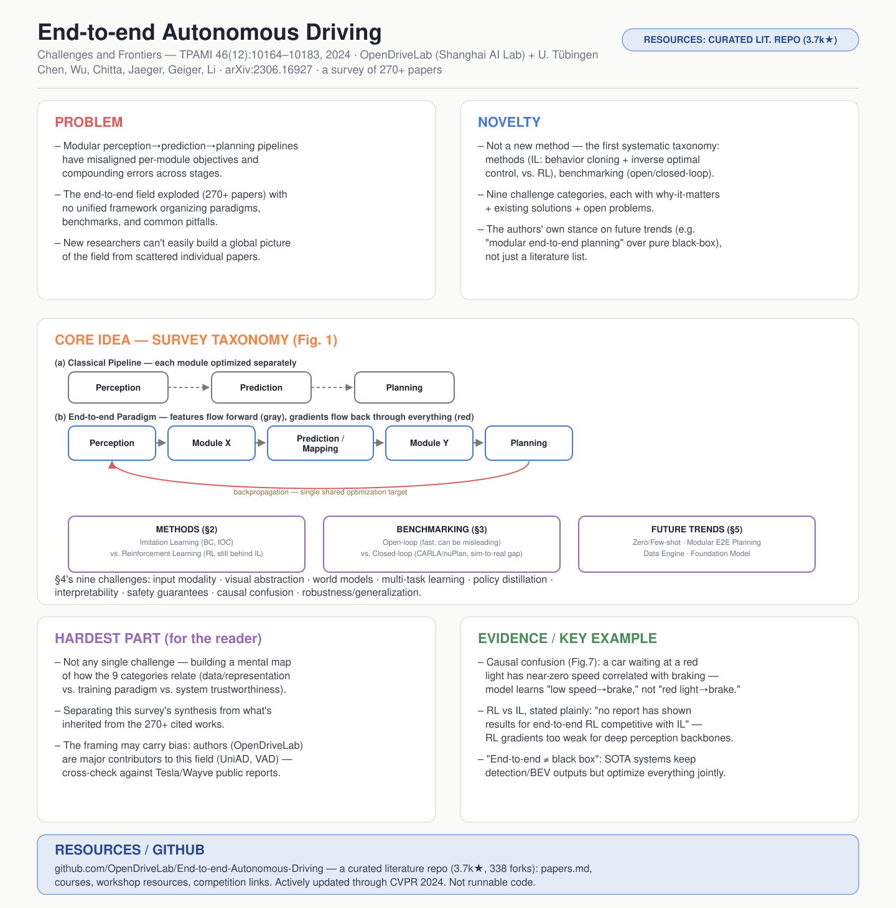

# End-to-end Autonomous Driving: Challenges and Frontiers

- **Venue / year:** IEEE Transactions on Pattern Analysis and Machine Intelligence (TPAMI) 46(12):10164–10183, 2024(初版 arXiv 2023)
- **Authors:** Li Chen, Hongyang Li(OpenDriveLab, 上海人工智能实验室 + 香港大学)· Penghao Wu(OpenDriveLab)· Kashyap Chitta, Bernhard Jaeger, Andreas Geiger(图宾根大学 + 图宾根 AI 中心)
- **Link:** https://arxiv.org/abs/2306.16927(v3, 2024-08-15)
- **来源说明:** 通过 arXiv 下载全文(2306.16927v3),用 `pdftotext` 提取原文逐句核对。
- **paper_matrix.csv id:** 无(不在 matrix 里,是自己额外找的一篇——不是具体方法/系统论文,是一篇**综述**,给整个端到端自动驾驶领域搭框架)
- **Code / 资源:** https://github.com/OpenDriveLab/End-to-end-Autonomous-Driving(**已核实:一个持续维护的精选文献仓库,不是可运行代码**——含分类整理的论文列表 `papers.md`、入门课程/讲座、CVPR/ICRA/NeurIPS workshop 资料、竞赛信息,3.7k stars、338 forks,截至最新还在更新 CVPR 2024 相关内容)
- **Input / 输入:** 这篇论文本身的"输入"是 270+ 篇端到端自动驾驶相关论文;它定义/讨论的对象——端到端自动驾驶系统——输入是原始传感器数据(相机/LiDAR/雷达等)
- **Output / 输出:** 这篇综述的"输出"是一套方法论分类(模仿学习/强化学习)+ 评测框架(开环/闭环)+ 九大挑战清单 + 未来趋势判断,外加一个持续更新的文献仓库;它讨论的端到端系统的输出是规划轨迹和/或底层控制指令(转向、加速度)

## TL;DR 浓缩版

**问题** → 自动驾驶该不该用一个可端到端联合训练的整体系统,取代"感知→预测→规划"分模块拼接的传统流水线?

**Gap** → 这个方向的论文数量暴增(270+ 篇),但研究者各自为战——用什么范式(模仿学习/强化学习)、怎么评测(开环/闭环)、会踩哪些共同的坑(多模态融合、可解释性、因果混淆、鲁棒性、世界模型),此前没有一个统一框架去梳理,新人很难建立全局图景。

**Novelty** → 不是提出新方法,而是**第一次对整个领域做系统性分类整理**:把方法论分成模仿学习(行为克隆 + 逆最优控制)和强化学习,把评测分成开环/闭环,把挑战归纳成九大类,每类都配上"为什么重要 + 现有解法 + 仍未解决的部分",外加作者自己对未来趋势的判断。

**核心洞察** → 端到端范式的核心卖点不是"模型更花哨",而是让所有模块共享同一个最终优化目标(驾驶安全/舒适)、可联合反向传播,避免模块化流水线里"每个模块各自优化局部指标、误差逐级累积"的问题;但"端到端"不等于"纯黑箱",可以保留检测框、BEV 分割这类中间输出——关键是优化目标是否统一,不是模型内部有没有结构。

**方法/论证** → 系统性文献综述,按"方法论(§2)→评测基准(§3)→九大挑战(§4)→未来趋势(§5)"的框架组织,每个挑战小节都给具体反例(比如因果混淆的红灯刹车例子),不是空泛评论。

**结果** → 没有实验结果(这是综述),"结果"是一套被广泛引用的分类框架、挑战清单,以及一个持续更新的开源文献仓库(3.7k 星)。

**意义** → 给刚进入这个方向的研究者提供一张全局地图,不用自己从 270 篇论文里理出头绪,可以直接站在这套框架上定位自己的研究问题属于哪一类挑战、已经有谁在做类似的事。

## 中文精读

### 1. 解决了什么问题(为什么重要)

传统自动驾驶是模块化设计:感知、预测、规划各自独立开发、独立优化。这种设计好调试、可解释性强,但有个根本问题——**各模块的优化目标彼此不统一**:检测模块追求 mAP(平均精度),规划模块追求驾驶安全和舒适,整个系统并没有对齐到"开好车"这一个最终目标上;而且误差会随着流水线逐级传递、累积放大,多模型部署也比单一网络更吃计算资源。

端到端自动驾驶应运而生,论文给出精确定义:

> "We define end-to-end autonomous driving systems as fully differentiable programs that take raw sensor data as input and produce a plan and/or low-level control actions as output."

这个方向从 2023 年前后开始论文数量暴增,但没人系统梳理过:该用模仿学习还是强化学习?该怎么评测(开环快但可能失真,闭环准但贵)?常见的坑有哪些?这篇综述要解决的问题就是:**给这个快速膨胀但缺乏统一图景的领域,搭一套系统性的分类框架**。

### 2. 最关键的贡献(按重要性排序,附证据)

**① 系统性分类框架本身,这是全文最核心的贡献。** 把方法论分成模仿学习(IL:行为克隆 BC + 逆最优控制 IOC)和强化学习(RL)两大类,评测分成开环/闭环,挑战归纳成九类。证据:第 1.4 节明确写"We provide a comprehensive analysis of end-to-end autonomous driving for the first time";Fig.1"Survey at a Glance"是全文唯一的总览图,把整个框架可视化成一张图。

**② 澄清"端到端 ≠ 纯黑箱"这个常见误解。** 论文明确指出:

> "the end-to-end paradigm does not necessarily indicate one black box with only planning/control outputs. It could have intermediate representations and outputs...In fact, several state-of-the-art systems propose a modular design but optimize all components together to achieve superior performance."

证据:Fig.1(b) 画出的端到端范式里,Perception→Module X→Prediction/Mapping→Module Y→Planning 依然是分阶段的,区别只在于灰色实线(特征在模块间流动)和红色反向传播箭头(整个链路联合优化)——**关键是优化目标统一,不是模型内部没有结构**。

**③ 因果混淆(causal confusion)问题的系统梳理,配一个极具体的反例。** 证据是 Fig.7 那个红灯刹车的例子和对应文字:

> "Driving is a task that exhibits temporal smoothness, which makes past motion a reliable predictor of the next action. However, methods trained with multiple frames can become overly reliant on this shortcut and suffer from catastrophic failure during deployment...This problem is referred to as the copycat problem in some works and is a manifestation of causal confusion, where access to more information leads to worse performance."

翻译:车辆等红灯时车速一直是 0、动作一直是刹车,模型很容易学会"车速低 → 刹车"这条虚假捷径,而不是真正理解"看见红灯 → 刹车"这条因果关系——只有当红灯变绿、车速为 0 但该起步时,这条捷径才会暴露。论文把从 LeCun 1989 年"只用单帧输入避免利用历史车速"到 ChauffeurNet"以 50% 概率随机丢弃历史自车运动信息"等一系列零散的应对方法串成了一条完整脉络。

**④ 未来趋势里的一个明确立场判断:"模块化端到端规划"(Modular End-to-end Planning)。** 证据:第 5.2 节写"This is advocated in recent literature and certain industry solutions (Tesla, Wayve, etc.) have involved similar ideas"——这不是简单罗列文献,是作者结合工业界实践给出的自己的方向判断:未来更可能是"保留一定模块化设计但整体联合优化",而不是纯黑箱端到端。

**⑤ 维护一个持续更新的开源文献库。** 让综述本身能保持"活的"状态,不是发表当天就过时的静态快照——这也是为什么这份笔记的第 6 节要单独核实这个仓库现在(2026 年)还在更新。

### 3. Novelty 具体分类

- **新的问题定义/research question:不算首次提出。** "要不要端到端"这个问题本身不是这篇论文提出的,是整个领域已经在实践的事。这篇论文是**系统化已有的研究方向**,不是开创一个新问题。
- **新的 insight/observation:部分算新。** "端到端不等于纯黑箱"这个澄清、以及因果混淆问题的系统梳理,是作者自己的综合判断,不是单纯罗列;但每个具体 challenge(因果混淆、协变量偏移等)在各自的原始论文里已经被提出过,这里是**归纳整理,不是首次发现**。
- **新的方法/architecture/algorithm:没有。** 这篇论文不提出任何新算法。
- **新的理论:没有。**
- **新的数据集/实验设置:没有。** 综述不做实验。
- **新的应用场景:不直接适用。**

**综合结论:这篇论文的 novelty 类型是"综述/分类框架类贡献"(survey/taxonomy contribution),和前面 8 篇方法/系统论文完全不是一类。** 它的价值不在提出任何单点新东西,而在**系统性整理 + 给出作者自己的立场判断**(比如"模块化端到端优于纯黑箱"这个未来趋势判断)。按你要的分类框架,这最接近"第一次把一个已经存在但分散的研究方向系统化命名和组织"——作者原话就是"comprehensive analysis...for the first time"。

### 4. 哪些内容可以略过

第 2 节里每个具体 IL/RL 子方法的引用(比如哪篇论文用了 DAgger 的哪个变种)——除非要具体复现某个方法,只需记住"IL 分 BC 和 IOC 两类,RL 目前打不过 IL"这个结论。

第 3.2.1–3.2.3 节关于仿真器参数初始化、交通仿真、传感器仿真的具体技术细节——只需记住"闭环仿真是趋势,但仍有 sim-to-real gap"这个结论。

每个 challenge 小节里列举的具体论文引用编号——这篇综述引用了 270+ 篇论文,记住分类框架比记住每篇论文是谁写的更重要。

Acknowledgments 和长达数页的 Reference list。

### 5. 最大难点在哪里

对读者(不是对作者)来说,难点不在理解任何单个 challenge,而在**建立起"这九类挑战之间怎么互相关联"的整体图景**——比如因果混淆(§4.8)和协变量偏移(§4.9.2)看起来是两个独立问题,但都源于"训练分布和部署时遇到的分布不一致";可解释性(§4.6)和安全保证(§4.7)也是相关但不同的两件事(前者是"能不能看懂模型在想什么",后者是"能不能证明模型不会犯致命错误")。读综述容易陷入"每节都懂,但读完不知道整体框架"的状态,精读时要主动去画一张自己的关系图,把这九类挑战按"数据/表示层面的问题"(输入模态、视觉抽象、世界模型)、"训练范式层面的问题"(多任务学习、策略蒸馏)、"系统可信度层面的问题"(可解释性、安全保证、因果混淆、鲁棒性)分组,而不是九个平铺的标题。

### 6. 假设、局限、值得质疑的地方

**论文自己承认的局限**(第 1 节结尾,原文明确写):

> "this review is mainly orchestrated from a theoretical perspective. Engineering efforts such as version control, unit testing, data servers, data cleaning, software-hardware co-design, etc., play crucial roles in deploying the end-to-end technology. Publicly available information regarding the latest practices on these topics is limited."

翻译:这篇综述主要是理论视角的——像版本控制、单元测试、数据服务器、数据清洗、软硬件协同设计这些工程细节,虽然对真正把端到端系统部署上车至关重要,但公开可得的资料很有限,论文没有覆盖。

**值得质疑的地方:这篇综述的作者本身就是这个领域的重度参与者。** OpenDriveLab(上海 AI Lab)团队是 UniAD、VAD 等端到端方法的原创团队,这些工作也出现在这篇综述的引用列表里。这意味着综述在组织框架、强调哪些挑战、判断未来趋势(比如第⑤条"模块化端到端优于纯黑箱")时,难免带有自己研究路线的倾向性,不是完全中立的第三方视角——精读时值得对照读一读其他团队(比如 Wayve、特斯拉的公开技术报告)的观点做交叉验证,而不是把这篇综述的判断当成行业共识。

**隐含假设:** 整篇综述默认"端到端是值得追求的方向",组织逻辑是在论证这个范式的价值和梳理它的障碍,而不是同等力度地论证"模块化流水线在某些场景下可能仍然更优"这个反方观点。

### 7. 是否能连 GitHub

**能,但要澄清期待:这是一个精选文献仓库,不是可运行代码。** 我核实了 https://github.com/OpenDriveLab/End-to-end-Autonomous-Driving :内容是分类整理的论文列表(`papers.md`)、入门课程/讲座资料、CVPR/ICRA/NeurIPS workshop 信息、竞赛链接,3.7k stars、338 forks,还在持续更新(最新到 CVPR 2024 相关内容)。这和前 8 篇的"代码开源情况"评估维度不一样——对综述论文,"开源"衡量的是"这份分类整理有没有持续维护、能不能当活文档用",而不是"能不能拉下来跑"。

---

## English at-a-glance summary

### 图解读 Diagram walkthrough

海报中间的架构图对应论文 **Figure 1**("Survey at a Glance"),这是这份阅读清单里第一张不画"模型数据流",而是画"综述自身分类框架"的图:

1. 最上方 **(a) Classical Pipeline**:感知→预测→规划三个框用虚线箭头连接,代表"只把上一个模块的输出传给下一个模块",每个模块自己独立优化,彼此不共享梯度。
2. 下方 **(b) End-to-end Paradigm**:同样是感知→Module X→预测/建图→Module Y→规划这条链路,但箭头变成灰色实线(代表特征在模块间连续流动,不是离散的检测框/轨迹这种"最终输出"),外加一条红色反向传播箭头贯穿整条链路——这条红色箭头是全图的关键:它意味着最终的规划表现能直接反向传播、调整前面每一个模块的参数,让所有模块朝着同一个目标优化。
3. 下面三个框分别对应论文的三大主体章节:**METHODS(§2)** 把方法论分成模仿学习(行为克隆 + 逆最优控制)和强化学习(至今打不过模仿学习);**BENCHMARKING(§3)** 把评测分成开环(快但可能失真)和闭环(准但贵,还有 sim-to-real gap);**FUTURE TRENDS(§5)** 是作者对下一步方向的判断——零/少样本学习、保留部分模块化的端到端规划、数据引擎、基础模型。
4. 最下方的灰字列出第 4 节的九大挑战类别,这是全文篇幅最长的部分,但海报里用一行文字概括,因为这九类挑战之间的具体细节更适合在中文精读第 5 节的分组讨论里理解,而不是塞进一张图。

### English at-a-glance table(中英对照)

| Aspect 方面 | Summary |
|---|---|
| **Problem 问题** | Should autonomous driving move from a modular perception→prediction→planning pipeline (misaligned per-module objectives, compounding errors) to a jointly-trained end-to-end system? The field has exploded (270+ papers) with no unified framework to organize paradigms, benchmarks, and common pitfalls. 自动驾驶该不该从"感知→预测→规划"模块化流水线(各模块优化目标不统一、误差逐级累积)转向联合训练的端到端系统?这个方向论文暴增(270+篇),但没有统一框架去梳理范式、评测方法和常见陷阱。 |
| **Novelty 新意** | Not a new method — the first systematic taxonomy of the field: methods (imitation learning: behavior cloning + inverse optimal control, vs. reinforcement learning), benchmarking (open-loop vs. closed-loop), and nine challenge categories, each with why-it-matters + existing solutions + open problems, plus the authors' own stance on future trends. 不是新方法——是对这个领域的首次系统性分类:方法论(模仿学习:行为克隆+逆最优控制,vs强化学习)、评测(开环vs闭环)、九大挑战类别,每类都配"为什么重要+现有解法+未解决问题",外加作者自己对未来趋势的判断。 |
| **Core idea 核心想法** | "End-to-end" ≠ "black box": the key is a UNIFIED optimization target with joint backpropagation across modules, not the absence of intermediate representations. Systems can keep detection boxes, BEV segmentation, etc. as intermediate outputs and still be "end-to-end" if gradients flow through the whole pipeline. "端到端"≠"黑箱":关键是跨模块联合反向传播、统一优化目标,不是没有中间表示。系统可以保留检测框、BEV分割等中间输出,只要梯度贯穿整条流水线,依然算"端到端"。 |
| **Hardest part 最大难点(对读者而言)** | Not any single challenge, but building a mental map of how the nine challenge categories relate — e.g. causal confusion and covariate shift both stem from train/deploy distribution mismatch; interpretability and safety guarantees are related but distinct (understanding vs. proving). Group them by data/representation, training paradigm, and system trustworthiness rather than reading nine flat headings. 难点不在任何单个挑战,而在建立九类挑战之间如何关联的整体图景——比如因果混淆和协变量偏移都源于训练/部署分布不一致;可解释性和安全保证相关但不同(理解 vs 证明)。应该按数据/表示、训练范式、系统可信度分组,而不是平铺读九个标题。 |
| **Evidence 证据/例子** | Causal confusion example (Fig.7): a car waiting at a red light has near-zero speed correlated with braking — the model can latch onto "low speed → brake" as a shortcut instead of "red light → brake," which only breaks down when the light turns green. RL vs IL: "no report has shown results for end-to-end training with RL that are competitive with IL," likely because RL gradients are too weak to train deep perception backbones like ResNet. 因果混淆例子(图7):等红灯的车速接近零且和刹车动作强相关——模型可能学会"车速低→刹车"这条捷径而非"红灯→刹车"这条真正因果关系,只有绿灯亮起才会暴露问题。RL vs IL:"至今没有报告显示端到端RL训练能和IL竞争",可能因为RL的梯度信号太弱、不足以训练ResNet这类深度感知骨干网络。 |
| **Assumptions/limitations 假设/局限** | Authors admit this is a "theoretical perspective" review, largely omitting engineering practices (version control, data pipelines, HW/SW co-design) needed to actually deploy end-to-end systems. Worth noting: the authors (OpenDriveLab) are themselves major contributors to this field (UniAD, VAD), so the framing and future-trend judgments (e.g. "modular end-to-end planning" as the favored direction) may carry their own research-agenda bias — worth cross-checking against other teams' public reports (Tesla, Wayve). 作者承认这是"理论视角"综述,基本没覆盖真正部署端到端系统所需的工程实践(版本控制、数据管线、软硬件协同设计)。值得注意:作者(OpenDriveLab)本身是这个领域的重度贡献者(UniAD、VAD),因此其框架和未来趋势判断(比如"模块化端到端规划"这个偏好方向)可能带有自己的研究路线倾向——值得对照特斯拉、Wayve等其他团队的公开报告做交叉验证。 |
| **Code / GitHub 资源开源情况** | **A curated literature repository, not runnable code** — github.com/OpenDriveLab/End-to-end-Autonomous-Driving: 3.7k stars, 338 forks, organized paper lists, courses/lectures, workshop resources, competition links, actively updated through CVPR 2024. **是精选文献仓库,不是可运行代码**——3.7k星,338 forks,分类论文列表、课程讲座、workshop资料、竞赛链接,持续更新到CVPR 2024相关内容。 |

## 一个月后只记住 5 件事

① 端到端 ≠ 纯黑箱:关键是"整个系统共享统一的最终优化目标、可联合反向传播",不是"必须只有一个模型、没有任何中间输出"。

② 方法论分两大类:模仿学习(行为克隆最简单最常用;逆最优控制学一个 cost function,更接近传统模块化系统)和强化学习(目前打不过模仿学习,主要因为驾驶任务的深度感知网络梯度信号不够强)。

③ 评测要看闭环不看开环:开环指标(比如 L2 轨迹误差)会掩盖真实驾驶表现,闭环仿真更能反映系统能不能真的开车,但闭环仿真本身有 sim-to-real gap。

④ 因果混淆是端到端驾驶的老大难问题:模型会学会用车速这种和动作强相关但没有因果关系的"捷径特征"作弊(红灯停车例子),现有解法(单帧输入、随机丢弃历史信息)都只是缓解不是根治。

⑤ 未来趋势判断:业界和学界都在往"保留一定模块化设计但整体联合优化"的方向走(不是纯端到端黑箱),外加基础模型/世界模型/数据引擎会是下一步的关键推动力。

---

## 精读补充:疑问与澄清(Q&A)

这一节记录我读 §4.6(可解释性剩余部分)、§4.9.3(Domain Adaptation)、§5(Future Trends)、§6(Conclusion)时具体卡住、又想明白的点,按论文自己的小节编号组织。内容已经对照原文核实过,不是转述别人的转述。

### §4.6 续:Cost Learning 和 Linguistic Explainability 是两条完全不同的可解释性路线

**Rules Integration and Cost Learning(规则集成/代价学习)**:不是把 camera 直接黑箱映射到 trajectory,而是先生成一批候选轨迹,再给每条打分,选 cost 最低的:

τ* = argmin_τ C(τ),其中 C(τ) = C_collision + C_traffic_rule + C_comfort + C_route

这样"为什么选这条"就能拆成具体分项——比如"候选 B 离前车太近,collision cost 高;候选 C 靠近行人,safety cost 高;候选 A 各项都低,所以选 A"。原文点了三篇代表作:NMP、DSDNet 先做检测 + 运动预测,建一个"cost volume"(可以想成一张危险程度地图,轨迹穿过高 cost 区域就不会被选中);P3 更进一步用**语义占据图**(不只知道"这里被占用",还知道"占用的是车/人/路"),再叠加舒适度和交通规则约束——这让"为什么没选 B/C、选了 A"完全可拆解、可审计,论文原话是这类方法"share similarities with traditional modular systems and thus exhibit a certain level of interpretability"(和传统模块化系统很像,所以天然带一定可解释性)。

**Linguistic Explainability(语言解释)**:另一条完全不同的路——模型除了输出动作,同时用自然语言说明理由("我正在减速,因为前面有行人正在过马路")。这需要专门的数据集,不能只有 video+trajectory,还要有 description/reasoning 标注。论文举了 ADAPT 这个例子:用 Transformer 网络"jointly estimate action, narration, and reasoning"——三者分工是 Action(我做什么)、Narration(我看到了什么)、Reasoning(我为什么这么做),比单纯的 saliency map("我主要看了这里")信息量大得多。

**这两条路线最关键的区别,也是后面读 Alpamayo-R1 时会反复碰到的同一个问题**:Cost/Rules 的因果链是显式、可审计的;Language Reasoning 虽然最像人类解释,但存在一个根本性风险——**模型说出来的理由不一定是它真正做决定的原因**(unfaithful explanation,模型完全可能先决定了动作,再编一个听起来合理的解释)。这也是 Alpamayo-R1 要专门设计"推理-动作一致性奖励"去强制两者对齐的原因,不是巧合。

### §4.9.3:Domain Adaptation 和 Covariate Shift 容易混,这样分清

**Domain Adaptation(域适应)**解决的是"环境本身换了"——训练在仿真器(CARLA),部署到真实世界;训练在晴天,部署在雪天;训练用 A 相机,换车后用 B 相机。论文列了五种会叠加的 shift:sim-to-real、地理位置(geography-to-geography)、天气、昼夜、传感器型号——而且这些可以同时发生,难度直接叠加。

**和 Covariate Shift 的区别**:Covariate Shift 是"策略自己开出了训练数据没见过的状态"(学生司机自己开偏了,开到了专家轨迹从没出现过的位置,根因是策略本身导致状态分布变化);Domain Shift 是"世界本身变了"(仿真↔真实、晴天↔下雪,根因是外部环境变化,和策略好坏无关)。一句话记:**Covariate Shift 是我自己开到了陌生状态,Domain Shift 是世界换了**。

解决思路主要三种:①**domain-invariant feature learning**——不管输入是仿真画风还是真实画风,都编码成同一种语义抽象("这里有车、有路、有行人",而不是像素风格本身),常见做法是用 GAN/图像翻译把仿真图像转成真实风格,或者把两边都映射到同一个 latent space;②**domain-specific vs domain-general 拆分**(LUSR/UAIL)——把 latent 表征拆成"和领域无关的部分"(前面有车、道路左弯)和"领域相关的部分"(仿真材质、真实相机噪声),只让 driving policy 依赖前者;③**domain randomization**——反其道而行之,不追求仿真器逼真,而是训练时把天气/光照/纹理/相机位置疯狂随机化,让真实世界变成模型见过的众多变体之一。

论文还有一个值得记的批评:大多数 domain adaptation 研究只关心"视觉差距",但 sim-to-real gap 不只是视觉的——仿真里其他司机的行为往往比真实世界规矩得多(真实司机会加塞、犹豫、突然刹车),LiDAR 的噪声/密度/波束模式也存在仿真-真实差异。这也是为什么 NeRF 这类"把真实世界数据直接重建进仿真器"的技术被寄予厚望——这条思路后来在 UB Digital Twin 那篇笔记里也出现过(用真实点云 + 照片测量重建场地),是同一条脉络。

### §5.1:Zero-shot / Few-shot 里的 "shot" 是什么意思

**"shot" = 给模型看的训练示例(example/demonstration)**,不是别的意思。Zero-shot = 不给新领域/新任务的任何示例,直接让模型处理;Few-shot = 只给少量示例(比如 5、10 个)就要求模型快速适应。这个用法在 LLM prompting 里是同一个词:不给任何范例直接让模型分类,是 zero-shot prompting;先给 3 个分类范例再让它做,是 3-shot prompting。放进这篇综述的语境:训练域是晴天+加州,能不能零标注就应对暴雪+水牛城,这就是 zero-shot generalization,和 §4.9.3 的 Domain Adaptation 是自然衔接的下一步问题("怎么适应新域" → "能不能不用新域数据就直接泛化过去")。

### §5.2–§5.4:Future Trends 三个方向补充理解

**§5.2 Modular End-to-end Planning**:传统模块化(每个模块各自优化局部指标,比如检测模块只管 mAP)和纯端到端黑箱之间的折中——模块还在(所以可解释、好调试),但整个系统围绕最终 Planning 目标联合优化。关键好处是"重要性"会被系统自动捕捉:一个很远、根本不影响驾驶的车检测差一点无所谓,但一个正在横穿马路的行人检测错了就是灾难,这种权重分配只有在**围绕最终任务联合优化**时才会自动出现,而不是靠人工给每个检测目标手动定权重。

**§5.3 Data Engine**:建立"收集 → 挖掘困难案例 → 自动标注 → 训练 → 评估 → 找失败场景 → 再收集"的持续迭代闭环("data flywheel"),本质是长尾问题(§4.9.1)的工程解法——与其被动等长尾场景出现,不如主动去大规模车队数据里挖模型表现差的场景,针对性地补数据。

**§5.4 Foundation Model**:这节和 WA-JEPA/Drive-JEPA/Alpamayo-R1 这条线关系最大。作者认为直接把 LLM 搬来开车有个根本问题——LLM 的语言生成允许一定的随机性/大概性("前方车辆大约 10 米"这种表述聊天没问题),但驾驶控制需要精确、稳定、连续的数值(方向盘打 0.12 和 0.42 是完全不同的动作),这是"plausible, human-like"(语言生成的目标)和"precise, stable, continuous"(驾驶控制的要求)之间的根本冲突。所以作者更看好训练一个能预测"世界接下来会怎样"的 world model(可以是 2D 图像、3D 场景,或者像 JEPA 这样直接在 latent space 里预测未来表征),再在这个表征基础上做 planning——这正好是 WA-JEPA 笔记里详细展开的那条技术路线,这篇综述早在 2023–2024 年就已经预判到了这个方向。

### §6 Conclusion & Outlook:落到 "Generalist Agent" 这个目标

结论部分没有新技术,主要是收尾。**Outlook 的核心判断**:传统模块化系统在高速公路这种结构化环境已经做得不错,但城市路口这种高度交互的场景(红绿灯 + 行人 + 自行车 + 对向车 + 路权 + 遮挡)容易在模块间的信息传递里丢失关键信息、错误逐级传递——这是作者认为端到端更有潜力的地方,前提是"extensive high-quality data collection, large-scale model training, and the establishment of reliable benchmarks"(高质量大数据 + 大规模训练 + 可靠评测)三者都到位,而不是无条件看好。

最终目标落在 **Generalist Agent(通才驾驶智能体)**:不是"专精高速的模型"+"专精停车的模型"分开做,而是一个模型能应对各种场景、甚至没见过的新场景也能合理处理。作者给出的路径是:大规模数据 + 基础模型/世界模型 + 更好的表征 + 规划——这条线正好和 WA-JEPA(先学一个能预测未来的 latent representation,再在这个表征上做 planning)、Alpamayo-R1(理解场景 + 推理 + 动作)对得上,这份综述实际上早早地给这两条后来的工作画好了方向图。
