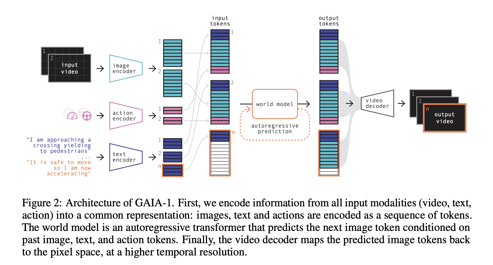
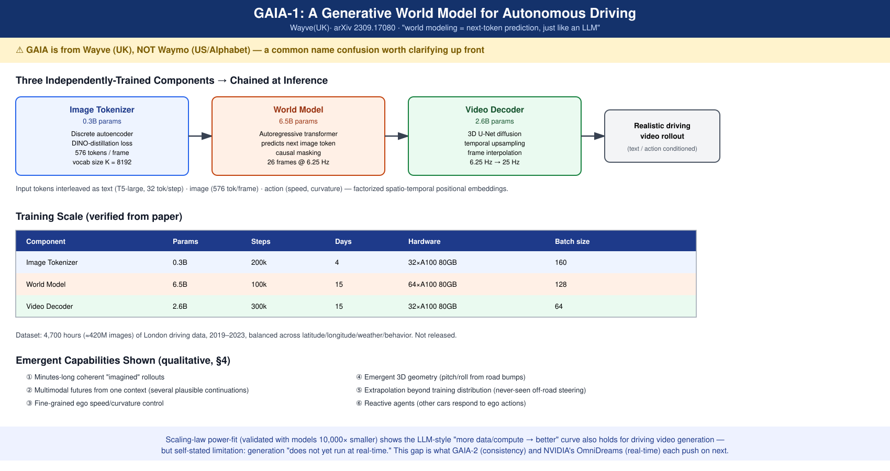

# GAIA-1: A Generative World Model for Autonomous Driving

- **Venue / year:** Technical report, arXiv 2309.17080, 2023-09（Wayve 自己发布，非会议/期刊同行评审）
- **Authors:** Anthony Hu, Lloyd Russell(共同一作), Hudson Yeo, Zak Murez, George Fedoseev, Alex Kendall, Jamie Shotton, Gianluca Corrado — **Wayve**(英国,伦敦,端到端自动驾驶公司)
- **Link:** https://arxiv.org/abs/2309.17080
- **来源说明:** 用户转述了一份关于 GAIA 系列的二手背景介绍(包含"GAIA 不是 Waymo 的核心,而是 Wayve"的更正,以及 GAIA-1/2/3 三代对比表)。我用 WebFetch 核实了 arXiv 全文(ar5iv HTML 版)逐项核对架构参数、训练细节、消融结果和局限性原文,没有直接采信二手表格里的数字。
- **⚠ 一处常见的名称混淆:** GAIA 不是 Waymo 的技术路线,是 **Wayve**(英国公司)的生成式世界模型系列。Waymo 和 Wayve 是两家完全不同的公司(前者是 Google/Alphabet 旗下,美国;后者独立创业公司,英国),名字相近容易搞混,presentation 时需要明确讲清楚。
- **Code:** **未开源。** 搜索未发现任何 GitHub 仓库或权重发布,只有技术报告 + 项目页的 demo 视频/博客文章,是 Wayve 内部研发工具性质的论文,不是面向复现的开源发布。
- **Input / 输入:** 图像序列(视频帧)+ 文本(驾驶场景描述)+ 动作(speed, curvature 两个标量)
- **Output / 输出:** 未来视频帧序列(想象出的驾驶场景 rollout),可被文本/动作条件引导

---

## TL;DR

**问题 →** 自动驾驶要学会应对各种可能的未来,但真实世界的罕见、危险场景采集成本极高(不可能靠真车去撞车来收集训练数据)。能不能让模型自己"想象"出逼真又合理的未来驾驶场景,用来训练和验证自动驾驶系统?

**Gap →** 当时的生成式视频模型(追求画面逼真)和经典的"世界模型"(强化学习语境下,学习环境动态用于规划,但通常不追求像素级真实感)是两条分开的路线,没有谁把两者结合起来做自动驾驶。

**Novelty →** 把"世界建模"重新表述成和大语言模型一样的**无监督序列预测**问题——把图像、文本、动作全部离散化成 token,用一个自回归 Transformer 去预测下一个图像 token,图像/视频生成的"套路"直接照搬语言模型。

**核心洞察 →** 不需要专门设计"懂物理规律"的世界模型架构——只要用 LLM 那套"预测下一个 token"的范式在海量驾驶视频上训练到足够大的规模,模型会自己涌现出对 3D 几何、其他车辆反应行为、极端场景的理解,而且这个过程遵循和 LLM 一样的 scaling law。

**方法/论证 →** 三个独立训练的组件:① 图像分词器(0.3B,DINO 蒸馏的离散自编码器,576 token/帧)② 世界模型(6.5B,自回归 Transformer,预测下一图像 token,文本用 T5-large 编码,动作是两个标量嵌入,causal mask)③ 视频解码器(2.6B,3D U-Net 扩散模型,把 6.25Hz 的离散 token 序列时间上采样成 25Hz 连续视频)。三者独立训练,推理时串联。

**结果 →** 模型能生成分钟级连贯的想象视频,根据同一上下文生成多种合理的不同未来(multimodal prediction),能精细控制自车的速度/转向,能涌现出对路面起伏导致的俯仰/侧倾的 3D 几何理解,能生成训练集里从未出现过的场景(比如故意偏出车道);scaling law 实验(用小 10000 倍的模型做幂律拟合)验证了"数据和算力越多,效果越好"这条 LLM 式的缩放规律同样适用于 GAIA-1。

**意义 →** GAIA-1 是这条"生成式驾驶视频世界模型"路线的开创性工作——证明了把世界建模当成序列预测问题来做,在真实复杂的驾驶场景里是可行的,而且有继续 scale 的空间。但论文自己承认最大的局限是**生成过程不是实时的**,离真正能用来做闭环仿真/策略训练还有距离——这个具体的"图像生成能不能用于闭环仿真"的问题,后续的 GAIA-2(多视角一致性)和更晚的 OmniDreams(NVIDIA,专门做实时闭环 rollout)分别从不同角度往前推进。

---

## Novelty 分类判断

- **新问题定义**:部分算——"用生成式视频模型服务自动驾驶闭环仿真"这个具体问题表述是这篇论文系统化提出的,但"世界模型"这个大概念本身(Ha & Schmidhuber 2018 等)不是 GAIA-1 首创。
- **新 insight**:算——"把世界建模当成和 LLM 一样的无监督序列预测问题,LLM 的 scaling law 同样适用"这个论证有具体的幂律拟合实验支撑(用小 10000 倍的模型外推验证)。
- **新方法**:算——三段式(图像分词器 + 自回归世界模型 + 扩散解码器)的具体组合,把 token 化驾驶视频生成做到这个规模(6.5B 世界模型),在当时(2023 年)是第一次。
- **新理论**:没有,scaling law 本身借用的是 LLM 领域已有的结论,这里是验证它在新领域(驾驶视频)同样成立。
- **新数据集**:没有公开新数据集,用的是 Wayve 自己的 4700 小时伦敦驾驶数据(未开放)。
- **新应用场景**:算——把生成式视频模型第一次系统性地用在"自动驾驶训练数据/仿真场景生成"这个具体场景上。

综合结论:**新 insight + 新方法组合类贡献**,是这条技术路线(生成式驾驶世界模型)的开创性/奠基性工作,2023 年提出时在"规模"和"把 LLM 范式搬进驾驶视频生成"这两点上都是第一次。

---

## 中文精读

### 1. 解决了什么问题

自动驾驶系统要在罕见、危险、安全攸关的场景下做决策,但这类场景在真实世界里出现概率极低、采集成本极高(没法靠真车去制造事故场景)。GAIA-1 要解决的是:**能不能训练一个模型,让它自己"想象"出逼真又符合物理/交通规律的未来驾驶场景,用生成的场景替代/补充真实采集,加速自动驾驶技术的训练和验证?**

### 2. 新意在哪里

**核心新意:把"世界建模"重新表述成序列预测问题。**

传统强化学习语境下的"世界模型"(World Model)通常是为了让 agent 在"脑内"模拟环境动态来规划/学习策略,不一定追求像素级真实感。GAIA-1 的做法是把图像、文本、动作全部离散化成统一的 token 序列(文本-图像-动作交替排列),然后用一个和语言模型完全同构的"预测下一个 token"的自回归 Transformer 去学习——这样一来,"预测接下来会发生什么"和"生成逼真的视频画面"变成了同一件事,不需要分开设计。

第二个新意:**scaling law 的验证**。论文专门做了幂律拟合实验,用参数量小 10000 倍的一系列模型外推,证明了"数据和算力越多效果越好"这条 LLM 领域的缩放规律在驾驶视频生成上同样成立——这意味着这条路线有明确的"继续砸资源就能变好"的路径,不是一个很快会遇到天花板的方法。

### 3. Idea 具体落在哪里

**三个独立训练的组件(推理时串联):**

① **图像分词器(Image Tokenizer,0.3B 参数)**:离散自编码器,把每帧图像编码成 576 个 token(词表大小 K=8192)。训练用重建损失(L1/L2/perceptual/GAN)+ 量化损失 + DINO 蒸馏损失(用 DINO 的语义特征做归纳偏置,让离散 token 里包含更多语义信息,不只是像素细节)。

② **世界模型(World Model,6.5B 参数)**:自回归 Transformer,在 26 帧(6.25Hz)的序列上训练。输入是交替排列的文本 token(T5-large 编码,每步 32 个)、图像 token(576 个/帧)、动作 token(speed + curvature 两个标量嵌入),用时空分解的位置编码(factorized spatio-temporal positional embeddings)。训练目标是用 causal mask,预测序列里下一个图像 token——这一步和 GPT 预测下一个词完全同构。

③ **视频解码器(Video Decoder,2.6B 参数)**:3D U-Net 扩散模型,把世界模型生成的 6.25Hz 离散 token 序列做时间上采样和插帧,解码成 25Hz 的连续视频。推理时用图像级和视频级去噪结果加权平均,逐帧自回归重建。

**推理技巧:** top-k(k=50)采样平衡多样性和真实感(避免 argmax 导致的重复循环,也避免分布尾部的失真样本);文本条件用 classifier-free guidance,引导强度在 token 和帧维度上有调度。

### 4. 最大难点在哪里

不在"能不能生成一段逼真视频"(当时的视频生成模型已经能做到),难点在于**让生成的视频真正服从输入的文本/动作条件,同时保持长序列的时空一致性和合理的物理/交通行为**——论文用大量定性案例(精细控制自车速度转向、生成同一上下文下的多种合理未来、涌现出路面起伏导致的 3D 几何理解、生成训练集里没有的极端场景如主动偏出车道)来论证这一点,但这些主要是**定性展示**,缺少像 GAIA-2 那样的系统性量化一致性指标(FDD/FVMD 等)——这是我读完后觉得 GAIA-1 论证相对单薄的地方,量化评估体系是 GAIA-2 才补上的。

### 5. 局限 / 对我项目的相关性

**论文自己承认的局限(原文见下方摘录):** 自回归生成过程**不是实时的**——虽然论文强调这个过程"天然适合并行化"(可以同时生成多个样本),但没有说明单个样本的生成延迟具体是多少,也没有给出"多快能达到实时"的路线图。这个局限直接催生了后续工作的两个不同回应方向:GAIA-2 用更系统的条件控制和一致性指标把"可控性"做扎实,而 NVIDIA 的 OmniDreams(2026)则专门针对"实时"这个具体痛点,做到 68 FPS 单视角实时 rollout——presentation 时这条"GAIA-1 留下的生成速度问题,后来被谁在哪个维度解决"的线索值得讲清楚。

**对我项目的相关性:** GAIA-1 证明的"token 化 + 自回归预测"范式,和这份阅读清单里 Qwen-Drive-1.0、EMMA 等"把一切表示成 token/文本"的思路是同一个大方向在不同子任务上的应用——世界模型生成未来帧、VLM 生成轨迹/检测框/回答,本质上都是在赌同一件事:**用 LLM 的训练范式去统一处理不同模态的任务,能不能涌现出超出单个任务训练的能力**。

### 6. 是否能连 GitHub

**不能。** 未发现 GitHub 仓库或权重发布,只有技术报告和项目页的演示视频/博客文章。这是 Wayve 内部研发能力的展示性技术报告,不是面向社区复现的开源项目,和这份清单里的 DriveVLM、DriveZero、DriveMLM、EMMA 性质类似(纯技术报告,无可复现代码)。

---

## 可略过的背景(如果时间有限)

- 图像分词器具体的 DINO 蒸馏损失权重配置(训练工程细节,不影响理解核心思路)
- 三个组件各自详细的训练步数/硬件/batch size 表格(记住"三个组件独立训练、规模分别是 0.3B/6.5B/2.6B"即可)
- classifier-free guidance 在 token 和帧维度上具体的调度曲线细节

---

## 假设、局限与质疑点

- **"不实时"的具体程度未量化**:论文只说"不是实时的""天然适合并行化",没有给出具体的延迟数字或者达到实时所需的工程路径,这个局限写得比较含糊。
- **定性展示多于定量一致性评估**:论文用大量视频案例展示"涌现能力",但缺少系统性的量化指标体系(这一点在 GAIA-2 里用 FDD/FVMD 等指标补上了)——presentation 时如果要强调"GAIA-1 效果好",应该说清楚证据主要是定性案例,不是量化基准分数。
- **训练数据未开放,规模和地理范围有限**:4700 小时伦敦数据,单一城市/国家,模型在其他路况(比如中国城市道路、美国高速)下的泛化能力论文里没有验证。
- **"自动驾驶训练数据生成"这个应用场景的下游效果未在本文验证**:论文论证的是"生成的视频看起来逼真、可控",但没有做"用生成数据训练下游规划器,规划器效果提升多少"这样的闭环实验——这个具体的下游价值验证,要到后续论文(以及 GAIA-3 定位的"评测基建")才更系统地做。

---

## 一个月后记住 5 件事

1. **GAIA 是 Wayve(英国)的,不是 Waymo(美国)的**——presentation 开场务必讲清楚这个常见混淆。
2. **核心思路:把世界建模当成和 LLM 一样的"预测下一个 token"问题**——图像/文本/动作全部 token 化,自回归 Transformer 预测下一图像 token。
3. **三段式架构:图像分词器(0.3B)+ 世界模型(6.5B)+ 视频解码器(2.6B)**,独立训练,推理串联。
4. **验证了驾驶视频生成也遵循 LLM 式 scaling law**——小 10000 倍的模型外推拟合幂律曲线。
5. **最大局限是不实时**——这个具体问题后来被 GAIA-2(一致性/可控性)和 NVIDIA OmniDreams(实时性)从不同角度往前推进。

---

## 关键原文摘录(中英对照)

**① 核心方法定位**
> "GAIA-1... leverages video, text, and action inputs to generate realistic driving scenarios while offering fine-grained control over ego-vehicle behavior and scene features."

中译:GAIA-1 利用视频、文本和动作输入来生成逼真的驾驶场景,同时对自车行为和场景特征提供精细控制。
解读:这句话点出了 GAIA-1 的三个输入模态和"精细控制"这个关键卖点——不是随便生成一段看起来像开车的视频,而是能按文本/动作指令被引导着生成。

**② 世界模型训练目标**
> "the model is an autoregressive transformer that predicts the next image token in the sequence conditioned on all past tokens, using causal masking."

中译:该模型是一个自回归 Transformer,在因果掩码(causal masking)下,根据所有过去的 token 预测序列中的下一个图像 token。
解读:这是全文最核心的一句话——和 GPT"预测下一个词"的表述几乎逐字对应,只是把"词"换成了"图像 token"。

**③ Scaling law 验证**
> "scaling laws...analogous to those observed in LLMs, are also applicable to GAIA-1."

中译:类似于 LLM 中观察到的缩放规律,同样适用于 GAIA-1。
解读:这句话是论文想证明的核心主张之一——这条路线不是"做到这个规模就到头了",而是有继续靠堆数据/算力获得回报的空间,这也是后续 GAIA-2(8.4B 世界模型)、GAIA-3(15B)持续做大的理论依据。

**④ 局限性原文**
> "The autoregressive generation process, while highly effective, does not yet run at real-time."

中译:自回归生成过程虽然非常有效,但目前还不能实时运行。
解读:这是论文自己承认的最大局限,措辞很克制("does not yet",暗示"以后会"),但没有给出具体数字或路线图。

---

## English at-a-glance summary

### Figure 2 · GAIA-1 Architecture(论文原图)

左侧输入模态(视频/动作/文本)各自编码成 token → 交替排列成统一序列 → 世界模型(自回归 Transformer)预测下一个图像 token → 输出 token 序列 → 视频解码器映射回像素空间、时间上采样到更高帧率。这张图最直观地体现了"世界建模 = 预测下一个 token"这个核心设计。

### Training Scale & Emergent Capabilities(重绘)

### 图解读 Diagram walkthrough

上半部分对应论文架构图:三个独立训练的组件(图像分词器 0.3B → 世界模型 6.5B → 视频解码器 2.6B)串联推理。

中间表格是三个组件各自的训练规模(步数/天数/硬件/batch size),全部取自论文原文,不是估算。

下半部分列出论文定性展示的六类涌现能力,底部总结 scaling law 验证结果和论文自曝的"不实时"局限,以及这个局限后来被谁(GAIA-2 / OmniDreams)从哪个角度推进。

| Aspect | Summary |
|---|---|
| **⚠ Correction** | GAIA is from **Wayve** (UK), not Waymo (US/Alphabet) — a common name confusion worth addressing up front. GAIA 是英国 Wayve 的技术路线,不是 Waymo 的,presentation 开场应先澄清。 |
| **Problem** | Rare, safety-critical driving scenarios are too expensive/dangerous to collect in the real world. Can a model imagine realistic, controllable future driving scenes instead? 罕见、安全攸关的驾驶场景真实采集成本极高,能否让模型自己想象出逼真可控的未来场景? |
| **Novelty** | Recasts world modeling as unsupervised next-token prediction, exactly like an LLM — tokenize image/text/action, train an autoregressive transformer to predict the next image token. 把世界建模重新表述成和 LLM 一样的"预测下一个 token"问题——图像/文本/动作全部 token 化,自回归预测下一图像 token。 |
| **Core idea** | Three independently-trained components: image tokenizer (0.3B, DINO-distilled discrete autoencoder) → world model (6.5B, autoregressive transformer) → video decoder (2.6B, 3D U-Net diffusion for temporal upsampling 6.25Hz→25Hz). 三段式架构:图像分词器(0.3B)→世界模型(6.5B)→视频解码器(2.6B,时间上采样)。 |
| **Hardest part** | Making generated video actually obey text/action conditioning while staying temporally consistent over long horizons — demonstrated mostly via qualitative cases, not a systematic quantitative consistency benchmark (that came later, in GAIA-2). 让生成视频真正服从条件控制、长序列保持时空一致——主要靠定性案例展示,缺系统量化一致性指标(GAIA-2 才补上)。 |
| **Evidence** | Scaling-law power-fit validated with models 10,000× smaller; qualitative demos of multimodal futures, fine-grained ego control, emergent 3D geometry, extrapolation beyond training distribution. 用小 10000 倍模型外推验证的 scaling law;多种未来生成、精细控制、涌现 3D 几何理解、分布外场景生成的定性案例。 |
| **Limitation** | Self-stated: "does not yet run at real-time" — no concrete latency numbers or roadmap given. Training data (4,700hr London-only) not released. 作者自述:"目前还不能实时运行",未给出具体延迟数字或路线图。训练数据(4700小时,仅伦敦)未开放。 |
| **Code / GitHub** | **Not released.** No GitHub repo or weights found — technical report + project-page demos only, same nature as DriveVLM/DriveZero/DriveMLM/EMMA in this reading list. **未开源。**未发现代码仓库或权重,仅技术报告+演示视频,和本清单里 DriveVLM/DriveZero/DriveMLM/EMMA 性质相同。 |

---

## 本文提到的词

| 术语 | 首次出现位置 |
|------|------------|
| 世界模型 / World Model | Abstract |
| 自回归 Transformer / Autoregressive Transformer | §2(世界模型架构) |
| Token 化 / Tokenization | §2.1(图像分词器) |
| Causal Masking(因果掩码) | §2.2(世界模型训练目标) |
| DINO 蒸馏 / DINO Distillation | §2.1(图像分词器训练损失) |
| 时空分解位置编码 / Factorized Spatio-Temporal Positional Embedding | §2.2 |
| 3D U-Net 扩散模型 / 3D U-Net Diffusion Model | §2.3(视频解码器) |
| Top-k 采样 | §3(推理技巧) |
| Classifier-Free Guidance | §3(推理技巧) |
| Scaling Law(缩放规律) | §4(实验) |
| 涌现能力 / Emergent Capability | §4(实验展示) |
| 闭环探索 / Closed-Loop Exploration | §5(讨论/未来工作) |
