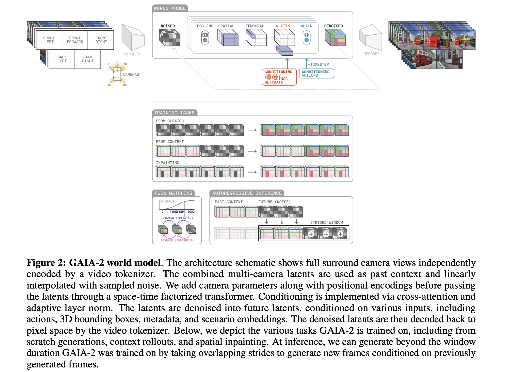
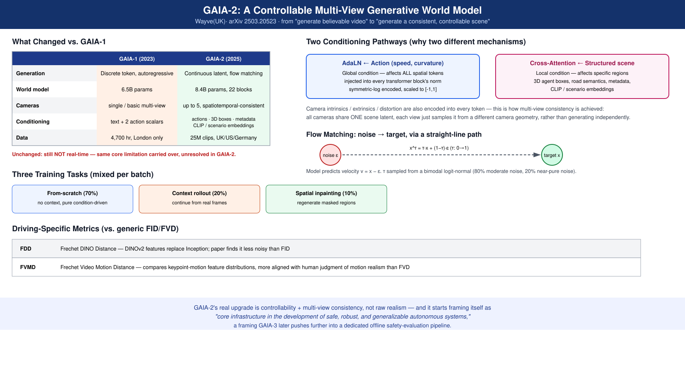

# GAIA-2: A Controllable Multi-View Generative World Model for Autonomous Driving

- **Venue / year:** Technical report, arXiv 2503.20523, 2025-03（Wayve 自己发布）
- **Authors:** Lloyd Russell, Anthony Hu, Lorenzo Bertoni, George Fedoseev, Jamie Shotton, Elahe Arani, Gianluca Corrado — **Wayve**(英国,伦敦)
- **Link:** https://arxiv.org/abs/2503.20523
- **来源说明:** 同 [gaia-1.md](gaia-1.md) 的来源说明——用户转述的 GAIA 系列二手对比表未直接采信,用 WebFetch 核实了 arXiv HTML 全文(架构参数、训练任务配比、flow matching 公式、量化指标定义、局限性原文)。
- **Code:** **未开源。** 搜索未发现 GitHub 仓库或权重发布,性质与 [gaia-1.md](gaia-1.md) 相同。
- **Input / 输入:** 多路环视摄像头视频(最多 5 路,448×960)+ 结构化条件(自车动作、其他车辆 3D 框、道路语义、环境元数据、CLIP 嵌入、专有场景嵌入)
- **Output / 输出:** 多视角时空一致的未来驾驶视频(可从头生成 / 接着真实上下文续写 / 对指定区域做空间 inpainting)

---

## TL;DR

**问题 →** [GAIA-1](gaia-1.md) 证明了"把世界建模当成序列预测问题"这条路可行,但留了两个具体痛点没解决:多路环视摄像头之间画面对不上(各看各的,不是一个统一 3D 场景的多个视角),以及可控性不够精细(只有文本/两个动作标量,没法指定"这里有辆车在左转""现在是雨天红灯"这种具体场景要素)。

**Gap →** 通用视频生成模型(Sora 这类)不是为自动驾驶设计的,没有针对多智能体交互、精细控制、多摄像头一致性这几个驾驶领域特有的需求做优化。

**Novelty →** 统一的**潜空间扩散世界模型**(latent diffusion world model),同时支持最多 5 路环视摄像头的时空一致生成,并引入丰富的结构化条件接口(自车动力学、他车 3D 框、道路语义、环境元数据、CLIP 嵌入、专有场景嵌入)。

**核心洞察 →** GAIA-1 的"自回归 Transformer 直接预测像素级 token"换成了"在连续潜空间里做条件去噪(flow matching)",多视角一致性问题通过时空分解 Transformer + 统一的相机几何编码(内参/外参/畸变都编码进每个 token)来解决——本质是把"每个摄像头各自生成"变成"所有摄像头共享同一套场景潜变量,只是从不同相机参数的视角去采样"。

**方法/论证 →** 视频分词器(把 24 帧×448×960×3 的视频压缩约 384 倍到 3×14×30×64 的连续潜空间)+ 世界模型(8.4B 参数,22 层时空分解 Transformer,用 AdaLN 注入动作条件、用 cross-attention 注入结构化场景条件)+ flow matching 训练目标(预测速度场 v = x - ε,双峰 logit-normal 噪声时间分布)。训练任务按 70%/20%/10% 配比混合"从零生成""给定上下文续写""空间 inpainting"三种模式。

**结果 →** 能生成 5 路摄像头时空一致的视频,支持精细条件控制(自车轨迹、他车 3D 框位置、天气/路口类型等 metadata、自然语言文本描述);引入了 FDD(Frechet DINO Distance)、FVMD(Frechet Video Motion Distance)等专门的驾驶视频评估指标,论文发现这些指标比通用的 FID/FVD 更贴合人类主观评价。

**意义 →** GAIA-2 把 GAIA-1 证明可行的"生成式驾驶世界模型"这条路线,从"能生成逼真视频"往"能被精细控制、能当仿真工具用"方向推进了一大步——条件接口(3D 框、metadata)和多视角一致性是这次的核心升级,但论文自己承认**生成仍然不是实时的**,计算开销依然很大,这个具体问题后来由 NVIDIA 的 OmniDreams(2026)专门针对"实时闭环 rollout"去解决。

---

## Novelty 分类判断

- **新问题定义**:算——"多摄像头时空一致的可控驾驶视频生成"这个具体问题表述(尤其是"一致性"这个要求)是 GAIA-2 系统化提出并建立评估指标的。
- **新 insight**:部分算——"用连续潜空间 + flow matching 代替离散 token 自回归"不是 GAIA-2 首创的生成范式(扩散/flow matching 在图像生成领域已经成熟),但"把这套范式系统性地用在多视角驾驶视频、并配上专门的相机几何条件编码"是这篇论文的具体贡献。
- **新方法**:算——结构化条件接口(3D 框 + metadata + CLIP 嵌入 + 场景嵌入的组合)和空间选择性 CFG(只对受 agent 条件影响的区域做引导)是比较具体的工程创新。
- **新理论**:没有,flow matching 本身借用的是已有的生成建模理论。
- **新数据集**:没有公开新数据集,用的是 Wayve 自己约 2500 万段(英/美/德三国)驾驶视频(未开放)。
- **新应用场景**:部分算——相比 GAIA-1,这篇更明确地把自己定位为"自动驾驶系统开发的核心基础设施"(见关键原文摘录),应用导向更强。

综合结论:**改进组合 + 新评估体系类贡献**——核心生成范式(扩散/flow matching)不是首创,但把它系统性地应用在多视角驾驶视频生成、配上专门的条件接口和评估指标(FDD/FVMD),是 GAIA 系列在"可控性"和"一致性"这两个 GAIA-1 留下的具体痛点上的扎实推进。

---

## 中文精读

### 1. 解决了什么问题

[GAIA-1](gaia-1.md) 验证了生成式世界模型这条路线可行,但有两个具体短板:①**多视角不一致**——环视摄像头各自生成,容易出现"同一辆车在不同摄像头画面里对不上"的问题;②**可控性粗糙**——只能用文本和两个动作标量(speed/curvature)条件,没法精确指定"路口有个行人在过马路""现在是雨天"这类具体的场景要素。GAIA-2 要解决的是:**能不能在生成逼真视频的同时,做到多摄像头时空一致,并且支持丰富、精细的结构化条件控制?**

### 2. 新意在哪里

**核心新意:从离散 token 自回归换成连续潜空间扩散(flow matching),并把相机几何本身变成条件的一部分。**

GAIA-1 的世界模型是"预测下一个离散图像 token"(类似 GPT);GAIA-2 换成了"在连续潜空间里做条件去噪"——视频先被压缩进一个连续的潜空间(视频分词器,约 384 倍压缩率),然后世界模型学习从噪声里"去噪"出目标潜变量,训练目标是预测速度场(flow matching 的标准表述)。

多视角一致性的关键设计:**把每个摄像头的内参、外参、畸变参数都编码进对应的 token**,所有摄像头的 token 共享同一个时空分解 Transformer 处理。这样一来,模型学到的不是"摄像头 A 的画面该长什么样",而是"给定某个相机参数,从统一的场景潜变量里该采样出什么画面"——多视角一致性不是靠后处理对齐,是从表示层面就被统一处理。

第二个新意:**条件接口的丰富程度**。动作用 AdaLN(自适应层归一化)直接注入每个 Transformer block(因为动作会影响所有空间位置的生成,属于"全局"条件);场景级信息(他车 3D 框、道路语义、天气、路口类型等)用 cross-attention 注入(属于"局部/结构化"条件)。这个"全局条件用 AdaLN、结构化条件用 cross-attention"的区分设计,是针对驾驶场景条件的异质性(有的条件影响全局,有的只影响局部物体)做的专门适配。

### 3. Idea 具体落在哪里

**视频分词器:** 空间维度下采样 32 倍、时间维度下采样 8 倍(8 帧输入压缩成 1 个潜变量 token),潜变量维度 64。编码器独立编码每帧,解码器联合解码保证时间一致性(这个"编码独立、解码联合"的不对称设计,是专门针对视频时间一致性问题的)。训练损失:L1/L2/LPIPS 感知损失 + DINOv2 蒸馏(权重 0.1)+ KL 正则 + 微调阶段加 GAN 损失。

**世界模型(8.4B 参数,22 层时空分解 Transformer,隐藏维度 4096):** 每层包含空间注意力、时间注意力、cross-attention、MLP、AdaLN 五个组件。位置编码:空间位置用正弦编码,相机时间戳用正弦编码+MLP(支持 20/25/30Hz 不同采样率),相机几何(内参/外参/畸变)用可学习线性投影。

**动作编码:** 用对称对数变换处理跨数量级的物理量——曲率(范围 0.0001-0.1 m⁻¹,缩放因子 1000)、速度(范围 0-75 m/s,换算成 km/h,缩放因子 3.6),输出归一化到 [-1,1]。

**Flow matching 训练目标:** 线性插值 x^τ = τ·x + (1-τ)·ε(τ 是去噪进度,x 是目标潜变量,ε 是高斯噪声),模型预测速度场 v = x - ε,损失是预测速度和真实速度的均方误差。噪声时间 τ 的采样用双峰 logit-normal 分布(80% 概率采样中低噪声区间,20% 概率采样接近纯噪声区间)——这个双峰设计让模型既能处理"轻微去噪"也能处理"从纯噪声生成"两种场景。

**三种训练任务混合(70%/20%/10%):** 从零生成(无上下文,纯条件驱动)、给定上下文续写(类似 GAIA-1 的续写模式)、空间 inpainting(指定区域重新生成,可选配合 agent 条件引导)。

**自回归长程 rollout:** 用滑动窗口(k=3 个潜变量 token 作为上下文),每次预测下一段后把结果拼进上下文窗口,重复滚动,让生成长度可以超过训练时的窗口时长。

### 4. 最大难点在哪里

**让"多个摄像头""多种条件类型(全局动作/局部结构化)""三种训练任务(生成/续写/inpainting)"这些异质的设计目标统一进一个模型,而不互相打架**,是这篇论文的核心工程难点。具体的应对:条件 dropout 策略(单个条件 80% 概率丢弃、所有条件同时丢弃的概率 10%、单摄像头视角丢弃概率 10%)让模型在训练时就见过各种不完整条件组合,推理时才能灵活应对"只给文本,不给 3D 框"这类部分条件场景。

评估这件事本身也是个难点——通用视频生成常用的 FID/FVD 不一定贴合驾驶场景的主观质量判断,论文专门引入 FDD(用 DINOv2 特征替代 Inception 特征,论文发现比 FID 噪声更小)和 FVMD(比较关键点运动特征分布,比 FVD 更贴合人类对"运动是否合理"的判断)。

### 5. 局限 / 对我项目的相关性

**论文自己承认的局限(原文见下方摘录):** 长时程/复杂场景下仍有时空不一致的情况;推理计算开销大(虽然能并行,但没说明具体延迟);对他车行为和环境细节的建模还比较有限(论文明确说未来要做"更丰富的 agent 行为建模")。**核心的"实时性"问题,GAIA-2 依然没有解决**——这是 GAIA-1 就存在的老问题,继续留到了 GAIA-2,直到 NVIDIA 的 OmniDreams(2026,68 FPS 单视角实时)才算是专门啃下这块硬骨头。

**对我项目的相关性:** GAIA-2 的"全局条件用 AdaLN、结构化/局部条件用 cross-attention"这个设计,和这份清单里其他论文处理"多种不同性质的条件输入"时的思路可以类比对照——比如 Qwen-Drive-1.0 把感知头当"探针"读取 VLM 隐含信息、DriveVLM 用双系统分别处理语言推理和实时轨迹,都是"针对条件/任务的性质差异,设计专门通路"这个大原则的不同体现。

### 6. 是否能连 GitHub

**不能。** 未发现 GitHub 仓库或权重发布,与 [gaia-1.md](gaia-1.md) 性质相同——纯技术报告,无可复现代码。

---

## 可略过的背景(如果时间有限)

- 视频分词器编码器/解码器具体的 Transformer block 层数配置(24 层 vs 16+8 层这类细节,记住"编码独立、解码联合"的设计动机即可)
- 训练超参数表格(学习率、warmup 步数、batch size 等工程细节)
- FDD/FVMD 具体的特征提取网络配置细节(记住"比通用 FID/FVD 更贴合驾驶场景主观评价"这个结论即可)

---

## 假设、局限与质疑点

- **"实时性"问题依然未解决,论文对此的讨论相对简短**:相比 GAIA-1,GAIA-2 在可控性和一致性上着墨很多,但对"不实时"这个和 GAIA-1 一样的老问题,只在未来工作里提了一句"将探索模型蒸馏、高效 Transformer 变体、推理加速技术",没有具体方案或时间线。
- **量化指标(FDD/FVMD)是论文自己提出的,缺少第三方交叉验证**:这两个指标是这篇论文自己设计并论证"比 FID/FVD 更贴合人类偏好"的,目前除了论文自己的实验,没有看到独立第三方复现验证这个结论。
- **训练数据(2500 万段视频,英/美/德)未开放**,模型在其他地区(比如中国城市道路)的泛化能力未在论文中验证。
- **"结构化条件丰富"是否真的转化为下游任务收益,论文未给出闭环实验**:论文论证的是"生成的视频能被条件精细控制、视觉和运动质量更好",但没有像 DriveZero 那样给出"用生成场景训练/测试下游规划器,指标提升多少"的闭环验证数据。

---

## 一个月后记住 5 件事

1. **GAIA-2 是 Wayve(英国)在 2025 年 3 月发布的,GAIA-1 的继任者**,核心升级方向是"多视角一致性"和"精细可控性"。
2. **从离散 token 自回归换成了连续潜空间 + flow matching(扩散)**,世界模型从 6.5B 涨到 8.4B。
3. **多视角一致性靠把相机内参/外参/畸变编码进每个 token、所有摄像头共享同一时空 Transformer**实现,不是后处理对齐。
4. **条件接口:全局动作用 AdaLN,结构化场景条件(3D 框/metadata)用 cross-attention**,两种注入方式对应两种条件性质。
5. **"实时性"这个 GAIA-1 的老问题在 GAIA-2 依然没解决**——继续留给了后续工作(NVIDIA OmniDreams 专门解决了这个)。

---

## 关键原文摘录(中英对照)

**① 问题定位**
> "current approaches remain limited in scope" [in addressing] "multi-agent interactions, fine-grained control, and multi-camera consistency."

中译:现有方法在应对多智能体交互、精细控制和多摄像头一致性方面,范围仍然有限。
解读:这句话直接点出了 GAIA-2 相比 GAIA-1(以及通用视频生成模型)要解决的三个具体缺口,后两个(精细控制、多摄像头一致性)是全文的核心升级点。

**② Flow matching 核心公式**
> x^τ_{t+1:T} = τ·x_{t+1:T} + (1-τ)·ε_{t+1:T}，v_{t+1:T} = x_{t+1:T} - ε_{t+1:T}

中译:潜变量沿线性路径从噪声插值到目标,速度场定义为目标减去噪声。
解读:这是 flow matching 的标准表述——模型不直接预测"干净的目标",而是预测"从当前噪声点到目标的速度方向",训练更稳定,推理时可以用不同步数的去噪调度灵活权衡速度和质量。

**③ 条件注入机制的设计动机**
> Actions are injected via AdaLN as an "explicit information gateway," since actions affect all spatial tokens.

中译:动作通过 AdaLN 作为"显式信息通道"注入,因为动作会影响所有空间 token。
解读:这句话解释了为什么动作(全局性质)用 AdaLN 而不是 cross-attention——AdaLN 直接调制整层的归一化参数,天然适合"影响全局"的条件;cross-attention 更适合"只影响部分 token"的局部/结构化条件(比如某辆车的 3D 框只应该影响画面里对应位置的生成)。

**④ 局限性与未来工作原文**
> "Improving the reliability and consistency of video generation through better failure detection, refinement models, or constraint-aware sampling is a key challenge."
> "Future work will explore model distillation, efficient transformer variants, and inference-time acceleration techniques."

中译:通过更好的失败检测、精炼模型或约束感知采样来提升视频生成的可靠性和一致性,是一个关键挑战。未来工作将探索模型蒸馏、高效 Transformer 变体和推理加速技术。
解读:第二句其实就是在回应"不实时"这个老问题,但只是列了几个研究方向(蒸馏、高效架构、推理加速),没有具体方案——这个问题留到了后续工作里才被真正解决。

**⑤ 定位表述**
> The authors position GAIA-2 and its successors as "core infrastructure in the development of safe, robust, and generalizable autonomous systems."

中译:作者将 GAIA-2 及其后继者定位为"开发安全、鲁棒、可泛化自动驾驶系统的核心基础设施"。
解读:这句话值得注意——GAIA-2 已经开始把自己定位成"基础设施"而不只是"一个生成模型",这个定位在 GAIA-3(进一步明确为"离线安全评测基建")上走得更远,是 GAIA 系列叙事从"能不能生成逼真视频"到"能不能用来做系统评测"的转折点。

---

## English at-a-glance summary

### Figure 2 · GAIA-2 World Model(论文原图)

左上:世界模型主干(编码器→时空分解 Transformer,带条件注入和时间步嵌入→解码器)。中间:三种训练任务(from scratch / from context / inpainting)。左下:flow matching 的噪声调度曲线。右下:自回归推理的滑动窗口(strided window)机制。这张图完整展示了 GAIA-2 相比 GAIA-1 新增的所有机制。

### GAIA-1 → GAIA-2 Evolution & Conditioning Design(重绘)

### 图解读 Diagram walkthrough

左上表格对比 GAIA-1 → GAIA-2 在生成机制/模型规模/摄像头数量/条件接口/数据规模五个维度上的变化,并标注"不实时"这一条是两代都没解决的共同局限。

右上展示两种条件注入通路(AdaLN 处理全局动作 vs. cross-attention 处理结构化场景条件)的设计动机,以及 flow matching 的噪声插值公式。

下半部分是三种训练任务的配比,和论文自建的两个驾驶专用评估指标(FDD/FVMD)。

| Aspect | Summary |
|---|---|
| **Problem** | GAIA-1 proved generative world models work, but left two gaps: multi-camera inconsistency and coarse controllability (only text + 2 action scalars). GAIA-1 证明了生成式世界模型可行,但留下两个缺口:多摄像头不一致、可控性粗糙(只有文本+2个动作标量)。 |
| **Novelty** | Latent diffusion world model (flow matching) supporting up to 5 spatiotemporally consistent camera views, with a rich structured conditioning interface (ego dynamics, 3D agent boxes, road semantics, metadata, CLIP/scenario embeddings). 潜空间扩散世界模型(flow matching),支持最多5路时空一致的摄像头视角,配丰富的结构化条件接口。 |
| **Core idea** | Replaces GAIA-1's discrete-token autoregression with continuous-latent flow matching; multi-view consistency comes from encoding each camera's intrinsics/extrinsics/distortion into its tokens, all views sharing one space-time factorized transformer. 把 GAIA-1 的离散 token 自回归换成连续潜空间 flow matching;多视角一致性靠把相机几何编码进 token、所有视角共享同一时空 Transformer。 |
| **Hardest part** | Unifying multiple cameras, heterogeneous condition types (global action via AdaLN vs. structured/local via cross-attention), and three training tasks (from-scratch / context / inpainting) without them interfering — plus building driving-specific evaluation metrics (FDD, FVMD) since generic FID/FVD don't match human judgment well. 统一多摄像头、异质条件类型(全局动作AdaLN vs 结构化cross-attention)、三种训练任务且互不干扰;还要自建驾驶专用评估指标(FDD/FVMD)因为通用FID/FVD不够贴合人类判断。 |
| **Evidence** | Qualitative multi-camera consistent generation across UK/US/Germany; FDD/FVMD shown to correlate better with human preference than FID/FVD; positive training trends across all metrics. 英/美/德多摄像头一致生成的定性展示;FDD/FVMD 比 FID/FVD 更贴合人类偏好;各指标训练趋势均为正向。 |
| **Limitation** | Self-stated: temporal/semantic inconsistencies remain in long-horizon/complex scenes; still computationally expensive, NOT real-time (same core issue as GAIA-1, unresolved here); training data (25M clips) not released. 作者自述:长时程/复杂场景仍有不一致;计算开销大,**仍不实时**(和GAIA-1同一个老问题,这里也没解决);训练数据(2500万段)未开放。 |
| **Code / GitHub** | **Not released.** Same as GAIA-1 — technical report only, no code or weights found. **未开源。**与 GAIA-1 相同——仅技术报告,未发现代码或权重。 |

---

## 本文提到的词

| 术语 | 首次出现位置 |
|------|------------|
| 潜空间扩散模型 / Latent Diffusion World Model | Abstract |
| 时空分解 Transformer / Space-Time Factorized Transformer | §2(视频分词器) |
| Flow Matching | §3(训练目标) |
| 速度场 / Velocity Field | §3 |
| AdaLN(自适应层归一化,Adaptive Layer Norm) | §2(世界模型条件注入) |
| Cross-Attention(交叉注意力) | §2(结构化条件注入) |
| 对称对数变换 / Symmetric Log Transform | §2(动作编码) |
| 空间 Inpainting | §4(训练任务) |
| 条件 Dropout / Conditioning Dropout | §4(训练策略) |
| 滑动窗口自回归 Rollout / Sliding-Window Autoregressive Rollout | §5(推理) |
| Classifier-Free Guidance(CFG) | §5(推理) |
| FDD(Frechet DINO Distance) | §6(评估指标) |
| FVMD(Frechet Video Motion Distance) | §6(评估指标) |
| DINOv2 蒸馏 | §2(视频分词器训练损失) |
