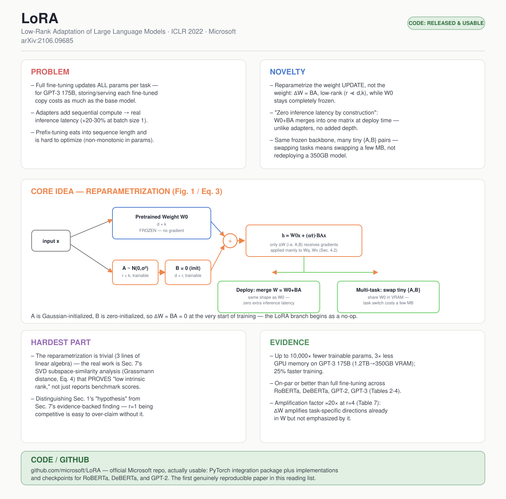

# LoRA: Low-Rank Adaptation of Large Language Models

- **Venue / year:** ICLR 2022(初版 arXiv 2021)
- **Authors:** Edward Hu, Yelong Shen, Phillip Wallis, Zeyuan Allen-Zhu, Yuanzhi Li, Shean Wang, Lu Wang, Weizhu Chen (Microsoft)
- **Link:** https://arxiv.org/abs/2106.09685
- **Local PDF:** `papers/autonomous_driving_moe/2106.09685v2.pdf`
- **paper_matrix.csv id:** `lora`
- **Code:** https://github.com/microsoft/LoRA(**已开源,含 RoBERTa/DeBERTa/GPT-2 的实现和模型 checkpoint**)
- **Input / 输入:** 层级(数学层面):某个预训练权重矩阵 W0 作用的输入激活 x;流程级:一个预训练模型 + 一份下游任务训练数据
- **Output / 输出:** 层级:h = W0x + (α/r)·BAx(和原层输出同形状);流程级:一个任务适配后的模型行为(效果持平/优于全量微调),但只训练了 A、B 两个小矩阵,部署时可合并回原模型、零推理延迟增加

## 中文精读

### 1. 解决了什么问题

大语言模型的标准适配(adaptation)方式是全量微调(full fine-tuning,把预训练模型 Φ0 的每一个参数都更新一遍)。这在小模型上只是"不方便",但在 GPT-3 175B 这种规模上是**灾难性的**:每来一个新任务就要存一份 1750 亿参数的独立模型副本。论文原文算过一笔账:

> "deploying independent instances of fine-tuned models, each with 175B parameters, is prohibitively expensive."

LoRA 要解决的问题是:能不能只用一小撮参数就完成任务适配,同时**不牺牲效果、不引入额外推理延迟**?后半句"不引入额外推理延迟"是精读时容易被忽略但其实是全文最关键的约束条件——在它之前已经有 adapter 层和 prefix-tuning 两条路线,但都在这个约束上翻车了(见第 3 节 "Aren't Existing Solutions Good Enough?"):adapter 层是**顺序**插入模型的,必须额外计算,batch size=1 的在线推理场景下延迟能涨 30%(Table 1);prefix-tuning 要占用一部分输入序列长度,而且优化起来对超参数很敏感、效果随可训练参数量变化是非单调的。这两条路线各自的失败,才是 LoRA 设计动机的真正来源,不是"我们想到了一个新点子"这么简单。

### 2. 新意在哪里

新意不是"参数高效微调"这个大方向(这在 LoRA 之前已经有一堆工作),而是**把微调目标从"权重"本身换成"权重的变化量",并对这个变化量做低秩分解**:

原本全量微调是 `Φ0 → Φ0 + ΔΦ`,ΔΦ 和 Φ0 一样大。LoRA 让 `ΔΦ = ΔΦ(Θ)`,其中 `|Θ| ≪ |Φ0|`——具体到 Transformer 的某个权重矩阵 `W0 ∈ R^(d×k)`,不直接调 W0,而是引入 `ΔW = BA`,其中 `B ∈ R^(d×r)`,`A ∈ R^(r×k)`,秩 `r ≪ min(d,k)`。训练时 W0 完全冻结、不接收梯度,只训练 A 和 B。

这个设计带来一个几乎是免费的额外好处:因为 ΔW=BA 和 W0 形状完全一样,**部署时可以把两者显式相加合并成一个新矩阵**,和全量微调后的模型在推理时没有任何结构差异——这就是它能同时躲开 adapter(有额外延迟)和 prefix-tuning(占用序列长度)两个坑的根本原因。

### 3. Idea 具体落在哪里

最核心的落点是 **Section 4.1 的重参数化(reparametrization)公式**和它两个不起眼但很关键的初始化细节:

`h = W0·x + ΔW·x = W0·x + BA·x` (Eq. 3)

- **A 用高斯随机初始化,B 用全零初始化**——这样训练刚开始时 `ΔW = BA = 0`,LoRA 分支等价于"什么都没加",保证训练从一个已知安全的起点(等价于原始预训练模型)开始,而不是从随机噪声开始扰乱模型。
- 输出还要乘一个缩放系数 `α/r`(α 是常数),论文发现只要按这个方式缩放,调 α 基本等价于调学习率,所以直接把 α 设成第一次尝试的 r 值、不再单独调它——这减少了换 r 时重新调超参数的成本。
- 应用范围上,论文只把 LoRA 加在 self-attention 的 `Wq, Wk, Wv, Wo` 四个矩阵上(且大多数实验只加在 `Wq, Wv` 两个),MLP 层完全不动——这是"简单性和参数效率"之间的取舍,论文明确留了一句"我们把 MLP/LayerNorm/bias 的适配留给未来工作",精读时要注意这不是穷尽性研究,是有意缩小了范围。

### 4. 最大难点在哪里

重参数化公式本身极其简单(三行线性代数),**真正的难点在 Section 7,即如何用实验证明"内在秩很低"这个假设是真的,而不是自说自话**:

- 第 1 节说的是"we **hypothesize** the change in weights…also has a low intrinsic rank"——这只是一个假设。真正验证靠的是 Section 7.2 的消融(Table 6):在 GPT-3 上,`r=1` 时 `{Wq,Wv}` 组合在 WikiSQL 上已经能拿到 73.4 的准确率,`r=64`(64 倍参数)也只有 73.5——几乎不再提升。
- 光靠"准确率不再随 r 增长"还不够有说服力,论文进一步做了 **子空间相似度分析**(Section 7.2-7.3):用 SVD 把不同 r 训出来的 A 矩阵分解,基于 Grassmann 距离定义了一个相似度指标 `φ(A,B,i,j)`(Eq. 4),证明 `r=8` 和 `r=64` 训出来的最主要方向几乎是同一批方向(Figure 3),不同随机种子训出来的 `ΔWq` 也高度重合(Figure 4)——这才是"低秩确实是模型的内在属性,不是训练巧合"的硬证据。
- 最后 Section 7.3 又往前走一步,用**放大因子(amplification factor)**这个量化指标回答"LoRA 到底在干什么":`ΔW` 不是学了一套全新特征,而是从预训练权重 W 里挑出几个原本不被强调的方向、使劲放大(r=4 时放大约 20 倍,Table 7)。这一步是把"效果好"升级成"机制解释",是全文最见功力的部分,也是最容易被读者跳过不看的部分(因为它在正文靠后、公式最多)。

### 5. 局限 / 对我项目的相关性

LoRA 本身不是 MoE,也不针对时间序列/交通数据,但它是**几乎所有"expert = adapter"路线论文的地基**:MixLoRA、LoRA-Switch、DynMoLE,以及老师给的 modular AD 方案里提到的 gated LoRA,全部是在 LoRA 这个重参数化技巧上再叠加一层路由(routing)机制——"专家"不是一个完整模型,而是一对 `{A,B}`。

对我自己的交通 imputation 项目直接有启发:如果做 CSDI-MoE,不需要每个 expert 都训一个完整的 CSDI,可以是"共享 CSDI backbone + 每个 regime(长缺失/低密度/暴雪等)一对 LoRA `{A,B}`",用 router 在推理时选择加载哪一对——专家之间共享绝大部分参数,存储和切换成本极低,这正是 LoRA 论文里"一个冻结的共享模型 + 很多小任务模块"思路的直接复用。

### 6. 是否能连 GitHub

**可以,而且是这份阅读清单里第一篇真正能跑起来的论文。** https://github.com/microsoft/LoRA 是微软官方仓库,不是占位符——里面有 PyTorch 集成包、RoBERTa/DeBERTa/GPT-2 的具体实现,以及训练好的 checkpoint。这和前两篇 DriveVLM(项目主页但无代码)、DriveMLM(仓库占位、代码未放出)形成明显对比:精读时值得注意——**"提出通用工具方法"的论文(LoRA)比"造一整套端到端系统"的论文(DriveVLM/DriveMLM)更容易做到真开源**,因为前者依赖的是公开数据集(GLUE、E2E NLG)和公开预训练模型,不涉及专有数据或量产车部署。

---

## English at-a-glance summary

### 图解读 Diagram walkthrough

海报中间的架构图对应论文 **Figure 1 和 Eq. 3**,和前两篇不一样——这不是一个多阶段流水线,而是一个"输入分叉、输出相加"的**重参数化(reparametrization)**结构:

1. 输入 `x` 同时走两条路。
2. 上面(蓝色)是预训练权重 **W0**,整个训练过程中完全冻结、不接收任何梯度——这是 LoRA 和"只微调部分层"(比如只训练最后两层的 `FTTop2` baseline)本质的区别:不是挑选训练哪些原始参数,而是原始参数一个都不碰。
3. 下面(橙色)是新注入的两个小矩阵:**A**(高斯随机初始化,形状 `r×k`)和 **B**(全零初始化,形状 `d×r`)。因为 B 初始为 0,训练刚开始 `BA=0`,LoRA 分支在第一步等价于什么都没加。
4. 两条路的输出按坐标相加:`h = W0·x + (α/r)·BA·x`。只有 A、B 接收梯度——这是参数量断崖式下降的来源(GPT-3 上从 1750 亿降到最低 470 万,减少了 10,000 倍)。
5. 图下方两个绿色框是部署时的两种玩法:要么把 `W0+BA` **显式合并**成一个新矩阵,形状和原来完全一样,推理时和全量微调后的模型没有任何速度差异;要么**不合并**,给不同任务保留各自的一小对 `{A,B}`,在显存里共享同一个 W0,几毫秒内切换任务——这两条路径分别对应"生产部署"和"多任务快速切换"两种场景,是 LoRA 相比 adapter 的两个直接优势来源。

### English at-a-glance table(中英对照)

| Aspect 方面 | Summary |
|---|---|
| **Problem 问题** | Full fine-tuning of huge LMs (e.g. GPT-3 175B) requires storing/deploying an independent full-size model copy per task — "prohibitively expensive." Existing PEFT alternatives trade something away: adapter layers add sequential compute (real inference latency); prefix-tuning eats into usable sequence length and is hard to optimize. 大模型(如 GPT-3 175B)全量微调需要为每个任务存储/部署一份完整模型副本——"贵到不可行"。已有的参数高效方案各有代价:adapter 层是顺序插入的,会带来真实的推理延迟;prefix-tuning 会占用可用序列长度,且难以优化。 |
| **Novelty 新意** | Reparametrize the weight *update* (not the weight itself) as a low-rank decomposition ∆W = BA (r ≪ d,k), while the pretrained W0 stays completely frozen. Because ∆W has the same shape as W0, it can be explicitly merged at deploy time — "zero inference latency by construction," unlike adapters. 把权重的*变化量*(而非权重本身)重参数化成低秩分解 ∆W = BA(r ≪ d,k),预训练权重 W0 完全冻结。因为 ∆W 与 W0 形状相同,部署时可显式合并——"从构造上就没有额外推理延迟",这是 adapter 做不到的。 |
| **Core idea 核心想法** | h = W0x + ∆Wx = W0x + BAx (Eq.3). A is Gaussian-initialized, B is zero-initialized so ∆W=0 at the start of training; output is scaled by α/r so tuning α is roughly equivalent to tuning the learning rate. Applied only to attention weights (mostly Wq, Wv), MLP left untouched. h = W0x + ∆Wx = W0x + BAx(公式3)。A 高斯初始化,B 零初始化,训练开始时 ∆W=0;输出按 α/r 缩放,调 α 近似等价于调学习率。只应用于注意力权重(主要是 Wq、Wv),MLP 不动。 |
| **Hardest part 最大难点** | The reparametrization itself is trivial — the real work is Section 7's SVD-based subspace-similarity analysis (Eq.4, Grassmann distance) *proving* the "low intrinsic rank" hypothesis, not just reporting benchmark numbers. Distinguishing what's an unverified hypothesis (Section 1) from what's evidence-backed (Section 7) matters. 重参数化本身很简单——真正的工作在第7节用基于 SVD 的子空间相似度分析(公式4,Grassmann 距离)去*证明*"低内在秩"假设,而不只是报告基准分数。要分清哪些是未验证的假设(第1节)、哪些是有证据支撑的结论(第7节)。 |
| **Evidence 证据** | Up to 10,000× fewer trainable params and 3× less GPU memory on GPT-3 175B (1.2TB→350GB VRAM); on-par or better than full fine-tuning across RoBERTa/DeBERTa/GPT-2/GPT-3 (Tables 2-4); r=1 already competitive on GPT-3 for some tasks; amplification factor ~20× at r=4 (Table 7) — ∆W amplifies task-specific directions already present but under-emphasized in W. GPT-3 175B 上可训练参数减少最多10,000倍、显存降低3倍(1.2TB→350GB);在 RoBERTa/DeBERTa/GPT-2/GPT-3 上与全量微调持平或更好;GPT-3 上部分任务 r=1 已有竞争力;r=4 时放大因子约20倍(表7)——∆W 放大了 W 中已存在但未被强调的任务相关方向。 |
| **Relevance to our project 对我项目的相关性** | LoRA is the foundation for every "expert = adapter" MoE paper (MixLoRA, LoRA-Switch, DynMoLE, gated LoRA). Directly applicable to a CSDI-MoE design: shared frozen CSDI backbone + one lightweight {A,B} pair per regime (long-block/low-density/storm), routed at inference — far cheaper than full per-regime models. LoRA 是所有"专家=adapter"类 MoE 论文的地基(MixLoRA、LoRA-Switch、DynMoLE、gated LoRA)。可直接用于 CSDI-MoE 设计:共享的冻结 CSDI backbone + 每个 regime(长缺失/低密度/暴雪)一对轻量 {A,B},推理时路由选择——比每个 regime 训练完整模型便宜得多。 |
| **Code / GitHub 代码开源情况** | **Released and usable** — official Microsoft repo (github.com/microsoft/LoRA) with a PyTorch integration package plus implementations and checkpoints for RoBERTa, DeBERTa, and GPT-2. The first genuinely reproducible paper in this reading list. **已开源且可用**——微软官方仓库,包含 PyTorch 集成包以及 RoBERTa、DeBERTa、GPT-2 的实现和模型 checkpoint。是这份阅读清单里第一篇真正可复现的论文。 |
