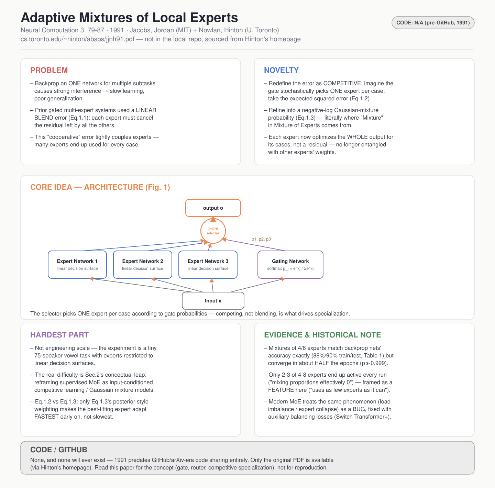

# Adaptive Mixtures of Local Experts

- **Venue / year:** Neural Computation 3, 79–87 (1991)
- **Authors:** Robert A. Jacobs, Michael I. Jordan (MIT) · Steven J. Nowlan, Geoffrey E. Hinton (University of Toronto)
- **Link:** https://www.cs.toronto.edu/~hinton/absps/jjnh91.pdf
- **来源说明:** 这篇不在 TimeSeriesMOE 仓库的本地下载列表里(1991 年的论文,早于 arXiv/GitHub 时代),我从 Hinton 个人主页(cs.toronto.edu/~hinton/absps)拿到了原文扫描 PDF,逐句核对过,不是转述二手资料。
- **paper_matrix.csv id:** 无(不在 matrix 里,是老师给的"MoE 基础"必读源头,不是 traffic/diffusion 相关文献)

## 中文精读

### 1. 解决了什么问题

这篇论文比后面三篇年轻 30 年,篇幅也短得多(正文只有 6 页),但它是所有现代 MoE 论文(Switch Transformer、Mixtral、DeepSeekMoE……)引用链的**源头**。它要解决的问题非常具体:

用一个单一的多层网络(single, multilayer network)去反向传播训练,同时处理多个不同的子任务时,会产生强烈的**干扰(interference)**——网络在学习任务 A 时调整的权重,会破坏它之前学到的任务 B,导致学习慢、泛化差。原文开篇第一句就是问题陈述:

> "If backpropagation is used to train a single, multilayer network to perform different subtasks on different occasions, there will generally be strong interference effects that lead to slow learning and poor generalization."

已经有人想到"用多个专家网络 + 一个门控网络分配任务"这个思路(Hampshire & Waibel 1989;Jacobs et al. 1990),但这些前作要么要求提前知道任务怎么划分子任务,要么——这是本文真正瞄准的靶子——虽然能自动学习分配,但**用来训练的误差函数设计错了**,导致专家之间无法真正各自独立(见第 2 节)。

### 2. 新意在哪里

新意极其精炼,就是**把误差函数从"合作式"改成"竞争式"**,这一个改动就是整篇论文的全部贡献:

- 旧做法(Hampshire & Waibel、Jacobs et al. 1990):把所有专家的输出线性加权混合,再和目标比较误差(原文 Eq. 1.1:`E = ‖d - Σ p_i·o_i‖²`)。这样做的后果是每个专家都要去"填补"其他专家留下的残差,专家之间强耦合、互相纠缠。
- 新做法:不再线性混合,而是想象门控网络做一次**随机选择**,每次只用一个专家的输出,误差取期望值(Eq. 1.2:`E = Σ p_i·‖d - o_i‖²`),后来进一步改成负对数概率形式(Eq. 1.3),这个形式本质上就是一个**高斯混合模型(mixture of Gaussians)**的极大似然——这也是"mixture of experts"这个名字里"mixture"的真正来源:每个专家对应混合模型里的一个分量,门控网络的 softmax 输出就是混合系数。

这个改动直接决定了专家们会**竞争**而不是**合作**去解释每一个训练样本,从而学会各自专注不同的输入区域——这就是"local experts"里"local"的含义。

### 3. Idea 具体落在哪里

最核心的落点是两条误差函数各自求导之后的**行为差异**(Section 1,Eq. 1.4 vs Eq. 1.5),这是全文最精彩、也最容易被现代读者忽略的一段推导:

- 用 Eq. 1.2(简单期望误差)求导:`∂E/∂o_i = -2p_i(d - o_i)`——每个专家的梯度只按门控概率 `p_i` 加权。
- 用 Eq. 1.3(负对数混合概率)求导:`∂E/∂o_i` 的权重换成了一个**相对表现**的比值(专家 i 的概率密度 / 所有专家概率密度之和)——本质上就是现代 EM 算法里的"后验责任(posterior responsibility)"。

这个差异带来一个反直觉的结果(原文明确写出来了):训练刚开始、门控网络对所有专家给等权重、且所有专家误差都很大时,**用 Eq.1.2,拟合得最好的那个专家反而适应得最慢;换成 Eq.1.3,拟合得最好的专家适应得最快**。这个"让暂时表现好的专家进一步被强化"的正反馈机制,才是专家真正走向分化(specialization)的驱动力,而不是架构设计本身。

### 4. 最大难点在哪里

对 1991 年的研究者来说,难点显然是"怎么想到把误差函数从线性混合换成随机选择再换成负对数混合概率"这个概念性跳跃——这不是工程规模问题(实验小到只有 75 个说话人的元音数据),而是**统计建模视角的转换**:第 2 节"Making Competitive Learning Associative"把整个方法重新解释成"给无监督的竞争学习(competitive learning / 聚类)加上一个输入条件"——每个专家对应一个高斯分量,门控网络让混合系数依赖输入 x,这样监督学习的 MoE 和无监督的聚类之间建立了一条统一的数学联系。这一步"打通两个领域"的洞察,比公式推导本身更难,也是这篇论文能进 Neural Computation 的原因。

对今天的读者来说,难点反而在于**降低预期**:这里的"专家网络"就是能画一条线性决策面的单个感知机(原文明确说 "The architecture of each expert was restricted so it could form only a linear decision surface"),不是 Transformer 里的 FFN 子网络;这里说的"mixture of 4 or 8 experts"是整个模型只有 4 到 8 个专家,不是现代 MoE 里成百上千个专家里选 top-2。精读时要能分清:哪些是 1991 年这篇论文本身证明的(小规模、线性专家、无 Transformer),哪些是后人扩展上去的。

### 5. 局限 / 对我项目的相关性

这篇论文里有一个非常值得注意的"历史照面"细节:实验结果部分写道——

> "Only experts 4, 5, and 6 are active in the final mixture. This solution is typical — in all simulations with mixtures of 4 or 8 experts all but 2 or 3 experts had mixing proportions that were effectively 0 for all cases."

翻译成现代 MoE 的术语,这就是**专家利用不均衡(load imbalance / 部分专家"死亡")**——但 1991 年的作者把这当成一个**优点**来描述("the system tends to use as few experts as it can"),而不是像 Switch Transformer 之后的论文那样,专门设计辅助负载均衡损失(auxiliary load-balancing loss)去强行让专家利用率更均匀。这说明:同一个现象,在"专家数量很少、追求可解释的任务切分"场景下是好事,在"专家数量成百上千、追求整体算力利用率"场景下变成了必须解决的工程问题——**目标变了,同一个机制的价值判断也跟着反转**,这是精读老论文时特别值得记录的一种认知。

对我自己的项目直接相关:这篇论文里"竞争式误差函数驱动专家自动按输入区域分化"的逻辑,正是我想让 traffic imputation 的专家按 missing-block 长度、观测密度、天气状态自动分化的理论依据——路由信号(路由由什么决定专家分工)的设计,本质上就是在决定"用什么变量当作 1991 年论文里的输入 x 去条件化混合系数"。

### 6. 是否能连 GitHub

**没有代码,也不会有**——1991 年远早于开源代码托管平台出现的年代。能拿到的只有论文原文 PDF(Hinton 个人主页),没有官方实现、没有 checkpoint、没有数据集(说话人元音数据来自 Peterson & Barney 1952,不是公开可下载的现代格式)。精读这篇论文的目的不是复现,而是理解现代所有 MoE 工程(路由 router、门控 gate、top-k 稀疏、专家利用率)的概念起点。

---

## English at-a-glance summary

### 图解读 Diagram walkthrough

海报中间的架构图对应论文 **Figure 1**,是现代所有 MoE 架构图的"祖先版本":

1. 最下方 **Input** 同时喂给所有专家网络和门控网络——注意这一点和后面 3 篇论文不一样,这里没有共享 backbone,每个专家是一个完全独立的小网络,直接从原始输入学习。
2. 三个 **Expert Network**(论文实验里限制成只能画线性决策面的简单单元)各自输出一个向量 `o_i`。
3. **Gating Network** 也吃同样的输入,输出一组 softmax 概率 `p_j = exp(x_j)/Σexp(x_i)`——这就是"门控"名字的来源,也是现代 MoE 里 router 的最初形态。
4. 顶部的 **Stochastic one-out-of-n selector**(随机一选一选择器)按 `p_j` 的概率选中一个专家的输出作为最终输出 `o`。论文强调这一步是关键:如果改成把所有专家输出线性加权混合(旧做法),专家之间就会互相纠缠;改成"只选一个"之后,每个专家只需要对被选中的那些样本负责。
5. 图下方两个对比框是这篇论文最核心的技术贡献——**同一个架构、两种误差函数,训练出来的专家分化行为完全不同**:线性混合误差(Eq. 1.1)让专家们互相"擦屁股"、纠缠不清;期望误差 / 负对数混合概率误差(Eq. 1.2 / 1.3)让专家彼此竞争,且已经表现好的专家会被进一步强化——这个正反馈机制,才是"专家自动按输入区域分化"的真正驱动力。

### English at-a-glance table(中英对照)

| Aspect 方面 | Summary |
|---|---|
| **Problem 问题** | Training one single multilayer network on multiple subtasks via backprop causes strong interference between tasks → slow learning, poor generalization. Prior gated multi-expert systems existed, but used an error function (linear blend of expert outputs) that doesn't encourage specialization. 用反向传播在一个单一多层网络上训练多个子任务,会造成任务间的强烈干扰,导致学习慢、泛化差。已有的带门控的多专家系统存在,但它们的误差函数(线性混合专家输出)并不能促使专家真正分化。 |
| **Novelty 新意** | Redefine the error function from cooperative (linear blend, Eq.1.1) to competitive: imagine the gate stochastically picks ONE expert per case, take the expected squared error (Eq.1.2), then refine to a negative-log mixture-of-Gaussians probability (Eq.1.3) — the literal origin of "mixture" in Mixture of Experts. 把误差函数从合作式(线性混合,公式1.1)改成竞争式:想象门控网络每次随机选一个专家,取期望平方误差(公式1.2),再改进为负对数高斯混合概率(公式1.3)——这正是"Mixture of Experts"里"Mixture"一词的字面来源。 |
| **Core idea 核心想法** | Comparing gradients of Eq.1.2 vs Eq.1.3: under Eq.1.2 the best-fitting expert adapts *slowest* early in training; under Eq.1.3 (posterior-responsibility weighting) it adapts *fastest* — this positive-feedback asymmetry is what actually drives specialization, not the architecture alone. 对比公式1.2和1.3的梯度:用公式1.2时,训练初期拟合最好的专家反而适应*最慢*;用公式1.3(后验责任加权)时它适应*最快*——正是这种正反馈的不对称性驱动了专家分化,而不是架构本身。 |
| **Hardest part 最大难点** | Not engineering scale (the experiment is a tiny 75-speaker vowel task with linear-only experts) but the *conceptual leap* in Section 2: reframing supervised MoE as input-conditioned competitive learning / clustering, linking gated mixture-of-experts to unsupervised Gaussian mixture models. 难点不在工程规模(实验只是75个说话人的元音小任务,专家只能是线性分类器),而在第2节的*概念性跳跃*:把有监督的 MoE 重新解释为"输入条件化的竞争学习/聚类",把带门控的专家混合和无监督高斯混合模型联系起来。 |
| **Evidence 证据** | On the vowel task, mixtures of 4 or 8 experts reach the SAME accuracy (88%/90% train/test) as comparable backprop nets (Table 1), but converge in about *half* the epochs (p≫0.999) — the real quantitative win is training speed, not accuracy, which is easy to misremember. 在元音任务上,4个或8个专家的混合模型和同等规模的反向传播网络达到*相同*的准确率(表1,88%/90% 训练/测试),但收敛所需的 epoch 数只要*一半*(p≫0.999)——真正的量化优势是训练速度而非准确率,这一点很容易被后人记错。 |
| **Historical note 历史对照** | The paper reports only 2-3 of 4-8 experts end up active ("mixing proportions effectively 0") and frames this as a *feature* — the system uses "as few experts as it can." Modern MoE (Switch Transformer onward) treats the same phenomenon (load imbalance / expert collapse) as a *bug* requiring an auxiliary balancing loss. 论文报告4-8个专家里最终只有2-3个真正活跃("混合系数近乎为0"),并把这当作*优点*来描述——系统会"尽量少用专家"。而 Switch Transformer 之后的现代 MoE 把同样的现象(负载不均衡/专家坍缩)当作*必须解决的问题*,专门设计辅助负载均衡损失。 |
| **Code / GitHub 代码开源情况** | **None, and never will be** — 1991 predates GitHub/arXiv-era code sharing entirely. Only the original PDF (via Hinton's homepage) is available; no implementation, checkpoint, or public dataset. Read for the concept (gate, router, competitive specialization), not for reproduction. **没有代码,也不会有**——1991年远早于 GitHub/arXiv 时代的代码分享传统。只能找到原始 PDF(Hinton 个人主页),没有实现、没有 checkpoint、没有公开数据集。读这篇论文是为了理解概念(门控、路由、竞争式分化),不是为了复现。 |
