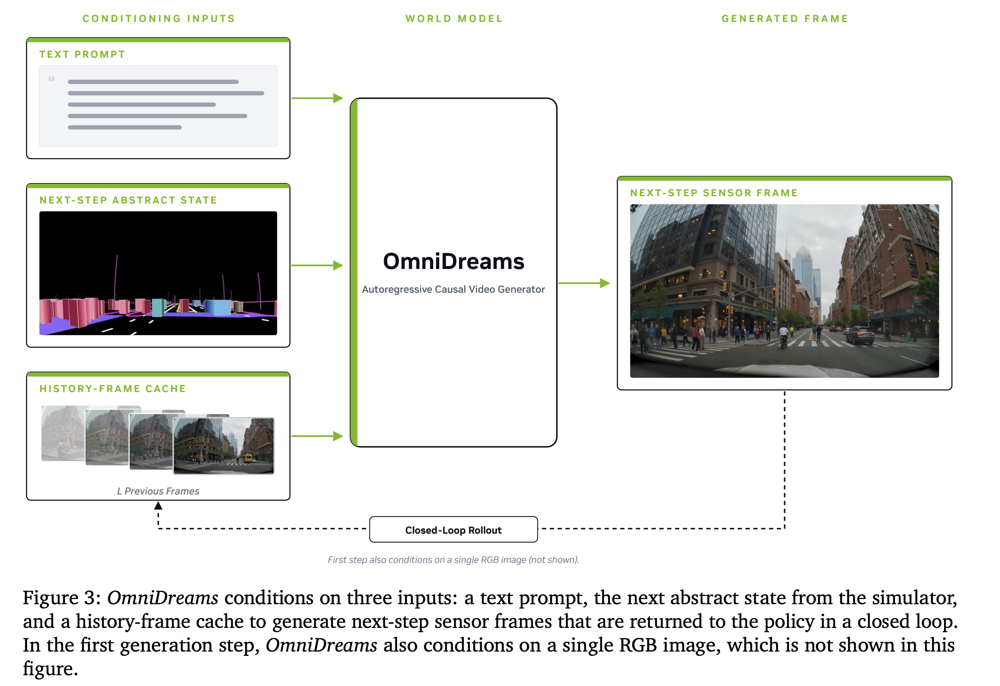

# NVIDIA OmniDreams: Real-Time Generative World Model for Closed-Loop Autonomous Vehicle Simulation

- **Venue / year:** arXiv 2606.03159(v1: 2026-06-02,v3: 2026-09-23),NVIDIA
- **Authors:** Aarti Basant, Amlan Kar, Despoina Paschalidou, Fangyin Wei, Francesco Ferroni, Guillermo Garcia Cobo, Haithem Turki, Huan Ling, Jaewoo Seo, James Lucas, Jay Zhangjie Wu, Jialiang Wang, Jonathan Lorraine, **Jun Gao**(IEEE IV 2026 上介绍过这篇,被 Anurag 的 PPT 引用过), Kai He, Katarina Tothova, Kevin Xie, Michal Tyszkiewicz, Qi Wu, Riccardo de Lutio, Ruilong Li, Sanja Fidler, Seung Wook Kim, Tianchang Shen, Tianshi Cao, Tobias Pfaff, William Lew, Xindi Wu, Xuanchi Ren, Yifan Lu, Yuxuan Zhang, Zan Gojcic, Zian Wang
- **Link:** https://arxiv.org/abs/2606.03159
- **来源说明:** 从同学 Anurag Hruday Pirangi 的 World Models 报告(World_Models_Anurag_Hruday.pptx)里看到这篇被引用,arXiv API + 全文 HTML 独立核实,没有直接采信他 PPT 里的转述数字,逐条跟论文原文核对过。
- **paper_matrix.csv id:** 无
- **Code:** https://github.com/nv-tlabs/omni-dreams(**已核实:真实可用**——含 `post-training/`、`samples/post-training/` 等真实训练代码,344 星、23 fork、11 次提交,CC BY 4.0 协议,权重在 HuggingFace `nvidia/omni-dreams-models`;交互式推理被移到配套仓库 `NVIDIA/flashdreams`)
- **Input / 输入:** 起始 RGB 帧(first-frame,仅第一步)+ 文本提示(场景属性,如天气/光照)+ 下一步抽象世界状态(来自仿真器的地图 + 包围框,不是渲染好的图像)+ 历史帧缓存(streaming KV cache)+ 驾驶动作(action-conditioned)
- **Output / 输出:** 自回归逐 chunk 生成的未来传感器帧(视频),通过 gRPC 实时回传给仿真器/策略,形成闭环

## TL;DR 浓缩版

**问题** → 做闭环自动驾驶仿真,现有两条路都有缺陷:基于图形引擎的仿真(1.0)成本高、场景要人工搭建;基于真实数据重建的仿真(2.0,NeRF/高斯泼溅)便宜、逼真,但原文点明了根本局限:

> "reconstruction-based workflows remain fundamentally anchored to the data that was originally observed...they struggle to scale beyond the captured corridor, introduce new scene content, or generate consistent photorealistic observations under substantially new conditions."

**Gap** → 生成式世界模型(3.0)理论上能解决"重建式仿真跳不出原始数据"这个问题,但要真正用于闭环仿真训练/评测,必须做到**实时**(策略每一步都要能马上拿到下一帧)且**精确可控**(要能被动作/地图这些仿真信号控制,不能只是"生成得好看但不听指挥"),此前的生成式视频模型大多离线、非实时。

**Novelty** → 把 Cosmos 扩散模型"中后期训练"(mid- and post-trained)成一个自回归、实时、动作条件化的视频生成器,专为闭环仿真设计:三路条件信号(文本提示 + 下一步抽象状态 + 历史帧缓存)+ 流式 KV 缓存保持时序一致性 + chunk-by-chunk 生成 + 通过 gRPC 和仿真器实时对话。

**核心洞察** → 实时性和可控性缺一不可,而且"可控"不需要靠重新渲染整个 3D 场景来实现——用一个轻量级的抽象状态(地图 + 框,不是图像)去控制生成,比用完整渲染场景当条件要快得多,这是能做到实时的关键简化。

**方法/论证** → 用 **Self Forcing + Distribution Matching Distillation(DMD)**,把一个双向(非因果、非实时)的教师模型蒸馏成因果自回归的实时学生模型;用"渐进式教师"训练策略(先用短上下文教师稳定住,再换长上下文双向教师)缓解长 rollout 里的漂移/伪影;2B 参数(单视角 SV / 多视角 MV 两个版本);工程上封装成有状态的 video model server,通过 gRPC 跟 AlpaSim 仿真器客户端通信,chunk 生成策略选择"pre-fetch"(策略和视频模型按同样的 chunk 边界对齐预测,避免错位)。

**结果** → 单视角 2B 模型 1 块 GB300 上 720p 做到 **68 FPS**(118ms 延迟);多视角(4摄像头)2B 模型 16 块 GB300 上每路摄像头 **105 FPS**(151ms 延迟,这是 Anurag PPT 里引用的那个数字,但那是多视角数字,不是单视角);蒸馏后模型 FVD 24.8、3D检测 LET-AP 0.400、车道线F1 0.828;最关键的下游证据——接入 Alpamayo 1.5 的 World-model-Augmented-Model(WAM)训练流程后,**碰撞率从 6.9% 降到 4.2%**(正面碰撞 1.0%→0.9%,侧碰 0.6%→0.4%,追尾 5.3%→3.0%),而且只用了 Alpamayo 1.5 **五分之一的参数量**(2B vs 10B)。

**意义** → 证明了"实时、可控、动作条件化"的生成式世界模型不只是能生成好看的视频,接入真实策略训练闭环后能带来可验证的下游安全指标提升,而且用更小的模型做到了——这是目前读过的世界模型论文里,少见的有"用它训练出来的策略变安全了多少"这种端到端证据链的例子,不只停留在 FVD 这类生成质量指标上。

## 中文精读

### 1. Idea 具体落在哪里

**三路条件信号**(对应用户贴的 Figure 3):文本提示(场景属性,比如天气/光照条件)、下一步抽象世界状态(来自仿真器的地图 + 3D 包围框,注意是**抽象表示不是渲染图像**——这是能做到实时的关键,不需要先把场景渲染出来再喂给模型)、历史帧缓存(L 帧,流式 KV 缓存维护时序一致性)。第一步额外条件一张起始 RGB 图(论文原话:"In the first generation step, OmniDreams also conditions on a single RGB image")。生成的下一步传感器帧经过虚线路径(Closed-Loop Rollout)被送回历史帧缓存,形成自回归闭环——这正是 Figure 3 底部那条虚线箭头的含义。

**Self Forcing + DMD 蒸馏**(§4.3):

> "we apply Self Forcing ([Huang et al., 2025]), a training framework that combines autoregressive self-rollout with a holistic, video-level distribution-matching objective based on Distribution Matching Distillation (DMD)"

蒸馏技术本身不是这篇论文发明的(引用 Huang et al. 2025),这篇论文的贡献是把它用在"闭环 AV 仿真"这个具体场景里,并设计了配套的渐进式教师训练策略。

### 2. 最大难点在哪里

不在蒸馏算法本身,在于**渐进式教师训练策略的设计**——直接用一个长上下文、双向(非因果)的教师模型去蒸馏,容易在长 rollout 里产生漂移和伪影(比如物体变形、建筑物在自车掉头之后变了样,这个具体症状 Anurag 的 PPT 里也提到过:"Objects morph, buildings change after a U-turn")。论文的解法是先用一个短上下文教师把学生模型稳定住,再切换到长上下文双向教师继续训练(§4.3,Figure 9)——这是一个需要对训练动态有经验判断、没法直接从公式推导出来的工程技巧,和我们之前读 UB Digital Twin 论文时记录的"静默失败模式需要主动埋点才能发现"是同一类"工程直觉"难度,不是算法难度。

### 3. 可以略过的内容

Table 2-3 里不同 GPU 配置(GB300 数量、batch size)下的详细延迟分解数字——记住头两个关键数字(68 FPS 单视角、105 FPS 多视角)就够了。

§6.3-6.4 关于 gRPC session 管理、NCCL 事件转发的具体系统实现细节——这是纯工程部署内容,除非要自己复现这套服务化架构。

### 4. 假设、局限、值得质疑的地方

**论文正文没有一个专门的"Limitations"小节**——这本身是一个值得记录的观察(和 EMMA 附录里专门用一段坦诚局限性的做法形成对比)。局限性只能从设计取舍细节里推断出来:

- **解码器质量-速度的权衡被量化承认**(Table 5):换成更快的 LightTAE 解码器后,FVD 从 24.8 恶化到 45.4——这是一个真实、被论文自己数据证实的取舍,不是隐藏起来的问题。
- **Chunk-based 生成**而非逐帧生成:论文原话"for performance and quality reasons, the current generation of video models generates frames in chunks"——chunk 边界处潜在的延迟/一致性代价论文没有展开讨论。
- **没有报告 PDMS/EPDMS**这类我们这几周反复见到的标准驾驶 benchmark 分数(NAVSIM 体系),主要证据是碰撞率和生成质量指标(FVD/LET-AP/车道线F1)——如果 presentation 时想把这篇和 WA-JEPA/Drive-JEPA 的 EPDMS 数字做"苹果对苹果"的直接数值对比,这篇论文没有对应数字,只能做类比、不能做直接比较,这点要在台上讲清楚,避免被问到时答不上来。
- **WAM 碰撞率改善实验的对照组不够清晰**:摘要级别的描述里,对照的是"完整的 Alpamayo 1.5(10B)"而不是"Alpamayo 1.5 去掉 OmniDreams 部分的严格消融版本"——碰撞率下降多少是严格来自 OmniDreams 这个组件,还是也掺杂了其他训练设置差异(比如数据量、训练步数不同),论文这段没讲清楚,**这是我没有十足把握、需要进一步看附录完整论文才能确认的疑点**,presentation 时如果要引用这个数字,最好加一句"论文对照组的严格性我没有完全确认"这样的免责说明。

### 5. 是否能连 GitHub

**可以,而且是真实可用的代码。** 核实了 https://github.com/nv-tlabs/omni-dreams:含 `post-training/`、`samples/post-training/`、`skills/run-post-training-sample/` 等真实训练基础设施,344 星、23 fork、11 次提交,CC BY 4.0 协议,权重在 HuggingFace(`nvidia/omni-dreams-models`,需要 token 认证访问)。交互式推理能力被拆分到了配套仓库 `NVIDIA/flashdreams` 里(这个仓库本身没有深入核实,只是论文和主仓库都提到了它)。

## Novelty 分类判断

- **新方法**:算——Self Forcing + DMD 蒸馏方案应用在"闭环 AV 仿真"这个具体场景、三路条件信号设计(尤其是用轻量"抽象状态"而非渲染图像去控制生成)是具体的架构贡献。
- **新 insight**:部分算——"实时性+可控性缺一不可"这个论证前提本身不算新(领域共识,Anurag 的 PPT 里"Simulation 3.0"这个框架也隐含了这个判断),这篇论文的贡献是把"怎么具体做到"讲清楚并实测验证了。
- **新理论**:没有,DMD 本身引用自 Huang et al. 2025,不是这篇首创。
- **新数据集**:算,RDS(16,600小时/300万片段)和 RDS-HQ-1M(4,944小时/114万片段)是自建的大规模训练数据集。
- **新应用场景**:不算,这是一个具体系统工程论文。

综合结论:**改进组合 + 系统工程集成类贡献**。把已有的蒸馏技术(Self Forcing/DMD)和 Cosmos 基座模型结合,针对"闭环仿真需要的实时性+可控性"这个具体工程目标做了系统性优化,核心价值在于让生成式世界模型真正能在策略训练闭环里跑起来、而且能带来可验证的下游安全收益,而不是停留在演示视频的生成质量层面。

## 关键原文摘录

1. 重建式仿真的根本局限(§1): "reconstruction-based workflows remain fundamentally anchored to the data that was originally observed...they struggle to scale beyond the captured corridor, introduce new scene content, or generate consistent photorealistic observations under substantially new conditions."

2. 核心方法定位(Abstract): "a foundation generative world model mid- and post-trained from the Cosmos diffusion model to autoregressively generate action-conditioned videos in real time."

3. 蒸馏框架(§4.3): "we apply Self Forcing...a training framework that combines autoregressive self-rollout with a holistic, video-level distribution-matching objective based on Distribution Matching Distillation (DMD)"

4. WAM 下游安全收益(§7.2): "reduces Collision from 6.9% to 4.2% (Front: 1.0% to 0.9%, Lateral: 0.6% to 0.4%, and Rear: 5.3% to 3.0%), despite using roughly five times fewer parameters"

5. 代码与权重发布(Abstract): "The code is available at [OmniDreams Github page]...and model weight at [Hugging face]."

## English at-a-glance summary

### Figure 3 · 条件信号与闭环结构(论文原图)

三路条件输入(文本提示、下一步抽象世界状态、历史帧缓存)经过 OmniDreams(自回归因果视频生成器)生成下一步传感器帧,再通过底部虚线的 Closed-Loop Rollout 路径把生成结果写回历史帧缓存,驱动下一轮生成——这张图最直观地体现了论文的核心设计:控制信号是轻量的抽象表示(地图+框),不是重新渲染的图像,这是实时性的来源。

| Aspect | Summary |
|---|---|
| **Problem** | Reconstruction-based AV simulators (NeRF/Gaussian splatting) are anchored to originally captured data and can't generate novel content/weather/objects beyond that corridor. Generative world models could, but need to be real-time AND precisely controllable to be usable in closed-loop simulation. 重建式仿真器(NeRF/高斯泼溅)被锚定在原始采集数据上,没法生成超出该走廊的新内容/天气/物体。生成式世界模型理论上可以,但要用于闭环仿真必须同时做到实时和精确可控。 |
| **Novelty** | Mid/post-trains the Cosmos diffusion model into a real-time, autoregressive, action-conditioned video generator conditioned on text + lightweight abstract world state (map+boxes, not rendered images) + history-frame cache, via Self Forcing + DMD distillation. 把Cosmos扩散模型中/后期训练成实时、自回归、动作条件化的视频生成器,条件信号是文本+轻量抽象世界状态(地图+框,非渲染图像)+历史帧缓存,用Self Forcing+DMD蒸馏实现。 |
| **Hardest part** | Not the distillation algorithm itself (cited from Huang et al. 2025), but designing the progressive-teacher training strategy (short-context teacher first, then long-context bidirectional teacher) to prevent drift/artifacts over long autoregressive rollouts. 难点不在蒸馏算法本身(引用自Huang et al. 2025),而在设计渐进式教师训练策略(先短上下文教师、再长上下文双向教师)来防止长自回归rollout中的漂移/伪影。 |
| **Evidence** | 68 FPS single-view (2B, 1 GPU) / 105 FPS multi-view (2B, 16 GPU); FVD 24.8; most compelling: plugging into Alpamayo 1.5's WAM training pipeline cuts collision rate 6.9%→4.2% at 1/5 the parameters (2B vs 10B). 单视角68FPS(2B,1GPU)/多视角105FPS(2B,16GPU);FVD 24.8;最有说服力的是接入Alpamayo 1.5的WAM训练流程后碰撞率从6.9%降到4.2%,且只用1/5参数量(2B vs 10B)。 |
| **Assumptions/limitations** | No dedicated Limitations section in the paper. Inferred from design tradeoffs: decoder speed/quality tradeoff is quantified (FVD 24.8→45.4 with faster decoder); no PDMS/EPDMS numbers reported, so no direct apples-to-apples comparison to WA-JEPA/Drive-JEPA is possible; the WAM collision-reduction experiment's control group (full Alpamayo 1.5 vs. an ablated version) isn't fully clear from the abstract-level description — unconfirmed, worth flagging when citing. 论文没有专门的局限性章节。从设计取舍推断:解码器速度/质量权衡被量化(FVD 24.8→45.4);未报告PDMS/EPDMS,无法和WA-JEPA/Drive-JEPA直接数值对比;WAM碰撞率改善实验的对照组(完整Alpamayo 1.5 vs 消融版本)从摘要级描述看不够清晰——未完全确认,引用时值得注明。 |
| **Code / GitHub** | **Released and verified real** — github.com/nv-tlabs/omni-dreams: real training infrastructure, 344 stars, 23 forks, CC BY 4.0, weights on HuggingFace (token-gated). Interactive inference split out to NVIDIA/flashdreams. **已开源且核实真实**——含真实训练基础设施,344星,23 fork,CC BY 4.0协议,权重在HuggingFace(需token)。交互式推理拆分到NVIDIA/flashdreams。 |

## 一个月后只记住 5 件事

① OmniDreams 是从 Cosmos 扩散模型中/后期训练出来的,专为闭环仿真做实时、动作条件化的自回归视频生成,不是从零训练的新架构。

② 核心技术是 Self Forcing + DMD 蒸馏,把双向(非实时)教师模型蒸馏成因果自回归(实时)学生模型,渐进式教师策略是防止长 rollout 漂移的关键难点。

③ 性能数字:单视角 68 FPS(2B,1GPU),多视角(4摄像头)每路 105 FPS(2B,16GPU)——Anurag PPT 里的"105 FPS"是多视角数字,presentation 时要讲清楚是哪个配置,别混用。

④ 最有说服力的证据是 WAM 实验:接入 Alpamayo 1.5 训练闭环后碰撞率 6.9%→4.2%,且只用了 1/5 参数量——这是少见的"生成式世界模型真的让策略更安全"的端到端证据,但对照组严格性我没有完全确认,引用时要留一句免责说明。

⑤ 已开源(github.com/nv-tlabs/omni-dreams,344星,CC BY 4.0,权重在HuggingFace),但没有报告 PDMS/EPDMS 标准分数,也没有专门的 Limitations 小节,局限性要从 chunk 生成、解码器质量权衡等设计细节里自己推断。
