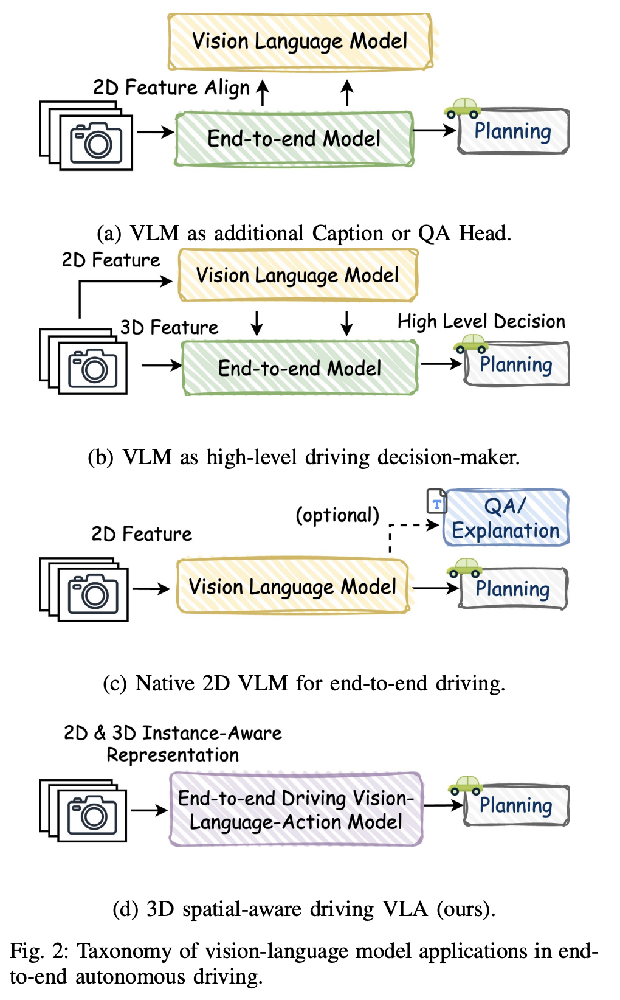

# OpenDriveVLA — 3D Spatial-Aware Vision-Language-Action Model for E2E Autonomous Driving

> **论文状态**：初步笔记（基于 Abstract + Introduction + Figure 2 整理）
> **发表**：AAAI 2026

---

## Metadata

| 字段 | 内容 |
|------|------|
| **标题** | OpenDriveVLA: Towards End-to-End Autonomous Driving with Large Vision Language Action Model |
| **发表** | AAAI 2026 |
| **代码** | [DriveVLA/OpenDriveVLA](https://github.com/DriveVLA/OpenDriveVLA) |
| **Benchmark** | nuScenes open-loop planning + driving QA（SOTA） |
| **Input** | 多目相机图像（2D + 3D instance-aware 表示）+ Ego State + Language Command |
| **Output** | 轨迹 waypoints（autoregressive LLM 解码生成）+ 可选 QA/Explanation |
| **Base LLM** | 开源大语言模型（具体型号待查） |

---

## TL;DR

**问题**：现有 VLM 用于自动驾驶有两个根本缺陷：(1) 只在静态 2D 图像-文字对上训练，空间推理差；(2) instance-agnostic（不区分哪辆是哪辆车），容易产生幻觉（hallucination），驾驶场景下幻觉=安全事故。

**两个核心设计**：
1. **Instance-aware 分层 2D+3D 视觉表示**：用感知模块先把场景结构化（每个 agent 单独表示，同时有 2D 语义和 3D 几何），再投影到 LLM 语义空间，从根源减少幻觉
2. **隐式 agent-environment-ego 交互建模**（辅助任务）：把传统 E2E 的显式交互建模变成 LLM 训练时的辅助 loss，让 LLM 内化物理合理性和多 agent 动态

**结果**：nuScenes 开环规划 + 驾驶 QA 双 SOTA

**意义**：把通用 VLM 安全接入驾驶的方法论，解决的核心问题是"如何弥合 2D 语言模型与 3D 动态驾驶世界之间的 gap"

---

## Figure 2：VLM 在 E2E 驾驶中的四种范式



这张图是 OpenDriveVLA 对整个领域的分类，说清楚了"VLM 可以怎么接到自动驾驶里"，以及为什么之前的方式不够好。

### (a) VLM as additional Caption or QA Head

```
Camera → End-to-end Model → Planning（主路径，负责实际驾驶）
              ↑
         2D Feature Align
              ↑
         Vision Language Model（旁路，只负责 Caption/QA）
```

**怎么做的**：E2E 模型（如 UniAD）照常做规划，VLM 接在旁边作为附加头，只负责生成文字描述或回答问题。两者通过 2D feature align 松散连接。

**代表论文**：DriveLM 早期版本、DriveMLM

**问题**：VLM 是"旁观者"，它的语言理解根本没有影响到规划决策。规划还是原来那套，VLM 只是给它加了一个"能说话"的外壳。语言和轨迹之间没有真正的联动。

---

### (b) VLM as high-level driving decision-maker

```
Camera → 2D Feature → VLM → High Level Decision（转左/直行/停车...）
       → 3D Feature → End-to-end Model → Planning（执行高层决策）
```

**怎么做的**：VLM 负责高层决策（"现在应该左转"），把这个决策传给 E2E 模型，E2E 模型负责具体轨迹规划。

**代表论文**：Senna（VLM→discrete meta-action→E2E→轨迹）

**问题**：两个模型割裂，信息传递是离散的高层决策（"左转"这个词），大量细粒度空间信息（"旁边那辆车距离我 3 米速度 40km/h"）在传递时丢失了。VLM 的空间感知没有直接参与轨迹生成。

---

### (c) Native 2D VLM for end-to-end driving

```
Camera → 2D Feature → VLM → Planning（直接出轨迹）
                          → QA/Explanation（可选）
```

**怎么做的**：直接用 VLM 做所有事，输入 2D 图像特征，VLM 同时输出轨迹和语言。

**代表论文**：EMMA（Waymo，Gemini）、早期 DriveLM

**问题**：VLM 只能处理 2D 图像，没有 3D 几何感知，空间推理差；instance-agnostic，容易对"某辆具体的车"产生幻觉。在动态 3D 驾驶环境里用 2D VLM 是根本性的能力缺陷。

---

### (d) 3D spatial-aware driving VLA（OpenDriveVLA，本文）

```
Camera → 2D & 3D Instance-Aware Representation
              ↓
    End-to-end Driving Vision-Language-Action Model
              ↓
          Planning
```

**怎么做的**：
1. 先用感知模块把场景转化为 instance-aware 的 2D+3D 结构化表示（不是原始图像）
2. 通过 hierarchical vision-language alignment，把 2D token 和 3D token 都投影到 LLM 语义空间
3. LLM 自回归生成轨迹 token（waypoint 量化为离散 token）
4. 训练时加入 agent-environment-ego 交互建模作为辅助 loss

**核心优势**：
- instance-aware → 减少幻觉
- 2D+3D 联合表示 → 空间推理强
- 端到端统一框架 → 语言真正影响规划，不是松散耦合
- VLA（Action 直接输出）→ 不需要额外的"决策→规划"两阶段

---

## 四种范式的演化逻辑（为什么必然走到 d）

| 范式 | VLM 角色 | 语言↔规划联动 | 空间感知 | 幻觉风险 |
|------|---------|------------|---------|---------|
| (a) Caption/QA Head | 旁观者 | 无 | 差（2D） | 中 |
| (b) High-level Decision | 上层指挥官 | 弱（离散决策） | 差（2D） | 中 |
| (c) Native 2D VLM | 全权负责 | 强（统一模型） | **差（无3D）** | **高** |
| (d) 3D VLA（本文） | 全权负责 | 强（统一模型） | **强（2D+3D）** | **低** |

演化逻辑：
- (a)→(b)：VLM 从旁观者变成决策者，但两个模型割裂问题没解决
- (b)→(c)：把两个模型合并，统一框架，但引入了 2D VLM 的空间盲区问题
- (c)→(d)：保留统一框架，解决空间感知和幻觉问题，加入 3D instance-aware 表示

**关键洞察**：(c) 的问题不是 VLM 这条路走错了，而是用错了工具（2D VLM 不适合 3D 动态世界）。OpenDriveVLA 的贡献是修复这个工具，而不是换回 (a)/(b) 的老路。

---

## 与其他论文的关系

| 维度 | UniAD | ARTEMIS | Senna | EMMA | OpenDriveVLA |
|------|-------|---------|-------|------|--------------|
| 范式（Fig.2） | 无 VLM | 无 VLM | (b) | (c) | (d) |
| 规划方式 | Query-based Transformer | Autoregressive + MoE | E2E Planner | LLM autoregressive | LLM autoregressive |
| 空间表示 | BEV | BEV（Camera+LiDAR） | BEV | 2D Image | 2D+3D Instance-Aware |
| 语言输入 | 无 | 无 | VLM→discrete | 直接 LLM | 直接 LLM |
| 幻觉风险 | 无语言 | 无语言 | 低（E2E执行） | **高** | **低** |

---

## 对我的研究方向的价值

**方向三（Risk-Aware Expert Routing）**：
- OpenDriveVLA 是最直接的 baseline，可以在其开源代码上加 Risk Router
- 它的 agent-environment-ego 交互建模天然提供了 TTC、agent 动态等 risk feature 来源
- 它没有任何 risk-aware routing 机制——对所有场景用同一个 LLM，这是你的 gap

**方向二（LiDAR-Guided VLA 蒸馏）**：
- OpenDriveVLA 用 Camera-only（nuScenes 实验），是你的 Student 候选
- 它的 3D instance-aware 表示已经部分补偿了深度信息缺失（用检测器估 3D），需要证明 LiDAR 在此基础上还能带来额外提升

---

## 待补充

- [ ] 精读 Architecture 部分：hierarchical vision-language alignment 具体怎么实现
- [ ] 精读 Training Strategy：multi-stage training 每个阶段冻结/更新什么
- [ ] 查具体使用的 base LLM 型号
- [ ] 查 nuScenes 上的具体数字（L2 误差、碰撞率）
- [ ] 查是否有 NAVSIM 实验结果
