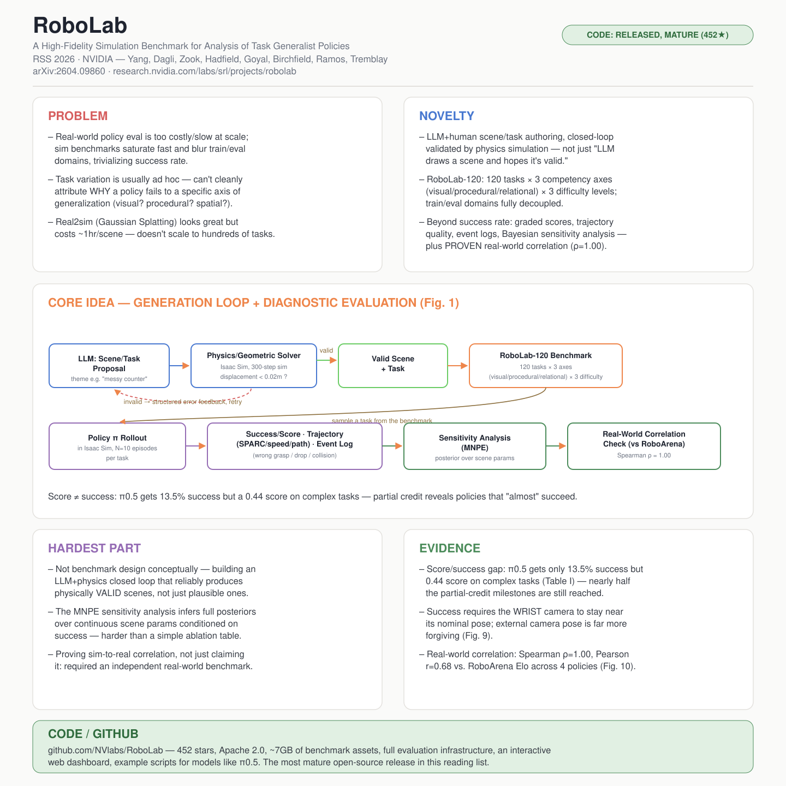

# RoboLab: A High-Fidelity Simulation Benchmark for Analysis of Task Generalist Policies

- **Venue / year:** Robotics: Science and Systems (RSS) 2026
- **Authors:** Jenai Xuning Yang, Rishit Dagli, Alex Zook, Hugo Hadfield, Ankit Goyal, Stan Birchfield, Fabio Ramos, Jonathan Tremblay — NVIDIA(+ University of Toronto, University of Sydney 联合培养)
- **Link:** https://arxiv.org/abs/2604.09860 · 项目主页 https://research.nvidia.com/labs/srl/projects/robolab/
- **来源说明:** 通过 arXiv 找到并下载全文(arXiv:2604.09860v4),用 `pdftotext` 提取原文逐句核对,不是转述二手资料。
- **paper_matrix.csv id:** 无(不在 matrix 里,是这次自己额外找的一篇,不是 traffic/diffusion 相关,是"如何严谨评测 VLA 策略泛化能力"这个方法论方向的参考)
- **Code:** https://github.com/NVlabs/RoboLab(**已核实:真实、成熟的开源仓库**——452 stars、Apache 2.0、约 7GB 的基准资产、完整评测基础设施、交互式仪表盘、针对 π0.5 等模型的示例脚本,是这份阅读清单里目前最完整的开源发布)
- **Input / 输入:** 一个待评测的策略 π(输入 proprioception/RGB/depth 等观测,输出关节动作)+ 一个场景(物体类别、位姿)+ 语言任务指令 + 环境变化参数(相机位姿、光照、背景、物体位姿的扰动幅度)
- **Output / 输出:** 每个 episode 的成功/失败 + 归一化的部分完成度分数(graded score)+ 轨迹质量指标(SPARC 平滑度、末端速度、路径长度)+ 离散事件日志(抓错物体、物体掉落、夹爪碰撞)+ 贝叶斯敏感度分析后验分布(哪些场景参数最影响成功率)

## 中文精读

### 1. 解决了什么问题

通用型机器人策略(task-generalist policies,类似机器人领域的 VLA)在真实世界测试成本极高、没法规模化,于是仿真基准成了主要评测手段。但论文开篇摘要直接点出现有仿真基准的病灶:

> "simulation-based benchmarking remains a bottleneck due to rapid performance saturation and a lack of true generalization testing. Existing benchmarks often exhibit significant domain overlap between training and evaluation, trivializing success rates and obscuring insights into robustness."

翻译:仿真评测本身成了瓶颈——一是性能很快就"跑满"(饱和),基准失去区分度;二是缺乏真正的泛化能力测试。很多现有基准的训练域和评测域高度重合(比如策略直接在仿真里微调过),这让成功率这个指标变得没有意义,也掩盖了对鲁棒性的真实洞察。Related Work 里还补了第三条:任务变化往往是随意的(ad hoc),没法把"策略为什么失败"归因到某一个具体的泛化维度上(是视觉变了?任务步骤变了?物体空间关系变了?)。

RoboLab 要解决的问题就是:能不能做一个**训练域和评测域彻底解耦**、**任务变化按可控维度系统组织**、**能规模化生成新场景而不是固定一批任务**的仿真基准。

### 2. 新意在哪里

三层新意,层层递进:

**① 场景/任务生成流水线是一个闭环的 LLM + 物理仿真验证系统**,不是"让 LLM 画一个场景然后祈祷它物理上合理":LLM 根据一个主题(比如"messy counter,乱糟糟的台面")生成结构化场景方案(物体子集 + 空间谓词),几何求解器把这些谓词转成具体位姿,再放进 Isaac Sim 里**正向仿真 300 步(受重力作用)**,如果哪个物体的最大位移超过 0.02 米就判定为"不稳定",生成一条具体的错误描述(比如"物体'苹果'从'盘子'上掉落,位移 0.15 米")反馈给 LLM 重新生成——这是一个真正的"生成→物理验证→报错→重试"闭环,不是一次性生成。任务代码的生成也是同样的模式(生成→语法校验→资产可行性校验→失败则把错误信息塞回 prompt 重试)。

**② RoboLab-120 基准的设计原则是把"训练域"和"评测域"彻底分开**:所有策略只在真实世界的 DROID 数据集上微调,仿真环境只用来做**受控的评测**,不参与训练。这直接对应 Related Work 里的表态:

> "policies are instead trained on large-scale real-world data (e.g., DROID), while high-fidelity simulation is used only as a controlled evaluation environment. Training and evaluation domains are decoupled and measured performance more closely reflects robustness in the real world."

**③ 120 个任务按三个"能力轴"(competency axes)系统组织**——视觉(visual:颜色/语义/尺寸识别)、程序性(procedural:可供性/重新定向/堆叠这类动作推理)、关系性(relational:连词、计数、空间关系)——再叉乘三个难度等级(简单/中等/复杂),这套设计借鉴了 VQA(视觉问答)基准的思路:不是笼统问"策略行不行",而是精确问"策略在哪个能力维度上不行"。

**④ 评测指标不止成功率**:归一化分级分数(graded score,按子任务/事件部分给分)、轨迹质量(SPARC 平滑度、速度、路径长度)、离散事件记录(抓错物体、掉落、碰撞),外加一套用**贝叶斯模拟推断(Simulation-Based Inference, SBI)**做的敏感度分析——这些合在一起,加上论文真的去验证了(不是空口宣称)仿真基准和真实世界基准的排名相关性(第 3 节细讲),构成了这篇论文比大多数"我们又做了一个基准"论文更扎实的地方。

### 3. Idea 具体落在哪里

最值得精读的三处具体设计:

**难度公式**(Section III-B):`DifficultyScore = N_subtasks + max(w_skill)`,其中 `w_skill` 视觉识别为 0、空间推理为 1、程序性推理为 2、重新定向/动态任务为 3——用任务结构本身(而不是主观判断)量化难度,再据此把任务分到 simple(≤2)/moderate(3–4)/complex(≥5)三档。这是一个很朴素但很有效的设计:把"这个任务有多难"变成一个可复现计算的数字,而不是研究者拍脑袋定的标签。

**贝叶斯敏感度分析(MNPE)**(Section III-D):不是简单地做消融表格,而是把"哪些场景参数最影响成功率"formalize 成一个贝叶斯推断问题——给定环境参数 θ(比如物体距离、相机位移),在多组扰动条件下跑策略、记录结果 x,用 Mixed Neural Posterior Estimation 学习后验分布 p(θ|x)。这比"改一个变量、跑一组消融"更进一步:直接推断出一个连续的后验分布,告诉你"在什么参数范围内,成功的概率最高"。论文用这套方法发现了一个很具体、可操作的结论(Fig. 9):

> "the wrist-camera posterior is sharply concentrated near zero, indicating that successful execution often required the wrist camera to remain close to its nominal pose, while performance is more tolerant to external camera position changes."

翻译:腕部相机的后验分布高度集中在零附近——意味着策略成功严重依赖腕部相机保持在标定的初始位姿,而外部相机的位置变化策略反而容忍度更高。这是一个非常具体、可以直接指导"下次该往哪个方向做数据增强/鲁棒性训练"的诊断结果,不是一句笼统的"策略不够鲁棒"。

**成功率和分级分数之间的"gap"是全文最反直觉、也最有价值的发现**(Section IV-B,类似 Alpamayo-R1 Table 9 那种"藏在细节里的真正洞察"):

> "π0.5 achieves only 13.5% success on complex tasks yet attains a score of 0.44, indicating that nearly half of the partial-credit milestones are reached even when full task completion is rare. This indicates that contemporary policies often partially understand the task but fail in the final stages of execution."

如果这篇论文只报告成功率,你会得出"π0.5 在复杂任务上几乎完全不行"的结论;但分级分数告诉你完全不同的故事——策略其实**理解了任务、走完了大半流程,只是在最后一步掉链子**。这个区分对判断"接下来该往哪个方向改进模型"极其关键:是重新设计任务理解模块,还是专门打磨执行的最后一步,这两个诊断指向完全不同的研发方向。

### 4. 最大难点在哪里

不在基准设计的整体理念(概念上不难理解),而在两处具体的工程/方法论难点:

- **让 LLM 生成的场景真正物理有效,而不只是看起来合理**:这需要一个真正跑起来的物理验证闭环(300 步重力仿真 + 0.02 米位移阈值 + 结构化错误反馈再生成),而不是相信 LLM 的空间推理直接能生成合法的物理配置。这类"LLM 生成 + 仿真器验证"的闭环设计,是这篇论文真正的工程含金量所在,比"用 LLM 生成任务"这个想法本身难得多。
- **贝叶斯敏感度分析(MNPE)**在方法论上是全文最"硬核"的部分——把敏感度分析从一张消融表格升级成一个真正的模拟推断(simulation-based inference)问题,需要训练一个神经密度估计器去直接学习"观测结果 → 参数分布"的映射,这比常规的网格消融需要更多的统计建模功底。
- **证明(而不只是宣称)仿真和真实世界的相关性**:论文没有止步于"我们的仿真很逼真",而是真的去找了一个独立的真实世界基准(RoboArena)、在同样的策略上跑了两边的评测、算出排名相关系数——但作者也诚实地把这个验证限定在"基准级别的排名相关",明确留了一句"我们把更深入的任务级别和运动级别相关性分析留给未来工作"(见下方摘录⑤),没有过度宣称。

### 5. 局限 / 对我项目的相关性

论文自己在 Limitations 一节写得很直接:

> "it currently focuses on rigid-body tabletop scenes and does not fully capture the challenges of deformable object manipulation (e.g., cloth, cables, bags)... contact-rich skills that require precise force control, compliant interaction, or complex frictional dynamics are underrepresented."

翻译:目前只覆盖刚体桌面场景,没能覆盖布料/线缆/袋子这类可变形物体操作,也没能很好覆盖需要精确力控制的接触密集型技能。此外,即使仿真已经是"高保真",和真实世界之间仍然存在残余的视觉分布偏移(residual visual distribution shift),这个差距还需要进一步刻画。

对我自己项目的两点具体启发:

- **"成功率 vs 分级分数"这个区分,直接对应我做 traffic imputation 评测时该注意的事**:如果只报告一个聚合的插补误差数字(比如整体 RMSE),可能会掩盖"模型其实在大部分缺失窗口都插得不错,只是在某个特定阶段(比如长缺失块的中段)系统性失败"这种更有诊断价值的信息。应该像这篇论文一样设计**按位置/按缺失类型分解的部分打分机制**,而不是只看一个汇总指标。
- **贝叶斯敏感度分析(MNPE)这个思路,可以直接迁移到路由信号设计上**:与其凭直觉手选"observation density、missing-block 长度、天气"这些路由特征,不如学这篇论文的做法——把"哪些上下文变量最能预测插补失败"本身 formalize 成一个推断问题,用类似的模拟推断方法反推出真正重要的信号,而不是靠经验挑选。

### 6. 是否能连 GitHub

**可以,而且是这份阅读清单里目前最成熟的开源发布。** 我核实了 https://github.com/NVlabs/RoboLab :仓库包含完整的评测框架代码、~7GB 的基准资产(物体/场景/背景/机器人配置)、`policies/` 目录下针对 π0.5 等具体模型的推理客户端实现、HDF5 格式的记录回放系统、一个网页版交互式仪表盘(浏览任务、回放 episode、分析结果)、完整文档和测试套件,采用 Apache 2.0 协议,已有 452 颗星标,还在持续更新(2026 年新增了 RoboVoLo 长时程任务扩展)。这不是一篇发了论文就搁置的项目,是一个正在被社区使用的活跃基准。

---

## English at-a-glance summary

### 图解读 Diagram walkthrough

海报中间的架构图对应论文 **Figure 1** 和 **Section III** 的完整流程,分两部分读——左半是"怎么造出基准",右半是"怎么用基准诊断策略":

1. 最左边 **LLM: Scene/Task Proposal** 根据一个主题(如"messy counter")生成结构化场景方案(物体子集 + 空间谓词)。
2. 送进 **Physics/Geometric Solver**:几何求解器把谓词转成具体位姿,再在 Isaac Sim 里正向仿真 300 步,检查每个物体的位移是否超过 0.02 米的稳定性阈值。
3. 如果验证失败,红色虚线箭头把结构化错误描述(比如"苹果从盘子上掉落")反馈回第 1 步的 LLM 重新生成——这是全文真正的工程闭环,不是一次性生成。
4. 验证通过后得到 **Valid Scene + Task**(场景 + 语言指令),汇入 **RoboLab-120 Benchmark**:120 个任务,按视觉/程序性/关系性三条能力轴 × 三个难度等级组织。
5. 下半部分是评测循环:抽样一个任务送入 **Policy π Rollout**(在 Isaac Sim 里跑策略),产出三类并行指标——**Success/Score**(含部分完成度打分)、**Trajectory Metrics**(SPARC 平滑度/速度/路径长度)、**Event Log**(抓错物体/掉落/碰撞)。
6. 这些结果进一步送进 **Sensitivity Analysis(MNPE)**,推断哪些场景参数(相机位移、物体距离等)的后验分布和成功率最相关。
7. 最后一步是 **Real-World Correlation Check**:把 RoboLab-120 的成功率和独立真实世界基准 RoboArena 的 Elo 分数做排名相关性检验(Spearman ρ=1.00),验证仿真结果确实能代表真实世界表现,而不是自说自话。

### English at-a-glance table(中英对照)

| Aspect 方面 | Summary |
|---|---|
| **Problem 问题** | Real-world policy evaluation is too costly to scale; existing sim benchmarks saturate quickly and blur train/eval domains, trivializing success rates. Task variation is usually ad hoc, so failures can't be attributed to a specific generalization axis. 真实世界策略评测成本太高、无法规模化;现有仿真基准很快就饱和,训练/评测域高度重合,让成功率失去意义。任务变化往往是随意的,失败原因没法归因到具体的泛化维度。 |
| **Novelty 新意** | A closed-loop LLM+physics scene/task generation pipeline (not just "LLM draws a scene and hopes it's valid"); RoboLab-120 — 120 tasks × 3 competency axes (visual/procedural/relational) × 3 difficulty levels, with training and evaluation domains fully decoupled (train only on real DROID data); analysis beyond success rate (graded scores, trajectory quality, event logs, Bayesian sensitivity analysis) plus a *proven* (not just claimed) real-world correlation. 一个闭环的LLM+物理验证场景/任务生成流水线(不是"LLM画个场景然后祈祷有效");RoboLab-120——120个任务×3条能力轴(视觉/程序性/关系性)×3个难度等级,训练评测域完全解耦(只在真实DROID数据上训练);超越成功率的分析(分级分数、轨迹质量、事件日志、贝叶斯敏感度分析),外加*证实*而非仅仅宣称的真实世界相关性。 |
| **Core idea 核心想法** | DifficultyScore = N_subtasks + max(w_skill) quantifies task difficulty from structure, not subjective labels. MNPE (simulation-based inference) learns a full posterior over scene parameters conditioned on success — e.g. revealing that success requires the wrist camera to stay near its nominal pose, while external camera tolerance is much looser. DifficultyScore = N_subtasks + max(w_skill) 用任务结构而非主观标签量化难度。MNPE(模拟推断)学习给定成功结果条件下场景参数的完整后验分布——例如揭示成功严重依赖腕部相机保持初始位姿,而外部相机容忍度高得多。 |
| **Hardest part 最大难点** | Not the benchmark design conceptually — building an LLM+physics closed loop that reliably produces physically VALID scenes (300-step forward simulation + 0.02m displacement threshold + fix-prompting on failure); formalizing sensitivity analysis as proper Bayesian inference (MNPE) rather than a simple ablation grid; and actually validating (not just asserting) sim-to-real correlation against an independent real-world benchmark. 难点不在基准设计理念本身——而在构建一个可靠产出物理有效场景的LLM+物理闭环(300步正向仿真+0.02米位移阈值+失败时的修复提示);把敏感度分析真正形式化为贝叶斯推断(MNPE)而非简单的消融网格;以及真正针对独立真实世界基准去验证(而非仅仅宣称)仿真-真实相关性。 |
| **Evidence 证据** | Score/success gap: π0.5 gets only 13.5% success but a 0.44 score on complex tasks — nearly half of partial-credit milestones reached even when full completion is rare (Table I). Real-world correlation: Spearman ρ=1.00, Pearson r=0.68 vs. RoboArena Elo across 4 policies (Fig.10) — but only benchmark-level ranking, not per-task, by the authors' own scoping. 分数/成功率之间的差距:π0.5在复杂任务上只有13.5%成功率,却拿到0.44的分数——即使完全完成很罕见,近一半的部分完成里程碑仍被达成(表I)。真实世界相关性:相对4个策略,与RoboArena Elo分数的Spearman ρ=1.00、Pearson r=0.68(图10)——但作者自己限定这只是基准级别的排名相关,不是逐任务级别的。 |
| **Relevance to our project 对我项目的相关性** | The success-rate/graded-score distinction directly applies to imputation evaluation — a single aggregate RMSE could hide the same "gets most of the way there but fails at a specific stage" pattern. The MNPE sensitivity-analysis approach is directly transferable to router-signal design: infer which context variables most predict imputation failure via simulation-based inference, rather than hand-picking features by intuition. 成功率/分级分数的区分直接适用于插补评测——单一聚合RMSE可能掩盖"大部分插对了、只在特定阶段系统性失败"这种模式。MNPE敏感度分析方法可直接迁移到路由信号设计:用模拟推断方法反推哪些上下文变量最能预测插补失败,而不是凭经验手选特征。 |
| **Code / GitHub 代码开源情况** | **The most mature open-source release in this reading list.** github.com/NVlabs/RoboLab: 452 stars, Apache 2.0, ~7GB of benchmark assets, full evaluation infrastructure, an interactive web dashboard, example scripts for models like π0.5, and active updates (2026 RoboVoLo long-horizon extension). **这份阅读清单里最成熟的开源发布。** github.com/NVlabs/RoboLab:452星标,Apache 2.0协议,约7GB基准资产,完整评测基础设施,网页交互式仪表盘,针对π0.5等模型的示例脚本,并持续更新(2026年新增RoboVoLo长时程任务扩展)。 |
