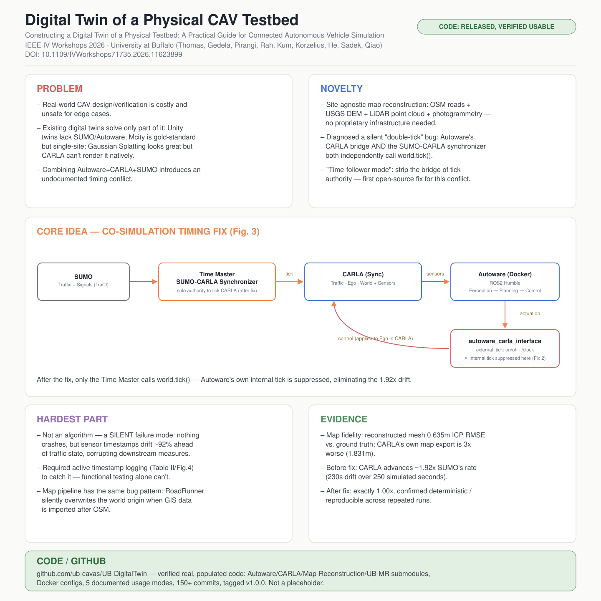

# Constructing a Digital Twin of a Physical Testbed: A Practical Guide for Connected Autonomous Vehicle Simulation

- **Venue / year:** 2026 IEEE Intelligent Vehicles Symposium Workshops (IV Workshops), Detroit, MI — June 2026
- **Authors:** Oakley Thomas, Rahul Gedela, Anurag Hruday Pirangi(共同一作), Jee Heum Rah, Yunchang Kum, Steven Korzelius, Chaozhe R. He, Adel W. Sadek, Chunming Qiao — **University at Buffalo**(CSE / 机械与航空航天工程系 / 土木-结构-环境工程系)
- **Link:** DOI 10.1109/IVWorkshops71735.2026.11623899
- **来源说明:** 用户直接提供了论文 PDF 全文,已逐句核对。
- **paper_matrix.csv id:** 无(不在 matrix 里)
- **Code:** https://github.com/ub-cavas/UB-DigitalTwin(**已核实:真实可用的代码库,不是占位符**——含 Autoware/CARLA/Map-Reconstruction/UB-MR 四个子模块、Docker 配置、5 种运行模式的完整文档、150+ commits、已打 v1.0.0 标签,见第 6 节)
- **Input / 输入:** 真实路测场地的 OSM 路网数据 + USGS 高程数据(DEM)+ 自己的自动驾驶车平台采集的 LiDAR/相机点云 + 无人机航拍视频(用于建筑重建);运行时输入 SUMO 交通状态 + CARLA 传感器流
- **Output / 输出:** (a) 一份经过量化验证的高保真 3D 数字孪生地图(ICP RMSE/点云距离指标);(b) Autoware + CARLA + SUMO 三方**确定性锁步(deterministic lock-step)**协同仿真——相同初始条件下轨迹、时间戳、事件完全可复现,Autoware 输出的控制指令(actuation)作用在仿真自车上

## 中文精读

### 1. 解决了什么问题

CAV(联网自动驾驶车辆)的设计验证如果全靠真实道路测试,又贵又危险,还没法覆盖长尾边缘场景。数字孪生(digital twin)是解法,但要做出**真正能用**的数字孪生,必须同时解决两件事,而已有工作往往只解决了其中一件:

- **环境重建**要做到位:Wang et al. 的 Unity 方案可视化不错但没原生集成 SUMO/Autoware;Mcity 是"物理-数字集成的黄金标准",但**只服务单一场地**,没法直接搬到别的测试场;3D Gaussian Splatting 照片级真实感很强,但 CARLA 0.9.16(基于 Unreal Engine 4.26)原生不支持渲染 splat。
- **多仿真器协同**要做到确定性锁步:CARLA 官方的 SUMO 协同工具假设 CARLA 是唯一的"时间消费者"(谁来推进仿真时钟),但一旦把 Autoware 也接进来,这个假设就被打破了——Autoware 自己的 CARLA 桥接层内部也会调用 `world.tick()`。

> "Introducing Autoware [7] breaks that assumption, since the Autoware-Carla interface [8] also issues world tick internally, causing CARLA to advance twice per logical step."

之前虽然有 Liu et al. 做过 SUMO-CARLA-Autoware 三方联调平台,证明了三方协同的需求确实存在,但"论文没提具体怎么同步的";TeraSim 用异步 Redis 消息总线做三方集成,牺牲了严格的时间戳因果性去换云端可扩展性;OpenCAMS 用 step-barrier 模型协调 SUMO+CARLA+OMNeT++,但没有接入生产级 Autoware。这篇论文要解决的问题就是:**把 Autoware、CARLA、SUMO 三者绑在同一个时钟上,做到真正的确定性锁步协同仿真**,同时提供一套任何测试场地都能复用的环境重建流程。

### 2. 新意在哪里

两个相对独立但互补的贡献:

**① 场地无关(site-agnostic)的地图重建流程**:不依赖任何专有基础设施,只需要 OSM 路网数据 + USGS 高程数据 + 一台装了 LiDAR 的车,就能重建任意测试场地——这是和 Mcity(单场地黄金标准)最直接的差异化定位:

> "Mcity [2] is the gold standard for physical-digital integration but is focused on a single-site; our framework is site-agnostic, requiring only OSM data, USGS elevation data, and a LiDAR-equipped platform."

**② 诊断并修复了一个此前没人明确报告过的"隐藏 bug"**:Autoware 的 CARLA 桥接层和 SUMO-CARLA 同步器**各自独立**调用 `world.tick()`,导致 CARLA 每个逻辑步实际推进了两次——这不是一个新算法,而是一个此前被所有"看似显然可行"的三件套组合方案共同忽略的系统性时序冲突。论文用一个"time-follower mode"解决:剥夺 Autoware 桥接层的 tick 权限,只让 SUMO-CARLA 同步器当唯一的时间主控(time master)。作者自己的定位很明确:

> "To the best of our knowledge, our external tick mechanism is the first open-source solution that explicitly resolves the double-tick conflict, yielding deterministic lock-step co-simulation across all three components."

### 3. Idea 具体落在哪里

最核心的技术落点是 **Algorithm 1** 和三处具体代码改动,这是全文唯一真正的"新方法":

1. **绕过世界重新初始化(Fix 1)**:原版 Autoware-CARLA 桥接层连接后会调用 `load_world()`,这会让 CARLA 重置、破坏 SUMO 同步器已经建立的 actor 映射关系。改成用 `get_world()` 挂载到已加载的世界,不触发重置。
2. **抑制内部 tick 调用(Fix 2,核心修复)**:这是解决"双重推进"问题的关键——桥接层默认的传感器处理循环会自己调用 `world.tick()`,论文直接把这个内部调用关掉,让 CARLA 只被 SUMO-CARLA 同步器推进,锁定顺序为:SUMO 推进交通 → 把 NPC 位置/信号状态镜像进 CARLA → 同步器触发**恰好一次** `world.tick()` → CARLA 渲染传感器数据 → Autoware 处理传感器输出控制指令。
3. **关闭实时步进节流(Fix 3)**:原桥接层会插入 sleep 来保证不比真实时间跑得快,这在协同�仿真里只会拖慢速度、增加延迟。关掉之后,节奏完全由外部编排器决定——可以正常实时跑,也可以为批量测试跑得更快,或为调试跑得更慢。

**证据链**(Table II / Figure 4)是这篇论文最有说服力的部分:修复前,CARLA 时间以 SUMO 时间的**约 1.92 倍**速度推进(几乎正好是"两次 tick"该有的比例),250 秒的仿真里累积漂移达到 230 秒;修复后,CARLA 和 SUMO 的时间戳在测量精度范围内完全对齐在 1:1 对角线上,而且反复跑同一场景,所有轨迹的时间戳日志完全一致——这是"确定性可复现"这个说法真正被验证的证据,不是空口宣称。

### 4. 最大难点在哪里

不在于任何单个算法,而在于**发现这个 bug 本身有多难**——这是一个完全静默的失败模式:

- **双重 tick 的问题不会报错、不会崩溃**,仿真照常运行,只是传感器时间戳会悄悄和交通状态错位近 92%。如果只做"能不能跑起来"这种功能性测试,永远发现不了这个问题——必须主动记录、对比多个组件各自的时间戳日志(Table II 那种做法),才能把这类问题揪出来。这是一个很值得记住的方法论教训:**多组件实时系统里的静默数值/时序漂移,需要主动埋点比对,不能只信"跑起来没报错"**。
- 地图重建流程里也有一个同构的"隐藏坑":RoadRunner 在导入 OSM 路网后会建立一个世界坐标原点,但后续导入 USGS 高程数据(GIS 投影)时会**静默覆盖**这个原点,这个偏移在 RoadRunner 里面看不出问题,直到导出给 CARLA 之类的下游工具时才会因坐标原点不一致而出现物理引擎错乱、场景对不齐——同样是"工具间顺序耦合导致的静默状态污染",只是这次发生在几何空间而不是时间轴上。
- 论文在 IV-F 节("Practical Considerations")非常坦诚地列了一堆没被抽象掉的琐碎细节:CARLA(OpenDRIVE)和 Autoware(Lanelet2)用的地图格式不同,需要手动做 y 轴翻转/坐标偏移;CARLA 地图缺车道级信号灯标注,需要手动改 HD 地图;传感器坐标系和 Autoware 默认传感器套件对不上,需要自定义 TF 变换;控制增益是车型专属的;定位启动时可能需要手动重置 GNSS 位姿。这些都是"跨工具集成"真实存在、但很少有论文愿意写出来的成本。

### 5. 局限 / 对我项目的相关性

- 作者自己承认的局限:整条地图重建流程严重依赖人工干预(车道语义、资产摆放和对齐都要手调),限制了可扩展性;精度也受限于外部数据源(OSM/DEM)本身的分辨率。目前演示的还是单自车场景,多智能体仿真(多个 Autoware 实例并发)和混合现实(Mixed Reality)集成都还是"进行中的工作",论文正文没有实际展示。
- **这篇论文来自 University at Buffalo**(和我用的 UB PPT 模板同一个学校),作者里的 Chaozhe R. He(机械与航空航天工程系)、Adel W. Sadek(土木-结构-环境工程系)、Chunming Qiao(计算机科学与工程系)——如果 Qiao 教授就是你邮件往来记忆里的"乔老师",这篇论文很可能直接来自你自己所在学校、甚至相关实验室的工作,而不是一篇随机挑到的论文。这点你可以自己核实一下,如果确实相关,这个开源代码库(`ub-cavas/UB-DigitalTwin`)可能是你能直接申请权限或本地部署去跑实验的具体资源,比前面几篇论文里"想用但用不了"的情况实用得多。
- 对我 traffic imputation 项目的方法论启发:这篇论文教会我的不是某个具体算法,而是**"接入一个你没写过的现成系统(这里是 Autoware),要主动去检查它有没有和你自己的编排逻辑抢同一个资源(这里是仿真时钟)"**——这和 DriveMLM"对接现成运动规划模块"是同一类工程风险,只是这篇论文把它具体量化到了"1.92 倍时间漂移"这个可核实的数字上。以后如果我的 MoE 路由器要接入别人已经写好的 backbone 或推理管线,应该主动去检查有没有类似的隐藏资源竞争(比如两边都在维护自己的缓存状态、都在各自触发某个副作用),而不是默认"能跑就是对的"。

### 6. 是否能连 GitHub

**可以,而且是真实可用的代码,不是占位符。** 我核实了 https://github.com/ub-cavas/UB-DigitalTwin 的实际内容:仓库包含 Autoware、CARLA、Map-Reconstruction、UB-MR(混合现实组件,论文里提到是"未来工作",但仓库里已经有对应子模块了)四个 submodule,`scripts/` 目录有多套启动脚本,`Scenarios/SUMO/` 有交通场景配置,还有 Docker 配置用于容器化部署;文档里写清楚了 5 种使用模式(基础 CARLA、AV 仿真、带交通的 AV 仿真、多智能体服务器、混合现实)的完整安装和运行说明,已有 150+ commits 和 v1.0.0 版本标签。这是这份阅读清单里第二个我可以真正下载部署去跑的项目(另一个是 Autoware 本身)。

---

## English at-a-glance summary

### 图解读 Diagram walkthrough

海报中间的架构图对应论文 **Figure 3**,聚焦于这篇论文真正的技术贡献——三方协同仿真的时序修复,不是地图重建流程(那部分更像一套操作手册,细节都写在中文精读第 3 节里了):

1. 最左边 **SUMO(Traffic + Signals)**独立维护交通流和信号灯状态,通过 TraCI 接口被外部推进。
2. 中间的 **Time Master / SUMO-CARLA Synchronizer**(橙色高亮,这是论文修复后唯一被允许触发 CARLA 时钟推进的角色)每个时间步做三件事:把 SUMO 的车辆位置镜像进 CARLA、触发**恰好一次** `world.tick()`、再把自车状态同步回 SUMO 让交通流对自车做出反应。
3. **CARLA(Sync)**内部维护 Traffic(背景车)、Ego(自车)、World + Sensors 三部分状态,tick 之后渲染出新一帧的传感器数据(LiDAR/相机/IMU/GNSS)。
4. 传感器数据流向 **Autoware(Docker 容器,ROS2 Humble)**内部的感知→规划→控制(Perception → Planning → Control)流水线,产出执行指令(actuation)。
5. 这条指令要经过 **`autoware_carla_interface`** 桥接层才能作用回 CARLA 里的自车——图上红色叉号标注的地方,就是原版桥接层会"偷偷"自己调用一次 `world.tick()` 的地方(Fix 2 之前的 bug 源头);论文的修复就是把这个内部 tick 显式关掉(`external_tick: on/off`),让整条链路只被第 2 步的同步器推进一次。

### English at-a-glance table(中英对照)

| Aspect 方面 | Summary |
|---|---|
| **Problem 问题** | Real-world CAV design/verification is costly and unsafe for edge cases. Existing digital twins solve only part of the puzzle: Unity twins lack SUMO/Autoware integration; Mcity is gold-standard but single-site; Gaussian Splatting looks great but CARLA can't render it natively. Combining Autoware+CARLA+SUMO also introduces an undocumented timing conflict. 真实道路上做CAV设计验证既贵又对边缘场景不安全。已有数字孪生方案只解决了部分问题:Unity方案缺SUMO/Autoware集成;Mcity是黄金标准但只服务单一场地;高斯泼溅效果好但CARLA原生不支持渲染。把Autoware+CARLA+SUMO三者组合还会引入一个此前没人记录过的时序冲突。 |
| **Novelty 新意** | (1) A site-agnostic map-reconstruction workflow (OSM + USGS DEM + LiDAR point cloud + photogrammetry) needing no proprietary infrastructure. (2) Diagnosed and fixed a silent "double-tick" bug: Autoware's CARLA bridge and the SUMO-CARLA synchronizer both independently call world.tick(); a "time-follower mode" strips the bridge of tick authority. (1) 场地无关的地图重建流程(OSM+USGS高程数据+LiDAR点云+摄影测量),不依赖任何专有基础设施。(2) 诊断并修复了一个静默的"双重tick"bug:Autoware的CARLA桥接层和SUMO-CARLA同步器各自独立调用world.tick();用"time-follower模式"剥夺桥接层的tick权限来解决。 |
| **Core idea 核心想法** | Algorithm 1: SUMO advances traffic → mirror NPC/signal states into CARLA → synchronizer ticks CARLA exactly once → CARLA renders sensors → Autoware computes control → command queued for next cycle. Three concrete fixes: skip world reload, suppress the bridge's internal tick, disable real-time pacing. 算法1:SUMO推进交通 → 把NPC/信号状态镜像进CARLA → 同步器触发恰好一次CARLA tick → CARLA渲染传感器 → Autoware计算控制指令 → 指令排队等待下一周期应用。三处具体修复:跳过世界重载、抑制桥接层内部tick、关闭实时步进节流。 |
| **Hardest part 最大难点** | Not any algorithm — diagnosing a completely SILENT failure mode: nothing crashes, but sensor timestamps drift ~92% ahead of traffic state, corrupting every downstream measurement. Required active timestamp logging (Table II/Fig.4) to catch, not just functional testing. The map pipeline has a structurally identical bug: RoadRunner silently overwrites the world origin when GIS elevation data is imported after OSM. 难点不在任何算法——而在诊断一个完全静默的失败模式:不会崩溃,但传感器时间戳会比交通状态漂移约92%,污染所有下游测量。必须主动记录时间戳日志(表II/图4)才能发现,光做功能测试发现不了。地图流程里有一个结构相同的bug:RoadRunner在OSM之后导入GIS高程数据时会静默覆盖世界坐标原点。 |
| **Evidence 证据** | Map fidelity: reconstructed mesh reaches 0.635m ICP RMSE vs. ground-truth point cloud; CARLA's own map export is 3x worse (1.831m). Timing: before the fix, CARLA advances at ~1.92x SUMO's rate (230s drift over 250 simulated seconds); after the fix, exactly 1.00x, confirmed deterministic/reproducible across reruns. 地图保真度:重建网格相对真实点云达到0.635m ICP RMSE;CARLA自己的地图导出误差是3倍(1.831m)。时序:修复前CARLA以约1.92倍SUMO速度推进(250秒仿真累积230秒漂移);修复后精确1.00倍,反复运行结果确定性可复现。 |
| **Relevance to our project 对我项目的相关性** | Methodological lesson: when plugging into an existing system you didn't write (here, Autoware), actively check whether it's silently fighting your own orchestration logic for a shared resource (here, the simulation clock) — the same category of risk as DriveMLM's "align to an existing planner," now quantified as a concrete 1.92x drift number. 方法论教训:接入一个自己没写过的现成系统(这里是Autoware)时,要主动检查它有没有在悄悄和自己的编排逻辑争抢同一个共享资源(这里是仿真时钟)——这和DriveMLM"对接现成规划器"是同一类风险,这里被量化成了具体的1.92倍漂移数字。 |
| **Code / GitHub 代码开源情况** | **Released and verified usable, not a placeholder.** github.com/ub-cavas/UB-DigitalTwin contains Autoware/CARLA/Map-Reconstruction/UB-MR submodules, Docker configs, 5 documented usage modes, 150+ commits, tagged v1.0.0. **已开源且核实可用,不是占位符。** 仓库含Autoware/CARLA/Map-Reconstruction/UB-MR四个子模块、Docker配置、5种文档化使用模式、150+次提交、已打v1.0.0标签。 |
