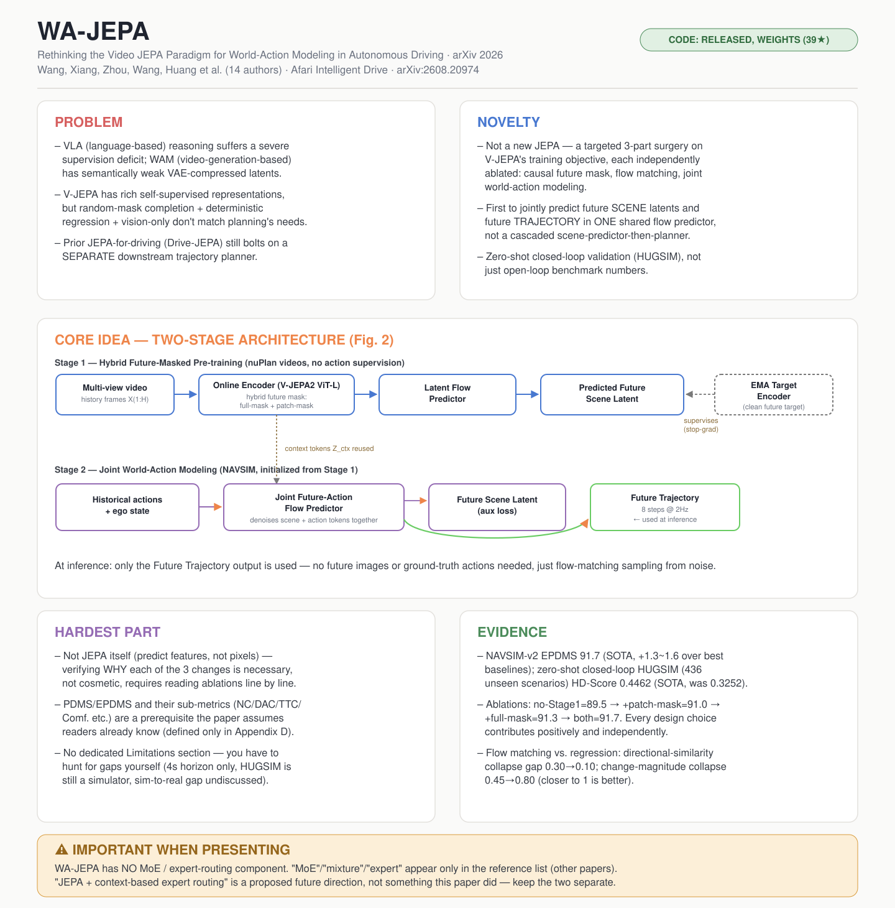

# WA-JEPA: Rethinking the Video JEPA Paradigm for World-Action Modeling in Autonomous Driving

- **Venue / year:** arXiv, Aug 2026 (v2: Sep 2026)
- **Authors:** Xinlin Wang, Yujiao Xiang, Yuheng Zhou, Jingqi Wang, Minqing Huang(通讯作者)等 14 人 — Afari Intelligent Drive(公司)+ 电子科技大学 + 东南大学 + 北京邮电大学 + 天津大学
- **Link:** https://arxiv.org/abs/2608.20974(v2)
- **来源说明:** 这篇是老师让 present 的候选论文,用户先转述了一份关于"JEPA + 自动驾驶"这条研究线的介绍(提到 Drive-JEPA / Auto-JEPA / WA-JEPA / DriveFuture 四篇)。我先用 arXiv API 逐个核实了这四篇的存在性和摘要(全部真实,不是编造的),然后下载 WA-JEPA 全文(2608.20974v2)用 `pdftotext` 提取原文逐句核对。
- **paper_matrix.csv id:** 无
- **Code:** https://github.com/AFARI-Research/WA-JEPA(**已核实:真实可用的代码,不是占位符**——含训练脚本、预训练权重、NAVSIM 开环评测和 HUGSIM 闭环评测代码、配置文件,39 stars,Apache-2.0 协议)
- **Input / 输入:** 历史 4 路环视相机图像(左/前/右/后,4 个历史帧,256×512 分辨率)+ 历史自车动作 + 当前 ego state
- **Output / 输出:** 未来 8 个时间步(2Hz,约 4 秒规划视野)的自车轨迹(位置 + 朝向);训练时还联合监督未来场景的 latent 表征(不直接生成 RGB 画面)

## TL;DR 浓缩版

**问题** → 想让端到端自动驾驶具备"推理"能力,目前有两条路:VLA(用语言模型推理)监督信号太稀疏;WAM(视频生成模型预测未来像素)语义表征被 VAE 压缩得太弱。能不能用 V-JEPA 这种"预测特征而不是像素"的自监督范式,既保留丰富语义、又能做规划?

**Gap** → V-JEPA 的表征语义很丰富,但它的训练目标(随机 mask 补全 + 确定性回归 + 只建模视觉)和"预测未来、和动作耦合"这个规划需求存在三处结构性错配,不能直接拿来用。此前唯一尝试(Drive-JEPA)也只是把 V-JEPA 编码器接进模型,还要另外接一个独立的下游轨迹规划器。

**Novelty** → 不是发明新的 JEPA,而是针对性地做了三处外科手术式改造:①随机 mask → 因果式"未来 mask"(只能看过去、预测未来);②确定性回归 → flow matching 生成式建模;③只建模视觉世界 → 联合建模世界状态和自车动作,用同一个预测器一起完成。

**核心洞察** → "表征语义丰富"和"能做规划"这两件事此前被认为要二选一,这篇论文证明只要把 V-JEPA 的训练目标本身改造对了(而不是简单地在外面接一个规划头),两者可以兼得——而且每一处改造都能在消融实验里量化出正向贡献,不是空谈。

**方法/论证** → 两阶段训练:Stage 1 用 nuPlan 视频做"混合未来 mask"自监督预训练(不涉及动作);Stage 2 在 NAVSIM 上加入动作监督,用一个联合的 flow-based 预测器同时去噪"未来场景 token"和"未来轨迹",两者共享同一套上下文。

**结果** → NAVSIM-v2 上 EPDMS 91.7(SOTA,超过第二名 1.3–1.6 分);零样本迁移到闭环仿真器 HUGSIM(436 个场景,完全没见过这些数据)上 HD-Score 0.4462,同样是 SOTA。

**意义** → 给"JEPA 类自监督表征能不能撑起自动驾驶世界模型"这个问题一个有消融实验支撑的正面答案,提供了一套具体、可复现的改造配方,而不是停留在"JEPA 应该适合驾驶"这种直觉判断。

## 中文精读

### 1. 解决了什么问题(为什么重要)

端到端自动驾驶想让模型具备"推理"能力(而不只是感知→动作的直接映射),目前主要有两条路,论文开篇就把两条路的病灶都点出来了:

第一条路是 VLA(Vision-Language-Action):利用 VLM 的语言理解能力做驾驶决策。但大多数 VLA 方法"simply learn a direct mapping from dense visual inputs to sparse action outputs, suffering from a severe supervision deficit"——翻译:输入是密集的视觉信号,输出却只是稀疏的动作(几个轨迹点),中间信息瓶颈太大,监督信号根本喂不饱模型。

第二条路是 WAM(World-Action Model):用视频生成模型去预测未来画面的像素,用这种"密集自监督"来指导决策。但这类方法大多在 VAE 压缩过的 latent 空间里做世界建模,这个空间"primarily optimized for visual generation and reconstruction, which may limit semantic abstraction"——为了生成画面好看而优化的表征,语义抽象能力有限。

于是论文提出一个问题:V-JEPA 这类"预测特征而不是像素"的自监督范式,表征语义天然丰富,能不能拿来解决这两条路各自的短板?

### 2. 最关键的贡献(按重要性排序,附证据)

**① 三处针对性改造,系统性解决 V-JEPA 用于规划的三个结构性错配,这是全文最核心的贡献。** 原文把这三处错配讲得很精确:

> "First, V-JEPA pre-training applies random spatiotemporal masking...This is inherently a completion objective, which lacks the future-directed predictive capability...Second, V-JEPA performs this masked prediction via regression, which...is insufficient for generating entirely unseen future tokens, a task that inherently requires generative modeling. Third, although V-JEPA can be fine-tuned for action-conditioned future prediction...the gap to actionable planning remains vast: existing approaches require a goal image and rely on Model Predictive Control (MPC) with multi-round optimization to recover actions."

对应的三处改造:随机 mask→因果未来 mask;确定性回归→flow matching;只建模视觉→联合建模世界+动作。证据是消融表 4(b):不做 Stage1 预训练直接用原版 V-JEPA2(89.5)→只加 patch-mask(91.0)→只加 full-mask(91.3)→两者结合(91.7),每一步改造的边际贡献都是正的,不是玄学。

**② flow matching 替代直接回归,是"生成式未来预测"这个想法的具体落地。** 证据是表 4(c):同样的联合建模框架下,直接回归 = 90.7,flow matching = 91.7,提升 0.9;更有说服力的是图 4 的定量指标——用 flow matching 后,方向相似度坍缩指标从 0.30 降到 0.10,变化幅度坍缩指标从 0.45 升到 0.80(越接近 1 越好),证明 flow matching 确实更好地保留了时序动态,不是纸面上的数字游戏。

**③ 联合世界-动作建模,而不是先预测未来场景再单独训练一个规划器。** 这是和 Drive-JEPA 的直接区分点,原文写得很明确:

> "Drive-JEPA attempts to bridge this gap by introducing a V-JEPA encoder into an end-to-end driving model, but still relies on a separate downstream trajectory planner. WA-JEPA instead extends predictive representation learning to jointly predict future world features and ego trajectories within a shared predictive representation."

证据同样在表 4(c):"级联"基线(未来预测器和动作预测分开,通过 cross-attention 注入)= 90.8;"联合建模但没有显式未来监督"= 91.1;两者都加上才是 91.7——说明"联合建模"和"显式未来预测监督"是互补的,不是互相替代的两个选项。

**④ V-JEPA2 作为骨干网络的选择本身是被验证过的,不是随手拿来的。** 表 4(a) 消融:同样的 Stage2 训练流程,只换初始化权重——MAE(83.8)、SigLIP2(83.1)、DINOv3(83.8)彼此接近,V-JEPA2 却达到 89.5,高出 5.7 分。原文的结论是:

> "The gap therefore tracks the V-JEPA 2 pre-training objective rather than the choice among image-level objectives, which motivates adopting a V-JEPA 2 encoder as the backbone."

**⑤ 不仅报开环指标,还做了零样本闭环验证。** 在 HUGSIM 436 个场景上(完全没在这些数据或它的 4 个源数据集上训练过),HD-Score 从次优的 0.3252 提升到 0.4462——这比大多数只报开环 NAVSIM 分数的论文更有说服力,因为开环指标容易和真实驾驶表现脱节。

### 3. Novelty 具体分类

- **新的问题定义/research question:不算首次提出。** "能不能用 JEPA 类自监督表征做自动驾驶世界模型"这个方向,Drive-JEPA(2026 年 1 月)已经开了头。WA-JEPA 是在这个已有问题设定下往前走了关键一步。
- **新的 insight/observation:部分算。** "V-JEPA 的三个设计选择分别对应规划任务的三个具体不匹配点"这个诊断是这篇论文自己给出的、有针对性的分析,不是泛泛而谈的"JEPA 应该适合驾驶"。
- **新的方法/architecture/algorithm:算,这是这篇论文最主要的贡献类型。** 具体的架构改造(混合未来 mask + flow matching 未来预测 + 联合未来-动作预测器)有消融实验逐项验证,是踏实的方法论贡献。但要注意:flow matching 本身不是这篇论文发明的(借用自图像生成领域的 rectified flow,Esser et al. 2024),这里是**移植已有技术到新场景 + 新的具体组合方式**,不是发明全新算法。
- **新的理论:没有。**
- **新的数据集/实验设置:没有新数据集**(用的是已有的 nuPlan/NAVSIM/HUGSIM),但"在 HUGSIM 上做完全零样本闭环验证"这个实验设计超出了大多数同类论文只做开环评测的常规做法,值得算作方法论上的加分项。
- **新的应用场景:算。** 把 V-JEPA 式自监督世界模型系统性地应用到"自动驾驶联合世界-动作建模"这个具体场景,比 V-JEPA2 原论文里做的机器人操作规划更复杂(多视角、多智能体交互)。

**综合结论:这篇论文的 novelty 类型主要是"方法/架构改造类贡献"**,在一个别人已经开了头的问题(Drive-JEPA)上做了更系统、更彻底的架构改造,每一步都有消融验证。三篇 JEPA-for-driving 论文的具体区别值得记清楚:Drive-JEPA 还是要接一个独立的下游轨迹规划器;Auto-JEPA 不预测未来场景,只做"未来意图 embedding"检索;WA-JEPA 第一次把"预测未来场景表征"和"直接输出轨迹"真正联合建模在同一个 flow-based 预测器里。

### 4. 哪些内容可以略过

Table 1/3 里那一长串 baseline 方法(TransFuser、ARTEMIS、Hydra-MDP++、DiffusionDrive、SparseDriveV2 等十几个)的具体细节——只需记住三大类(E2E 方法 / VLA 方法 / World-Action-Model 方法),以及 WA-JEPA 在每一类里最强的对手是谁(SparseDriveV2 和 Discrete-WAM)。

Stage1/Stage2 具体的公式推导(flow matching 的线性插值、MMDiT 细节)——除非要自己实现,理解"用生成式建模代替确定性回归去预测未来特征"这个思路本身就够用。

Appendix 里的详细实验设置(GPU 数量、学习率等超参)——除非要复现训练。

每个 baseline 方法的具体 backbone 型号(ResNet-34/V2-99/InternVL3 等)——除非要专门比较模型规模的影响。

### 5. 最大难点在哪里

不在于理解 JEPA 本身(概念不难:预测特征而不是像素),难点在于**理解为什么这三处具体改造是必需的、而不是锦上添花**——这需要对照消融表逐条核实每一步的边际贡献,而不是被"我们做了三处创新"这种表述唬住。另外,NAVSIM/HUGSIM 用的这些评测指标(NC/DAC/DDC/TLC/EP/TTC/LK/HC/EC,以及汇总出来的 PDMS/EPDMS)本身是一个前置门槛,论文正文默认读者已经懂,具体定义丢进了附录 D——presentation 前最好先搞清楚 PDMS(NAVSIM-v1 用)和 EPDMS(NAVSIM-v2 用,E 代表 Extended)大致在衡量什么维度,不然汇报时被问到"这个 91.7 到底是什么意思"会答不上来。

### 6. 假设、局限、值得质疑的地方

**这篇论文没有专门的 Limitations 小节**(我搜了全文确认,消融讨论结束直接接参考文献列表)——这是很多篇幅受限的会议论文的通病,精读时要自己主动去找漏洞,不能指望论文自己讲清楚。我自己找到的几处:

- 训练只用 4 个历史帧、预测 8 个未来步(2Hz,约 4 秒规划视野),更长时间尺度的规划能力完全没有验证。
- 闭环验证虽然是零样本、436 个场景,但 HUGSIM 本身也是一个仿真器,离真实世界还有 sim-to-real gap,论文完全没讨论这一点。
- **Table 1 有一个容易被忽略的细节**:表格脚注写"EPDMS∗ refers to scores obtained before correction of the human-reference penalty-filter aggregation, whereas EPDMS reports the corrected scores"——不是所有 baseline 都报告了"修正后"的 EPDMS(TransFuser、ARTEMIS、Hydra-MDP++、Drive-JEPA 的 ResNet-34 版本、WAM-Diff 等好几个只有 EPDMS∗)。WA-JEPA"超过第二名 1.6/1.3 分"这个头条结论,比较对象是 SparseDriveV2(90.1)和 Discrete-WAM(90.4),两者确实都是修正后的 EPDMS,所以这个结论站得住脚,但这提醒我们:**读对比表格时要先确认清楚"到底在跟哪一列数字比较",不能只看粗体加黑**。

**给你的一个重要提醒:你转述的介绍里提到"JEPA latent world model + MoE:不同 expert 专门学习行人/车辆交互/路口/高速动态,然后动态 routing"——这个想法在 WA-JEPA 论文里完全不存在。** 我在全文里搜索了"MoE"“mixture”“expert”这几个词,只在参考文献列表里出现(引用的是别的论文,比如 ARTEMIS 用了 Mixture of Experts 做轨迹规划,还有一篇多专家世界模型),WA-JEPA 本身是一个**统一的单一联合预测器**,没有任何专家路由机制。这个"JEPA + MoE 按驾驶场景路由专家"是你(或者你参考的那份介绍)提出的**尚未被做过的延伸研究方向**,不是 WA-JEPA 已经做了的事——跟乔老师 present 时一定要把"论文做了什么"和"这给了我们什么启发/下一步能做什么"分开讲清楚,不然会被追问"论文里 MoE 部分在哪一节"answer 不上来。

### 7. 是否能连 GitHub

**可以,而且是真实可用的代码。** 我核实了 https://github.com/AFARI-Research/WA-JEPA :仓库包含训练脚本(`scripts/training/train.sh`)、预训练权重(达到论文报告的 91.7 EPDMS)、NAVSIM 开环评测和 HUGSIM 闭环评测(436 个场景)代码、配置文件,目录结构清晰(`models/`、`training/`、`scripts/`、`datasets/`、`eval/`、`configs/`、`utils/`),主入口是 `models/multiview_causal_future_jepa.py`,39 stars,Apache-2.0 协议。这是这份阅读清单里又一篇可以真正下载复现的论文。

---

## English at-a-glance summary

### 图解读 Diagram walkthrough

海报中间的架构图对应论文 **Figure 2** 的两阶段训练流程:

1. **Stage 1(上半部分,自监督预训练,用 nuPlan 视频,不涉及动作)**:多路环视历史视频送进 **Online Encoder(V-JEPA2 ViT-L)**,用"混合未来 mask"策略处理——一部分训练样本用 full-mask(完全看不到未来,纯粹从历史推断),一部分用 patch-mask(能看到部分未来 token,难度更低、有助于表征学习)。编码后的上下文token 送进 **Latent Flow Predictor**,通过 flow matching 生成式建模,预测出**未来场景的 latent 表征**。
2. 同时,一个**EMA Target Encoder**(在线编码器的动量平均版本,虚线框表示它只提供监督信号、不参与主干计算)直接编码真实的未来帧,产出"干净"的未来目标表征,通过 stop-gradient 的方式监督 Latent Flow Predictor 的预测输出——这就是 Stage1 的训练信号来源。
3. **Stage 2(下半部分,加入动作监督,用 NAVSIM 数据,从 Stage1 权重初始化)**:历史动作和 ego state 编码后,和 Stage1 的上下文 token 一起送进 **Joint Future-Action Flow Predictor**——这是全文的核心机制:这一个预测器**同时**去噪"未来场景 token"和"未来轨迹 token",两者共享同一套上下文表征,不是先算好未来场景表征再喂给另一个独立的规划器。
4. 最终输出两路:一路是**未来场景 latent**(作为辅助监督信号,继续维持模型的世界建模能力,防止在动作微调阶段"遗忘"),另一路是**未来轨迹**(8 个时间步,2Hz,这是真正在推理时被使用的输出)。推理时不需要真实的未来图像或动作,从高斯噪声出发,通过几步 flow matching 迭代积分就能采样出轨迹。

### English at-a-glance table(中英对照)

| Aspect 方面 | Summary |
|---|---|
| **Problem 问题** | Two paradigms try to give E2E driving reasoning ability: VLA (language-based) suffers a severe supervision deficit; WAM (video-generation-based) has semantically weak VAE-compressed latents. Can V-JEPA-style feature prediction offer rich semantics without either drawback? 两条路想给端到端驾驶加推理能力:VLA(语言)监督信号太稀疏;WAM(视频生成)的VAE压缩latent语义太弱。V-JEPA式的特征预测能不能两者都要? |
| **Novelty 新意** | Not a new JEPA — a targeted 3-part surgery on V-JEPA's training objective: causal future masking (not random) + flow matching (not deterministic regression) + joint world-action modeling (not vision-only), each independently ablated. First to jointly predict future scene latents and trajectory in ONE shared flow predictor, unlike Drive-JEPA's separate downstream planner. 不是新JEPA——是对V-JEPA训练目标的三处针对性改造:因果未来mask(非随机)+flow matching(非确定性回归)+联合世界-动作建模(非纯视觉),每一处都单独消融验证。首次在一个共享flow预测器里联合预测未来场景latent和轨迹,不像Drive-JEPA还要接独立下游规划器。 |
| **Core idea 核心想法** | Two-stage training: Stage 1 self-supervised hybrid future-masked pretraining on nuPlan (no action); Stage 2 joint future-action flow predictor on NAVSIM, denoising future scene tokens and trajectory tokens together, sharing the same context. 两阶段训练:Stage 1 在nuPlan上做混合未来mask自监督预训练(无动作);Stage 2 在NAVSIM上用联合未来-动作flow预测器,共享同一上下文,一起去噪未来场景token和轨迹token。 |
| **Hardest part 最大难点** | Not JEPA itself (predict features, not pixels — simple enough), but verifying WHY each of the three architectural changes is necessary rather than cosmetic — requires checking the ablation tables line by line. Also, NAVSIM/HUGSIM's evaluation metrics (PDMS/EPDMS and their sub-metrics) are a prerequisite the paper assumes readers already know. 难点不在JEPA本身(预测特征而非像素,概念不难),而在核实三处架构改动为何必要而非锦上添花——需要逐行核对消融表。另外NAVSIM/HUGSIM的评测指标(PDMS/EPDMS及其子指标)是论文默认读者已懂的前置知识。 |
| **Evidence 证据** | NAVSIM-v2 EPDMS 91.7 (SOTA, +1.3~1.6 over best baselines); zero-shot closed-loop HUGSIM (436 unseen scenarios) HD-Score 0.4462 (SOTA, up from 0.3252); ablations show each design choice (masking, flow matching, joint modeling, V-JEPA2 backbone) contributes positively and independently. NAVSIM-v2 EPDMS达91.7(SOTA,超最强基线1.3~1.6分);零样本闭环HUGSIM(436个未见过场景)HD-Score达0.4462(SOTA,从0.3252提升);消融显示每个设计选择(掩码策略、flow matching、联合建模、V-JEPA2骨干)都独立且正向地做出贡献。 |
| **Assumptions/limitations 假设/局限** | No dedicated Limitations section in the paper. Only 4 history frames / 8 future steps (4s horizon) tested — longer-horizon planning unverified. HUGSIM is still a simulator — sim-to-real gap undiscussed. Table 1 mixes corrected EPDMS and uncorrected EPDMS* across baselines — the headline comparison is apples-to-apples, but readers must check which column is which. 论文没有专门的局限性小节。只测试了4历史帧/8未来步(4秒视野)——更长时间尺度规划未验证。HUGSIM仍是仿真器——sim-to-real gap未讨论。表1里baseline混用了修正后EPDMS和未修正EPDMS*——头条对比确实是同口径,但读者要自己核实清楚在比较哪一列。 |
| **Important note for presenting 汇报提醒** | The user's source material proposed "JEPA + MoE routing by driving context" as a research direction — this does NOT exist in WA-JEPA itself. A full-text search finds "MoE"/"mixture"/"expert" only in the reference list (citing other papers). WA-JEPA uses a single unified joint predictor, no expert routing. Keep "what the paper did" separate from "what this suggests as future work" when presenting. 用户参考材料提出的"JEPA+按驾驶场景MoE路由"是一个研究方向设想——WA-JEPA本身完全没有这个东西。全文搜索"MoE"/"mixture"/"expert"只出现在参考文献列表里(引用别的论文)。WA-JEPA用的是单一统一的联合预测器,没有专家路由。汇报时务必把"论文做了什么"和"这启发了什么未来方向"分开讲。 |
| **Code / GitHub 代码开源情况** | **Released and verified real** — github.com/AFARI-Research/WA-JEPA: training scripts, pretrained weights (reproducing 91.7 EPDMS), NAVSIM open-loop + HUGSIM closed-loop eval code, configs. 39 stars, Apache-2.0. **已开源且核实真实可用**——含训练脚本、预训练权重(复现91.7 EPDMS)、NAVSIM开环+HUGSIM闭环评测代码、配置文件。39星标,Apache-2.0协议。 |

## 一个月后只记住 5 件事

① WA-JEPA 不是发明 JEPA,是把 V-JEPA 的三个训练设计(随机 mask/确定性回归/只管视觉)针对性改成"因果未来 mask/flow matching 生成式预测/联合动作建模",专门为"能拿来规划"这个目标做的改造。

② 核心机制是 flow matching(借自图像生成的 rectified flow),用来替代直接回归去预测未来的 latent 特征——消融表和坍缩指标都证实这比直接回归更能保留时序动态。

③ 两阶段训练:Stage1(nuPlan 视频,纯自监督,不涉及动作)→ Stage2(NAVSIM,加入动作监督,联合预测未来场景表征 + 未来轨迹,共用同一个 flow 预测器)。

④ 证据链完整:开环 NAVSIM-v2 SOTA(91.7 EPDMS)+ 零样本闭环 HUGSIM SOTA(HD-Score 0.4462),不是只挑一个对自己有利的 benchmark 报数字。

⑤ 论文本身**没有** MoE 组件,"JEPA + MoE 按驾驶场景动态路由专家"是一个尚未被做过的、可以往下延伸的研究方向,不是 WA-JEPA 已经做了的事——presenting 给乔老师时务必把这两者分开讲清楚。
